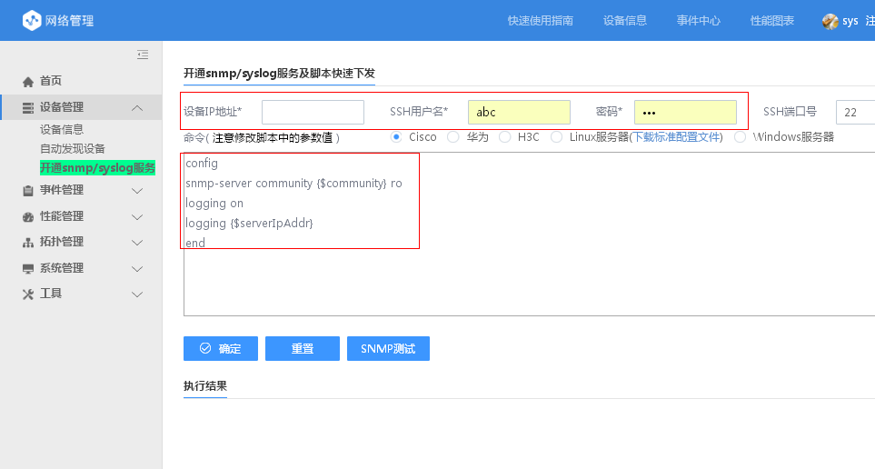
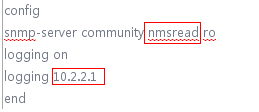
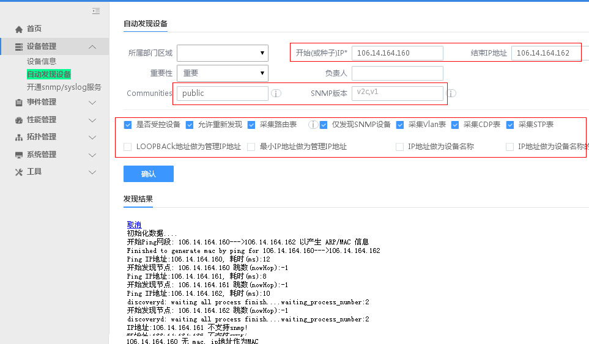
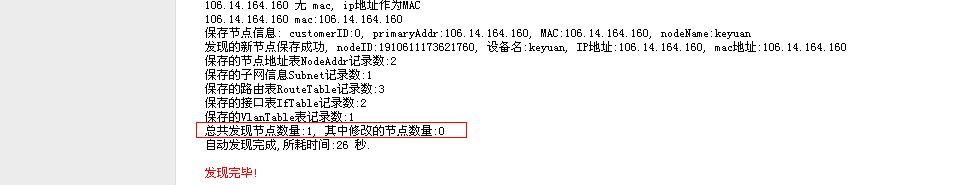
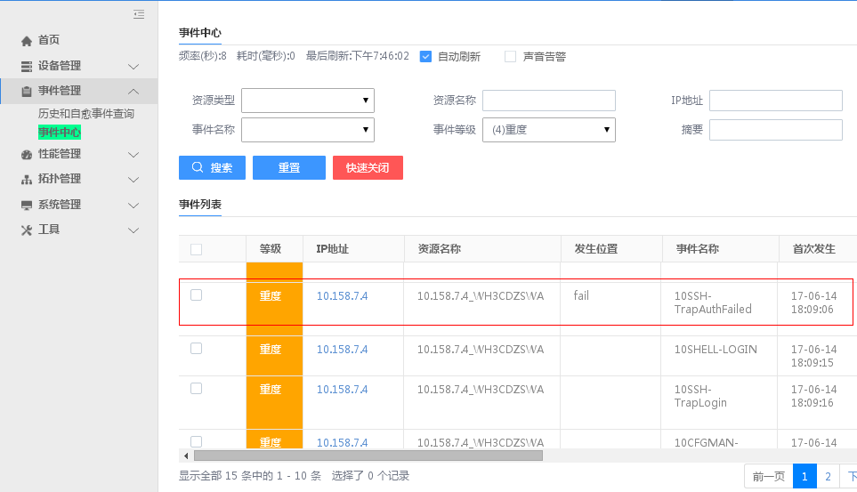
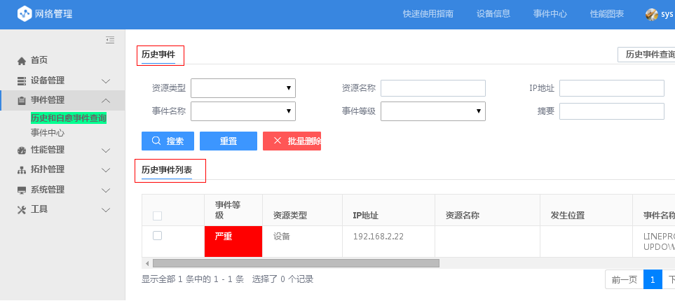
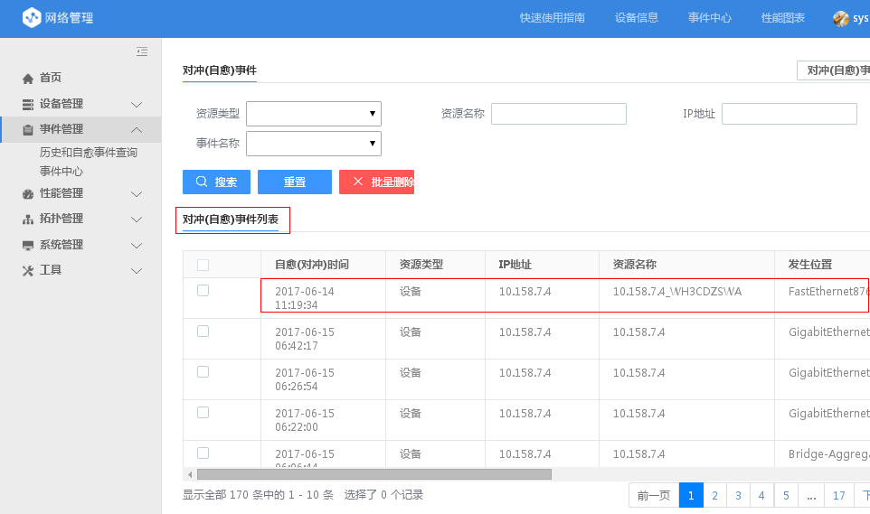
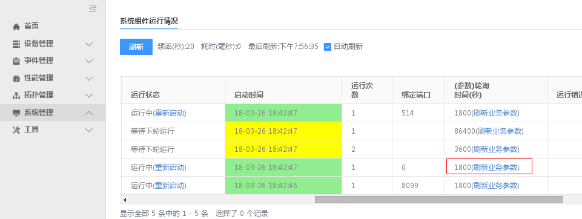
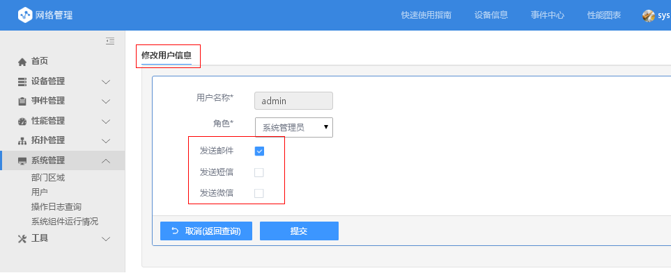

# 快速入门

登录蓝鲸平台后，在蓝鲸主页（Portal）中点击 “网络管理” 图标。

点击“网络管理主页”的上部“快速使用指南”连接

   

依照 4 个步骤完成系统的初次使用，包括：

## 确认系统各服务组件运行正常

“系统管理”----”系统组件运行情况”,出现下面 5 个组件的运行状态信息，确认红色框中的组件运行正常。

- Geneinfo:系统主程序

- Perfd：性能数据采集和处理程序

- Syslogd：Syslog 采集和处理程序

- CleadDatad：数据清理程序。缺省性能数据保存 90 天，严重的事件信息保存 1 年，一般的事件信息保存 90 天

- Discoveryd：设备自动扫描程序

## 开通设备的 SNMP 服务器和 Syslog 服务

所有纳管设备必须支持 ping（不能禁 ping）和 SNMP，网络设备同时要开通 Syslog 服务，Linux 系统可以将 syslog 转发到网络管理服务器。

- 网络管理员可以登录到网络设备上手工执行有关命令，以开通和设置 SNMP，Syslog 服务

- 也可以使用“开通 SNMP 和 Syslog”，采用 ssh 远程执行相关命令的方式，如下图所示:

如红色框中的命令可以是:

假设网管服务器的 IP 地址为 10.2.2.1； 假设设置 read community 为 nmsread

- Linux 和 Windows 的 SNMP 设置可参考系统的“开通 SNMP 和 Syslog” 功能页面中的说明

## 自动扫描发现设备及其模块

点击”设备管理”--”自动发现设备”，再界面中最小输入为：起始 IP 地址和 community。
一般输入一个 IP 地址段，设备的 community， SNMP 版本输入:v2,  其它选项不用改变。

如上图所示，发现完毕后，会给出发现设备数量的统计信息，和保存了哪些设备信息。

**再次强调：设备要能 ping 的通，并且支持 SNMP 才会自动发现出来**。

## 自动接收 Syslog 信息和自动进行事件（故障）处理

- 系统(Syslogd 服务组件)等待收集 Syslog 日志信息的服务端口为 UDP 514。

- 系统收到 Syslog 会根据内置的处理，进行抛弃，丰富，压缩，自愈，升降机，转发，关联，告警等处理。

- 处理后的事件首先保存到事件中心，然后保存到历史事件中，如下图所示：

首先保存到“事件中心“

然后保存到“历史事件“中：

如果发生了对冲（自愈）处理，则“抵消“后的事件信息，保存到”对冲（自愈）事件中。

## 新发现的设备等待 25 分钟左右，会自动采集（基础）性能数据
- 新发现的设备系统缺省 25 分钟左右会采集相应的性能数据：

    所有交换机和路由器设备会采集端口流量信息

    Cisco 和 H3C 设备会采集 CPU 和内存利用率

    Linux 和 Windows 服务器会采集 CPU，内存，磁盘和 Swap 利用率

- 设备新发现后，也可以点击“系统组件运行情况“中的 Perfd 的”刷新业务参数“，使系统立即采集设备的性能数据，如下图所示：

## 接收邮件或短信或微信告警（如果事件（故障）等级为最高级，即严重等级）

- 系统缺省将最高等级的事件（5 级：严重事件）发给能够接收告警信息的用户。

- 哪些用户能够接收告警信息，在“用户“管理界面中定义，如下图所示：

