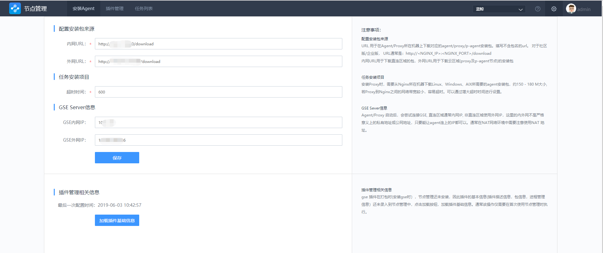

# Agent 安装

用户的业务主机和蓝鲸系统所在的局域网或相同或不同，安装 Agent 包含 3 场景：直连区域的 Agent 安装、非直连区域的 Proxy 安装、非直连区域的 P-Agent 安装。

## 前置步骤

配置 Nginx 服务器地址。**首次使用节点管理，必须先配置 Nginx 服务器地址，否则无法使用其他功能。**

**Note：**

- 配置包来源：
  URL 用于在 Agent/Proxy 所在机器上下载对应的 Agent/Proxy/P-Agent 安装包。填写不含包名的 URL。 对于社区版/企业版， URL 通常是: `http://<NGINX_IP>:<NGINX_PORT>/download`。内网 URL 用于下载直连区域的包，外网 URL 用于下载云区域 ( Proxy 及 P-Agent 节点)的安装包。
- 任务安装项目：
  安装 Proxy 时，需要从 Nginx 所在机器下载 Linux、Windows、AIX 所需要的 Agent 安装包，约 150 - 180 M 大小, 若 Proxy 到 Nginx 之 间的网络带宽较小，容易超时。可以通过增大超时时间进行设置。
- GSE Server 信息：
  Agent/Proxy 启动后，会尝试连接 GSE, 直连区域通常内网 IP，非直连区域使用外网 IP，这里的内外网不是严格意义上的私有地址或公网地址，只要能让 Agent 连上的 IP 都可以。通常在 NAT 网络环境中需要注意使用 NAT 地址。

## 直连区域安装 Agent

当安装 Agent 的受控主机与蓝鲸系统中的 GSE Server，在同一局域网内（非跨云），受控主机能通过局域网建立与 GSE Server 的 TCP/UDP 链接。这种情况下，选择直连区域安装 Agent 。

## 安装要求

- 要能正常安装 Agent，除了满足网络策略要求 (参考 [开通网络策略要求](../附录/network_policy.md)) 外, 还要满足：

> - 操作系统可以是 `Linux/Windows/AIX` 。
> - 目前仅支持 `root/Administrator` 账户。
> - 若为 Linux：
>   - 开通网络策略，允许从 APPO 所在机器 SSH 到目标机器(Linux/AIX)
>   - 需要安装好 wget，curl 工具。或者可以使用 yum 或 apt 工具安装 wget，curl
> 3. 若为 Windows：开通网络策略，允许 APPO 访问服务器的 139，445 端口
> 4. Windows 必须使用 Administrator 账号，Linux 可以使用 root，或者可以免密 sudo 执行命令的用户
