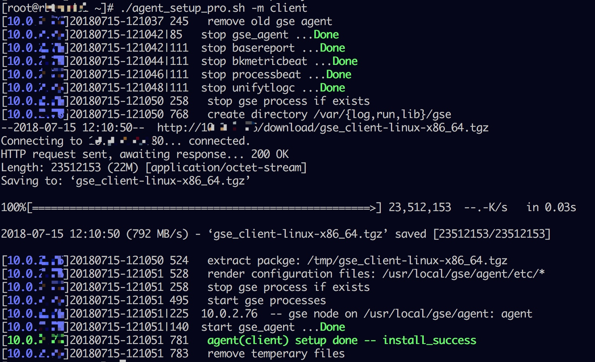

# 附录
## 手动安装 Agent
目前节点管理部分版本不支持复杂环境的安装，这里提供手动安装方法供参考.。

手动安装分两种情况：

- 通过官方脚本 (也是节点管理使用的脚本)，提供更多参数。
- 完全手动操作复杂的 NAT 网络中需要及建议为了解原理的同学空闲时间尝试。

手动安装与通过节点管理安装 Agent 的共同点在于：都是用同一个脚本 (agent_setup_pro.sh) 完成核心的安装功能。

差别在于：
1. 所有动作都需要手动完成。
2. 安装完后，在节点管理中看不到。

在一些特殊场景下，手动安装比节点管理安装更直接，当然相对也更麻烦。

## 手动安装 Agent 使用脚本

**Note：**

通过手动脚本安装 Agent，蓝鲸平台是无法获取到该主机信息。如果需要将主机信息注册到 CDMB，请参考如下方法：

- 通过配置平台将主机导入到 CMDB，详情见 [配置平台](5.1/配置平台/产品功能/Resource.md#主机)
- 通过 POST 方式将主机注册到 CMDB，详情见 [注册主机到CMDB](./add2cmdb.md)

## 直连区域 Linux/Cygwin

安装 Linux 与 Windows/Cygwin 下的 安装流程几乎是一模一样的，所以我们放在一块讲。
假设要安装 Agent 的目标机器 IP 为：`10.0.0.1`，步骤如下：

在 [产品架构图](../../产品架构图/architecture.md) 中说过，第一步是：
**1. 登录到目标机器, 然后下载脚本**

```bash
foo@agent-01 ~$
foo@agent-01 ~$
foo@agent-01 ~$ ssh root@10.0.0.1
... 此处省略登陆提示

foo@bar ~# wget http://$NGINX_IP:$NGINX_PORT/download/agent_setup_pro.sh
--2018-07-15 12:03:07--  http://X.X.X.X/download/agent_setup_pro.sh
Connecting to X.X.X.X:80... connected.
HTTP request sent, awaiting response... 200 OK
Length: 35618 (35K) [application/octet-stream]
Saving to: ‘agent_setup_pro.sh’

100%[============================================================>]35,618      --.-K/s   in 0s

2018-07-15 12:03:07 (566 MB/s) - ‘agent_setup_pro.sh’ saved [35618/35618]
foo@bar ~# chmod +x agent_setup_pro.sh


# 我们先看看用法
foo@bar-01 ~# ./agent_setup_pro.sh -h
usage: agent_setup_pro.sh -m { proxy | client } OPTIONS

OPTIONS list:
  -h    print this help page
  -r    uninstall
  -m    'proxy' or 'client'
        client: a host under the control of proxy or server
        proxy: manager node of seperated datacenter
  -b    bridge mode of client, client connected to proxy
  -u    upgrade agent/proxy, with configuration reserved/migrated
  -t    set timeout limit
  -e    NAT ip, connecte by appo/proxy
  -g    NGINX server ip:port

when BRIDGE MODE enabled
  -i    datacenter id, valid in proxy mode. default: 2
  -w    ip1,ip2, comma seperated ip address of multiple proxy server
  -l    ip1,ip2, comma seperated ip address of multiple proxy server
  -o    target host ip list file. default: /tmp/hosts.config
        each line format like this:
          IP PORT USERNAME IDENTITY
```

**参数说明**

```bash
-r  卸载 Agent
-m  指定安装的节点类型, 可以是 Proxy, Client 中的一种
-b  开启该选项时,表示安装在云区域, 此时需要提供 -i 指定云区域 ID
-u  升级功能, 保留原有配置
-t  设置安装超时时间, 默认 500s, 执行该脚本时, 若在脚本执行阶段超时, 可以用该参数调整超时时间
-e  指定识别 IP, 数据 IP, 它将被注册到 CMDB 的主IP. 默认为 ifconifg/ipconfig 输出中的第一个私有地址 IP

当指定了 -b 参数或节点类型为 Proxy 时(安装云区域), 还可以指定一下选项
-i  云区域 ID. 默认为 2
-w  Proxy 节点的外网 IP (与 GSE 建立连接用)
-l  Proxy 节点的内网 IP (与 P-Agent 建立连接)
-o  指定 P-Agent 的 主机信息列表, 后接文件名. 文件内容格式为空白分隔的固定列文本
    IP 端口 用户名 密码/密钥文件绝对路径 操作系统类型 是否有 Cygwin
```

> **Note:**
>
> 1. -i 指定的云区域 ID，需要先在页面上创建好云区域才能获得. 详情请参考 [非直连区域的Proxy安装](../../快速入门/add_proxy.md) 。
> 2. 要卸载 Agent，使用所提供的脚本(包括后续 AIX、Windows 安装的脚本) 带上  -r 参数即可完成卸载。

**2. 执行安装**

```bash
foo@bar ~#
foo@bar ~# ./agent_setup_pro.sh -m client
```

输出如图所示:


> 1. TIPS：执行该命令前，设置环境变量 HASTTY=1，可以显示上图中的绿色字体。
> 2. 脚本执行过程中，需要使用到 wget 命令下载 Agent 安装包，所以先确保 wget 命令可用。


- Note
    1. 需要以 root 用户执行，或者 sudo 执行。
    2. 输出中的第一列是自动获取的本机内网 IP。若为空，说明在部署蓝鲸后台时，没有针对非标准私有 IP进行处理。
    3. 出现 2 的情况时，可以有另一种方法处理： 带上 -e 参数指定内网 IP，此时上报的数据也将关联该 IP。如图：
       ```bash
       foo@bar ~# ./agent_setup_pro.sh -m client -e 10.0.0.2
       ```
