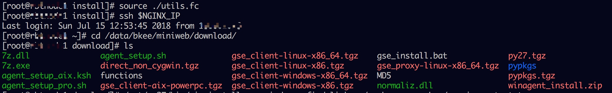
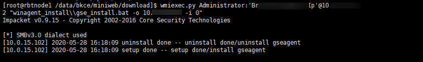

# 手动安装 Agent 使用脚本
## 直连区域 Windows

这节描述的是，Windows 服务器的 Agent 安装方法(有 Cygwin 的 Windows 也适用)。

要求如下：
- Windows 机器的 139，445 端口开放可用访问(可用在安装完后关闭)。
- Windows 机器的密码不含 @ ' " \  等特殊符号(不完全统计, 提示密码错误时可以检查一下)。


因为所需的安装包及脚本都在 Nginx 服务器，所以，方便起见，之间在 Nginx 服务器上操作。

**1. 首先登陆到 Nginx 所在机器**

进入$INSTALL_PATH/miniweb/download 目录。 以下截图中的 $NGINX_IP 需替换成实际的 IP



**2. 安装 所需的 python 包**
解压 pypkgs.tgz，并使用 /opt/py27/bin/pip 安装包。

```bash
foo@nginx-1 download# tar xf pypkgs.tgz
foo@nginx-1 download# /opt/py27/bin/pip install --no-index --find-links=./pypkgs -r pypkgs/requirements.txt
...
...
...
Successfully installed Naked-0.1.31 PyYAML-3.12 appnope-0.1.0 certifi-2017.11.5 cffi-1.11.2 cryptography-2.1.4 decorator-4.1.2 impacket-0.9.15 ipaddress-1.0.19 ipython-5.0.0 pathlib2-2.3.0 pexpect-4.3.1 ptyprocess-0.5.2 pyasn1-0.4.2 pycrypto-2.6.1 scandir-1.6 shellescape-3.4.1 six-1.11.0
```

执行过程无报错，末尾出现 Successfully installed ... 时，表示 ok，否则需要根据实际情况处理异常后继续。

**3. 上传安装包到 Windows 机器**

步骤安装完成后， 可以使用 wmiexec.py 命令了， 使用方法可以`执行 wmiexec.py -h` 查看帮助

```bash
root@nginx-1 download# wmiexec.py Administrator:'密码'@IP地址 "put gse_client-windows-x86_64.tgz"
Impacket v0.9.15 - Copyright 2002-2016 Core Security Technologies

[*] SMBv2.1 dialect used
[*] Uploading gse_client-windows-x86_64.tgz to C:\gse_client-windows-x86_64.tgz
```

```bash
root@rbtnode1 download# wmiexec.py Administrator:'密码'@IP地址 "put gse_client-windows-x86.tgz"
Impacket v0.9.15 - Copyright 2002-2016 Core Security Technologies

[*] SMBv2.1 dialect used
[*] Uploading gse_client-windows-x86.tgz to C:\gse_client-windows-x86.tgz
```

```bash
root@rbtnode1 download# wmiexec.py Administrator:'密码'@IP地址 "put winagent_install.zip"
Impacket v0.9.15 - Copyright 2002-2016 Core Security Technologies

[*] SMBv2.1 dialect used
[*] Uploading winagent_install.zip to C:\winagent_install.zip
```

```bash
[root@rbtnode1 download]# wmiexec.py Administrator:'密码'@IP地址 "put 7z.dll"
Impacket v0.9.15 - Copyright 2002-2016 Core Security Technologies

[*] SMBv2.1 dialect used
[*] Uploading 7z.dll to C:\7z.dll
```

```bash
root@rbtnode1 download# wmiexec.py Administrator:'密码'@IP地址 "put 7z.exe"
Impacket v0.9.15 - Copyright 2002-2016 Core Security Technologies

[*] SMBv2.1 dialect used
[*] Uploading 7z.exe to C:\7z.exe
```

```bash
root@rbtnode1 download# wmiexec.py Administrator:'密码'@IP地址 "put normaliz.dll"
Impacket v0.9.15 - Copyright 2002-2016 Core Security Technologies

[*] SMBv2.1 dialect used
[*] Uploading normaliz.dll to C:\normaliz.dll
root@rbtnode1 download#
```

安装包默认上传到 C 盘根目录下

**4. 远程执行安装脚本**

完成 Windows Agent 安装的脚本是 gse_install.bat。
- gse_install.bat 参数说明

```bash
第一个参数: 主机内网 IP, 连接 GSE, 及绑定数据, 都是用这个 IP
第二个参数: 云区域 ID, 下图中为 0
第三个参数: Proxy 内网 IP, 多个 Proxy 用短横线分隔
第三个参数: Proxy 外网 IP, 多个 Proxy 用短横线分隔
```

> **Note**
>
> 若第一个参数为  -r，则其忽略其余参数，直接卸载 Agent。

接下来登陆远程 Windows，解压安装包， 然后执行安装即可。
注意：执行脚本 gse_install.bat 时的第二个参数是 0，表示云区域 ID。

```bash
root@nginx-1 download# wmiexec.py Administrator:'密码'@IP地址 "7z.exe -y x winagent_install.zip -oC:\\"
```
```bash
root@nginx-1 download# wmiexec.py Administrator:'密码'@IP地址 "winagent_install\\gse_install.bat -o IP地址 -i 0 "
```
输出如下所示：


