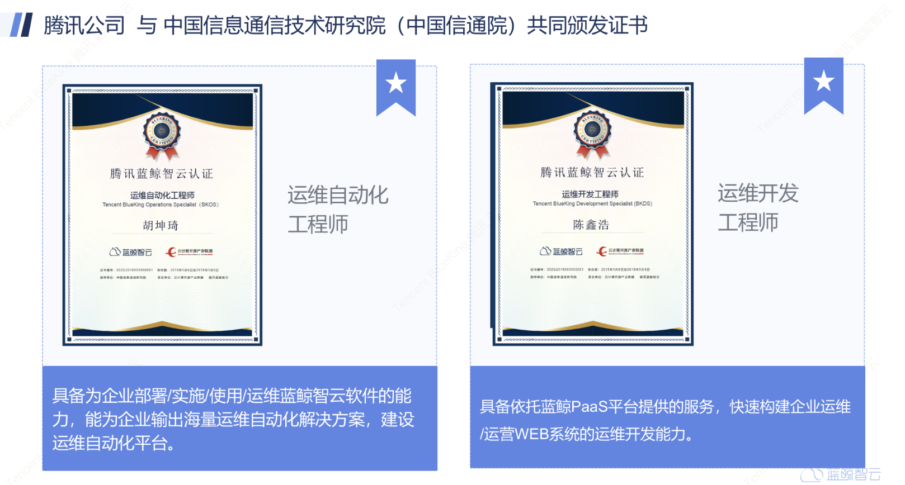

# 客户服务

腾讯蓝鲸智云授权“合作伙伴”提供服务，每年会提供资源提升技术合作伙伴的服务能力，确保客户获得及时有效的技术支持，请客户积极获取正规渠道的技术支持，以保证服务的质量。

- 服务企业资质查询

腾讯蓝鲸智云官网会随时更新授权的企业，可以前往[官网查询](https://bk.tencent.com/cooperation_partner/)或者邮件（contactus_bk@tencent.com）咨询官网。

- 服务员工资质查询

腾讯蓝鲸通过认证考试的模式，提高工程师的技能，客户可以前往“[认证动态](https://bk.tencent.com/training_exam/)”查询服务工程师的能力，也可以主动要求提供服务的工程师出示证书。

温馨提示：该证书具备时效性，目前蓝鲸正在根据认证的能力类型，指定时效声明中，请关注后续官方通知。

