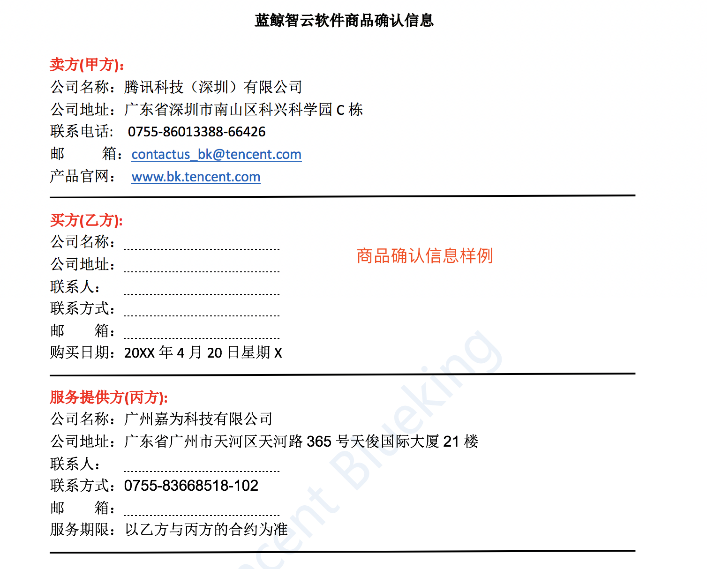

# 软件说明

腾讯蓝鲸智云不直接面向企业客户提供软件的销售和技术支持，由授权的“企业版技术合作伙伴”提供服务。关于合作模式，请参考[“腾讯蓝鲸智云合作伙伴指南”](https://bk.tencent.com/cooperation_partner/)。

- 软件申请

由“企业版技术合作伙伴”发起，经企业客户接口人确认，腾讯工程师审批后，才可以获取有效的软件。
    
- 软件 POC

根据发起人填写的版本、时间、企业名称等有效信息，申请仅用于企业客户 POC 的软件，该软件有效期最长时间不超过 1 年，且不建议客户用于生产环境使用。

- 软件续期

根据发起人与客户的合作情况，发起软件续期申请，经腾讯工程师审核后，交付给发起人证书文件，为客户软件进行续期。

- 软件证书

当客户购买了蓝鲸企业版软件后，将获得由指定邮箱(BKSoftWare@tencent.com)发出的授权邮件，否则为无效软件。

授权模板如下，会根据具体情况做适当调整。

