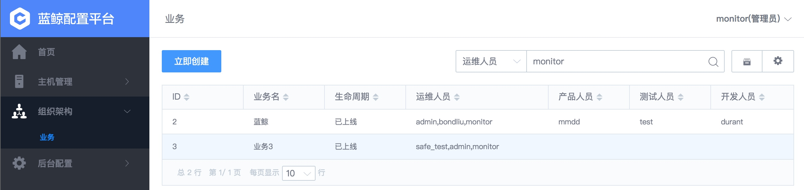
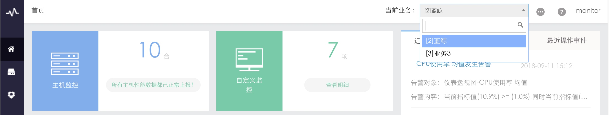

# 权限管理

蓝鲸监控的权限体系分 2 个层面：`业务隔离`、`业务下角色隔离`，均是基于蓝鲸配置平台（CMDB）实现。提供了 **业务访问角色控制** 和  **业务配置查看或变更权限控制** 的功能。

## 业务隔离

配置平台业务间的权限通过业务管理中的角色配置实现业务隔离，不同业务中，拥有对应业务权限的人员才能访问。

如 `monitor` 在配置中心拥有 `蓝鲸` 和 `业务3` 的运维人员业务权限

他在蓝鲸监控中也只有这 2 个业务的权限，因为蓝鲸监控集成了配置平台对角色的业务权限管理。

## 业务下角色隔离

业务中角色权限又分为 `查询` 和 `变更` 权限， `查询` 仅能查看当前业务中监控配置及告警信息，无法修改，`变更` 则可以修改业务中的监控配置，该角色同样继承于蓝鲸配置平台（CMDB）业务中设置的 `运维人员` 、 `产品人员` 、 `测试人员` 、 `开发人员` 权限。

默认运维拥有 `查询` 和 `变更` 权限，其他人员拥有 `查询` 权限。

根据实际使用场景，可以针对单个角色做权限调整。

