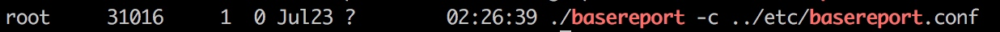

# 主机监控

蓝鲸监控支持以主机为单元的基础性能指标查看、告警策略配置等功能。指标支持 CPU、内存、磁盘、网络、进程、系统、事件（ Corefile 产生 、主机重启等）等 7 类共 30~40 项指标，满足用户对主机层的精准监控。

图 1. 主机监控视图

## 主机基础性能采集方式

[部署蓝鲸 Agent](5.1/节点管理/快速入门/agent0.md) 后，默认会拉起 `basereport` 进程自动上报主机性能指标（CPU、内存、网络、磁盘、TCP 连接数等指标），关于采集器详情可参考附录文档 [采集器概述](../二次开发/plugins.md)

图 2. 基础性能采集器工作状态示意图

主机性能指标默认采集周期为 1 分钟。

## 主机基础性能指标定义

<table>
  <tr>
    <th width="90">指标</th>
    <th width="60">类型</th>
    <th width="60">单位</th>
    <th width="150">含义</th>
    <th>采集方法(Linux)</th>
    <th>采集方法(Windows)</th>

  </tr>
  <tr>
    <td>5 分钟平均负载</td>
    <td>CPU</td>
    <td>%</td>
    <td>五分钟内同时处于就绪状态的平均进程数</td>
    <td>awk ‘{print $2}’ /proc/loadavg</td>
    <td>N/A</td>
  </tr>
  <tr>
    <td>cpu 总使用率</td>
    <td>CPU</td>
    <td>%</td>
    <td>当前消耗的总 CPU 百分比  </td>
    <td>delta(busy) / delta(total) * 100 busy = user + sys + nice + iowait + irq + softirq + steal + guest + guestnice + stolen total = busy + idle</td>
    <td>for /f “tokens=1,2,* delims==” %i in (‘wmic path Win32_PerfFormattedData_Counters_ProcessorInformation where "Name=’_Total’" get PercentIdleTime/value | findstr PercentIdleTime’) do (set /a 100-%j)</td>
    </tr>
    <tr>
      <td>cpu 单核使用率</td>
      <td>CPU</td>
      <td>%</td>
      <td>当前单个 CPU 消耗的百分比</td>
      <td>delta(busy) / delta(total) * 100 busy = user + sys + nice + iowait + irq + softirq + steal + guest + guestnice + stolen total = busy + idle</td>
      <td>for /f “tokens=1,2,* delims==” %i in (‘wmic path Win32_PerfFormattedData_Counters_ProcessorInformation where “not name like ‘%Total%’” get PercentIdleTime/value | findstr PercentIdleTime’) do (set /a 100-%j)</td>
      </tr>
      <tr>
      <td>接收字节流量</td>
      <td>网络</td>
      <td>KB/s</td>
      <td>网卡每秒接收的比特数，即网卡的上行带宽</td>
      <td>读取/proc/net/dev 文件 第 1 项 SpeedRecv = delta(new.BytesRecv, old.BytesRecv) / interval</td>
      <td>wmic path Win32_PerfRawData_Tcpip_NetworkInterface get BytesReceivedPersec/value | findstr BytesReceivedPersec</td>
    </tr>
    <tr>
      <td>发送字节流量</td>
      <td>网络</td>
      <td>KB/s</td>
      <td>网卡每秒发送的比特数，即网卡的下行带宽</td>
      <td>读取/proc/net/dev 文件第 9 项 SpeedSent = delta(new.BytesSent, old.BytesSent) / interval</td>
      <td>wmic path Win32_PerfRawData_Tcpip_NetworkInterface get BytesSentPersec/value | findstr BytesSentPersec</td>
    </tr>
    <tr>
      <td>发送包速率</td>
      <td>网络</td>
      <td>个/s</td>
      <td>网卡每秒接收的数据包数</td>
      <td>读取/proc/net/dev 文件 第 10 项 SpeedPacketsSent = (counterDiff(once.Stat[i].PacketsSent, val.PacketsSent, NetCoutnerMaxSize)) / interval</td>
      <td>wmic path Win32_PerfRawData_Tcpip_NetworkInterface get PacketsSentPersec/value | findstr PacketsSentPersec</td>
    </tr>
    <tr>
      <td>接收包速率</td>
      <td>网络</td>
      <td>个/s</td>
      <td>网卡每秒接收的数据包数</td>
      <td>读取/proc/net/dev 文件 第 2 项 SpeedPacketsRecv = delta(new.PacketsRecv, old.PacketsRecv) / interval</td>
      <td>wmic path Win32_PerfRawData_Tcpip_NetworkInterface get PacketsReceivedPersec/value | findstr PacketsReceivedPersec</td>
    </tr>
    <tr>
      <td>established 连接数</td>
      <td>网络</td>
      <td>个</td>
      <td>当前服务器下 TCP 链接处于 ESTABLISHED 状态的连接数</td>
      <td>系统 netlink 实现 验证方法 netstat -pant|grep ESTABLISHED</td>
      <td>netstat -ano -p tcp | more +4 | find " ESTABLISHED "</td>
    </tr>
    <tr>
      <td>time_wait 连接数</td>
      <td>网络</td>
      <td>个</td>
      <td>当前服务器下 TCP 链接处于 TIME_WAIT 状态的连接数</td>
      <td>系统 netlink 实现 验证方法 netstat -pant|grep TIME_WAIT</td>
      <td>netstat -ano -p tcp | more +4 | find " TIME_WAIT "</td>
    </tr>
    <tr>
      <td>listen 连接数</td>
      <td>网络</td>
      <td>个</td>
      <td>当前服务器下 TCP 链接处于 LISTEN 状态的连接数</td>
      <td>系统 netlink 实现 验证方法 netstat -pant|grep LISTEN</td>
      <td>netstat -ano -p tcp | more +4 | find " LISTENING "</td>
    </tr>
    <tr>
      <td>last_ack 连接数</td>
      <td>网络</td>
      <td>个</td>
      <td>当前服务器下 TCP 链接处于 LAST_ACK 状态的连接数</td>
      <td>系统 netlink 实现 验证方法 netstat -pant|grep LAST_ACK</td>
      <td>netstat -ano -p tcp | more +4 | find " LAST_ACK "</td>
    </tr>
    <tr>
      <td>syn_recv 连接数</td>
      <td>网络</td>
      <td>个</td>
      <td>当前服务器下 TCP 链接处于 SYN_RECV 状态的连接数</td>
      <td>系统 netlink 实现 验证方法 netstat -pant|grep SYNC_RECV</td>
      <td>netstat -ano -p tcp | more +4 | find " SYN_RECV "</td>
    </tr>
    <tr>
      <td>syn_sent 连接数</td>
      <td>网络</td>
      <td>个</td>
      <td>当前服务器下 TCP 链接处于 SYN_SENT 状态的连接数</td>
      <td>系统 netlink 实现 验证方法 netstat -pant|grep SYNC_SENT</td>
      <td>netstat -ano -p tcp | more +4 | find " SYN_SENT "</td>
    </tr>
    <tr>
      <td>fin_wait1 连接数</td>
      <td>网络</td>
      <td>个</td>
      <td>当前服务器下 TCP 链接处于 FIN_WAIT1 状态的连接数</td>
      <td>系统 netlink 实现 验证方法 netstat -pant|grep FIN_WAIT1</td>
      <td>netstat -ano -p tcp | more +4 | find " FIN_WAIT_1 "</td>
    </tr>
    <tr>
      <td>fin_wait2 连接数</td>
      <td>网络</td>
      <td>个</td>
      <td>当前服务器下 TCP 链接处于 FIN_WAIT2 状态的连接数</td>
      <td>系统 netlink 实现 验证方法 netstat -pant|grep FIN_WAIT2</td>
      <td>netstat -ano -p tcp | more +4 | find " FIN_WAIT_2 "</td>
    </tr>
    <tr>
      <td>closing 连接数</td>
      <td>网络</td>
      <td>个</td>
      <td>当前服务器下 TCP 链接处于 CLOSING 状态的连接数</td>
      <td>系统 netlink 实现 验证方法 netstat -pant|grep CLOSING</td>
      <td>netstat -ano -p tcp | more +4 | find " CLOSING "</td>
    </tr>
    <tr>
      <td>closed 状态连接数</td>
      <td>网络</td>
      <td>个</td>
      <td>当前服务器下 TCP 链接处于 CLOSED 状态的连接数</td>
      <td>系统 netlink 实现 验证方法 netstat -pant|grep CLOSED</td>
      <td>netstat -ano -p tcp | more +4 | find " CLOSE "</td>
    </tr>
    <tr>
      <td>UDP 接收包量</td>
      <td>网络</td>
      <td>个</td>
      <td>UDP 包接受数</td>
      <td>读取 /proc/net/snmp 文件 InDatagrams 项 cat /proc/net/snmp|grep Udp:|grep -v ‘InDatagrams’|awk ‘{print $2}’</td>
      <td>wmic path Win32_PerfFormattedData_Tcpip_UDPv4 get DatagramsReceivedPersec/value</td>
    </tr>
    <tr>
      <td>UDP 发送包量</td>
      <td>网络</td>
      <td>个</td>
      <td>	UDP 包发送数</td>
      <td>读取 /proc/net/snmp 文件 OutDatagrams 项 cat /proc/net/snmp|grep Udp:|grep -v ‘InDatagrams’|awk ‘{print $5}’</td>
      <td>读取/proc/net/dev 文件 第 2 项 SpeedPacketsRecv = delta(new.PacketsRecv, old.PacketsRecv) / interval</td>
    </tr>
    <tr>
      <td>可用物理内存</td>
      <td>内存</td>
      <td>MB</td>
      <td>可用内存容量</td>
      <td>读取 /proc/meminfo 文件 MemTotal 字段*1024 cat /proc/meminfo |grep ‘MemTotal’|awk -F ‘:’ ‘{print $2}’|awk ‘{print $1}’|awk ‘{print $1 * 1024}’</td>
      <td>for /f “tokens=1,2,* delims==” %i in (‘wmic OS get FreePhysicalMemory/value| findstr FreePhysicalMemory’) do (set /a %j/1024)</td>
    </tr>
    <tr>
      <td>交换分区已用量</td>
      <td>内存</td>
      <td>MB</td>
      <td>交换分区使用容量</td>
      <td>读取 /proc/meminfo 文件 golang 系统调用 syscall.Sysinfo sysinfo.Totalswap - sysinfo.Freeswap 验证方法 free -m</td>
      <td>wmic os get TotalSwapSpaceSize/value</td>
    </tr>
    <tr>
      <td>物理内存使用率</td>
      <td>内存</td>
      <td>%</td>
      <td>内存使用百分比</td>
      <td>读取 /proc/meminfo 文件[MemTotal-MemFree]/MemTotal*100.0</td>
      <td>wmic os get FreePhysicalMemory,TotalVisibleMemorySize/value</td>
    </tr>
    <tr>
      <td>物理内存使用率</td>
      <td>内存</td>
      <td>MB</td>
      <td>已经使用的内存容量</td>
      <td>读取 /proc/meminfo 文件[MemTotal-MemFree]*1024</td>
      <td>wmic os get FreePhysicalMemory,TotalVisibleMemorySize/value | findstr “FreePhysicalMemory TotalVisibleMemorySize”</td>
    </tr>
    <tr>
      <td>应用内存使用量</td>
      <td>内存</td>
      <td>MB</td>
      <td>应用进程使用的内存量</td>
      <td>读取 /proc/meminfo 文件 如果有 MemAvailable 字段（不同系统版本有差异）(MemTotal-MemAvailable)/1024,如果没有该字段，MemAvailable=MemFree+Buffers+Cached</td>
      <td>N/A</td>
    </tr>
    <tr>
      <td>应用内存使用率</td>
      <td>内存</td>
      <td>%</td>
      <td>应用进程内存量占总内存的百分比</td>
      <td>读取 /proc/meminfo 文件 (MemTotal-MemAvailable)/（MemTotal*100.0），如果没有 MemAvailable 字段，则 MemAvailable=MemFree+Buffers+Cached</td>
      <td>N/A</td>
    </tr>
    <tr>
      <td>磁盘使用率</td>
      <td>磁盘</td>
      <td>%</td>
      <td>磁盘已用空间的百分占比</td>
      <td>golang 系统调用 syscall.Statfs 相当于 df</td>
      <td>for /f “tokens=1,2,* delims==” %i in (‘wmic path Win32_PerfFormattedData_PerfDisk_LogicalDisk where “name like ‘%:%’” get PercentFreeSpace/value | findstr PercentFreeSpace’) do (set /a 100-%j)</td>
    </tr>
    <tr>
      <td>读速率</td>
      <td>磁盘</td>
      <td>次/s</td>
      <td>磁盘每秒输出次数</td>
      <td>	读取 /proc/diskstats 每一行的第四项 float64((new_stat.ReadCount - stat.ReadCount)) / 60 只上报逻辑分区</td>
      <td>wmic path Win32_PerfFormattedData_PerfDisk_LogicalDisk get DiskReadsPersec/value</td>
    </tr>
    <tr>
      <td>写速率</td>
      <td>磁盘</td>
      <td>次/s</td>
      <td>磁盘每秒写入次数</td>
      <td>读取 /proc/diskstats 第 8 项 float64((new_stat.WriteCount - stat.WriteCount)) / 60 只上报逻辑分区</td>
      <td>wmic path Win32_PerfFormattedData_PerfDisk_LogicalDisk get DiskWritesPersec/value</td>
    </tr>
    <tr>
      <td>磁盘 IO 使用率</td>
      <td>磁盘</td>
      <td>%</td>
      <td>磁盘处于活动时间的百分比</td>
      <td>读取 /proc/diskstats 文件读取 /proc/diskstats 第 13 项 （new_stat.IoTime - stat.IoTime）/60.0 / 1000.0</td>
      <td>for /f “tokens=1,2,* delims==” %i in (‘wmic path Win32_PerfFormattedData_PerfDisk_LogicalDisk where "Name=’_Total’" get PercentIdleTime/value | findstr PercentIdleTime’) do (set /a 100-%j)</td>
    </tr>
    <tr>
      <td>系统进程数</td>
      <td>进程</td>
      <td>个</td>
      <td>系统已启动进程数量</td>
      <td>抓取/proc 目录下所有子目录数量</td>
      <td>wmic path win32_process get ProcessId/value</td>
    </tr>
    <tr>
      <td>Agent 心跳丢失-GSE</td>
      <td>事件</td>
      <td>/</td>
      <td>监测 GSE 的 Agent 是否正常</td>
      <td>N/A</td>
      <td>N/A</td>
    </tr>
    <tr>
      <td>磁盘只读-GSE</td>
      <td>事件</td>
      <td>/</td>
      <td>监测磁盘状态</td>
      <td>N/A</td>
      <td>N/A</td>
    </tr>
    <tr>
      <td>磁盘写满-GSE</td>
      <td>事件</td>
      <td>/</td>
      <td>监测磁盘状态</td>
      <td>N/A</td>
      <td>N/A</td>
    </tr>
    <tr>
      <td>Corefile 产生-GSE</td>
      <td>事件</td>
      <td>/</td>
      <td>监测/proc/sys/kernel/core_pattern 中目录内文件的变化</td>
      <td>N/A</td>
      <td>N/A</td>
    </tr>
    <tr>
      <td>PING 不可达告警-GSE</td>
      <td>事件</td>
      <td>/</td>
      <td>监测 PING 不可达事件告警</td>
      <td>N/A</td>
      <td>N/A</td>
    </tr>
    <tr>
      <td>进程端口</td>
      <td>事件</td>
      <td>/</td>
      <td>进程对应端口</td>
      <td>N/A</td>
      <td>wmic path win32_process get */value 和 netstat -ano</td>
    </tr>
    <tr>
      <td>自定义字符型</td>
      <td>事件</td>
      <td>/</td>
      <td>N/A</td>
      <td>N/A</td>
      <td>N/A</td>
    </tr>
    <tr>
      <td>系统启动时间异常</td>
      <td>事件</td>
      <td>/</td>
      <td>监测系统启动异常告警</td>
      <td>N/A</td>
      <td>N/A</td>
    </tr>
