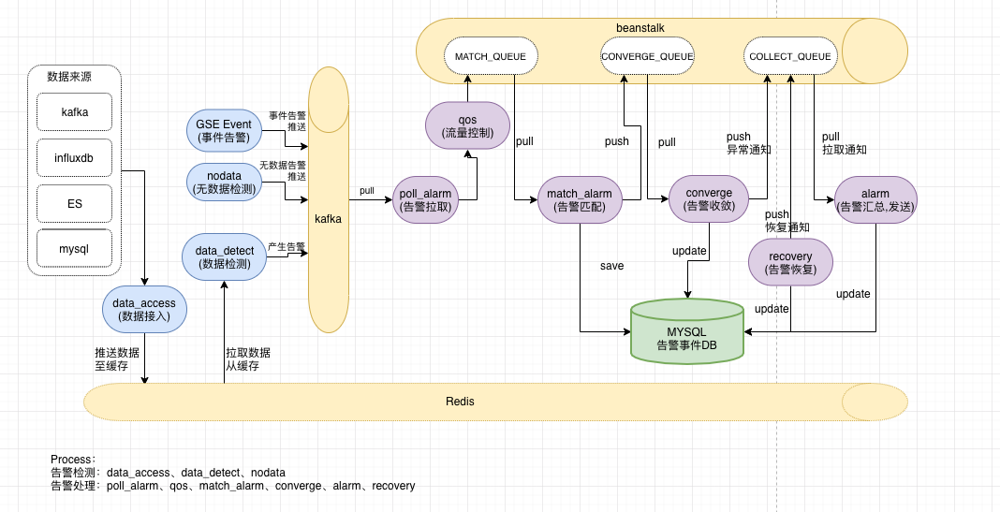

# 产品架构

（图 1. 蓝鲸监控产品架构图）

---

（图 2. 蓝鲸数据链路架构图）

蓝鲸监控是蓝鲸体系数据链路的重要一环，根据用户的配置，从蓝鲸基础平台（配置平台、管控平台和作业平台）获取数据源，数据传递到数据基础模块进行分析和计算处理后，将数据分发入库，蓝鲸监控后台服务在数据库（InfluxDB）获取数据二次处理后提取到 SaaS 以供用户使用。

（图 3. 蓝鲸监控数据链路架构图）

（图 4. 蓝鲸监控数据链路架构图 - 清洗配置生流程 ）

