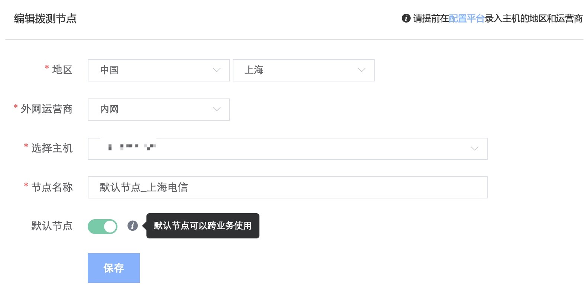

# 采集

服务拨测的采集主要分为两个部分，先是：`添加拨测节点`，然后`添加拨测任务`。

- **2.1 拨测节点**

`拨测节点`是部署蓝鲸 Gse_Agent 的主机，服务拨测的逻辑是从`拨测节点`向`目标地址`探测服务可用性。

- **2.2 添加拨测节点**

通过主机属性：`国家`、`地区` 和 `外网运营商` 从配置平台中筛选主机作为拨测节点。

`外网运营商`字段选择`内网`：为探测内网服务可用性而设，只会使用内网 IP ，不会筛选运营商等外网属性，选择`电信`等其他运营商：只会使用外网 IP，探测外网服务可用性。

> 管理员身份可以添加默认节点，供跨业务场景的节点使用。

- **2.3 拨测任务**

选择节点后，配置不同的协议对网站/应用服务进行主动拨测，就是服务拨测采集的第二步：添加拨测任务

2.3.1 HTTP(S) 协议

默认新建的拨测协议为 HTTP(S) ，即 HTTP 或 HTTPS 协议。

  - GET 方法

    - 1.在地址栏输入待拨测的 Web 服务 URL 地址
    - 2.选择节点。如果默认节点不满足，可以新增节点。
    - 3.设置期望响应时间：设置服务正常的响应时间范围，比如 3000ms ，超过会产生告警。
    - 4.设置任务分组区分不同类别的拨测任务
    - 5.设置任务名称便于标识。

    

  - POST 方法

    - 与 GET 方法相比多一项`提交内容`：输入需要提交的请求内容

    

>> POST 请求可提前通过作业平台在拨测节点本地测试，测试成功后再通过蓝鲸监控进行服务拨测

  - 高级设置

    此处设置 HTTP 拨测的高级特性，比如拨测周期、期望返回码、期望响应信息、地理位置（用于大屏展示）或请求的头信息。

    - 期望返回码：可以为： `200` 、 `301` 等，如果返回码与填写的期望值不一致，则会产生告警。
    - 匹配响应信息：例如 `Welcome` ，如果 Web 页面返回的内容中不包含 `Welcome` ，则产生告警。
    - 地理位置：[大屏展示](../../产品功能/Uptime_Check_desc.md)功能中中，拨测数据流转的目的地。
    - 头信息：请求的头信息，比如 `Cookies` 。

      

2.3.2 TCP 协议

  - 从拨测节点探测 TCP 服务的可用性。

    

  - 高级选项请参照 `HTTP 拨测` 。

2.3.3 UDP 拨测

  - 从拨测节点探测 UDP 服务的可用性

    

  - 由于 UDP 无状态，需发送 UDP 服务允许接受的请求内容，同时 UDP 服务返回内容，才能探测服务是否连通。

  -  高级选项，请参照 HTTP 拨测

> 请求内容请转换为 16 进制。
