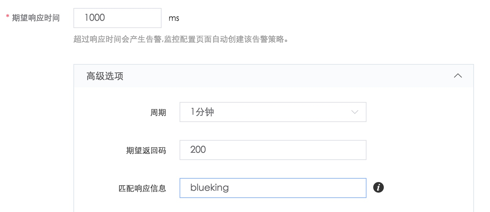

# 策略配置

4.1 创建拨测任务成功后，默认会创建 2 条策略：可用率小于 100%  和响应时间小于 3000ms （该时间非固定值，取决于拨测任务配置的期望响应时间）。

4.2 配置服务拨测告警策略

可以在监控配置页的服务拨测 TAB，创建或修改策略。

由于 HTTP 状态码和响应内容的策略需要下发至 Gse_Agent ，所以请在拨测任务的高级设置中创建该策略，创建完成后可在策略配置页面修改告警规则、通知方式等。

4.3 查看拨测告警

在事件中心可以找到服务拨测的告警

点击告警 ID，可以找到单个拨测任务的告警详情

