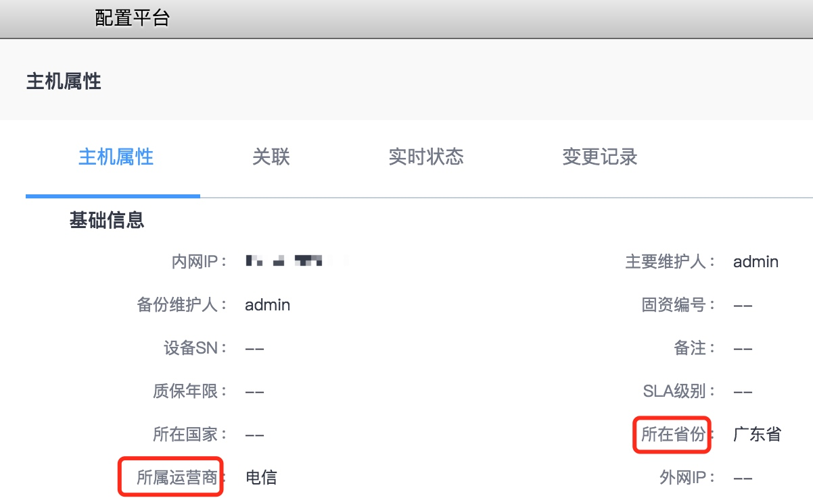

# 服务拨测

如何通过蓝鲸监控主动探测网站/应用服务的可用性。

## 前置步骤

依赖组件：配置平台，管控平台，节点管理

 用户需要将受控主机导入配置平台并安装 Agent （[配置平台快速入门](../../../配置平台/快速入门/case1.md)），或通过节点管理直接在对应业务下安装 Agent 导入主机（[节点管理快速入门](../../../节点管理/快速入门/agent0.md)）。在配置平台中需要为主机属性补充上地区信息

