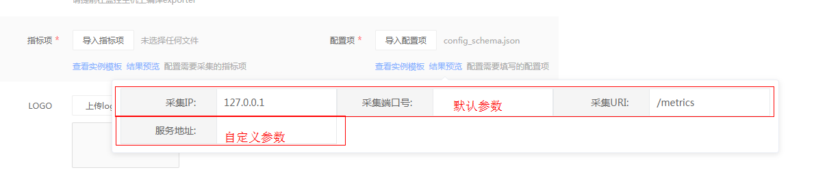

# 自定义组件采集导入教程

## 1 数据链路

### 1.1 监控整体链路图


### 1.2 自定义组件采集流程


**蓝鲸监控通过 job 部署 prometheus 社区的 exporter，对目标组件进行性能数据采集。接着 bkmetricbeat 从 exporter 上周期拉取性能数据并通过数据通道上报。**

## 2 自定义组件采集导入流程

**蓝鲸监控当前支持使用 go 编写 exporter。**

  (1)在[社区](https://promet heus.io/docs/instrumenting/exporters/)找到适合自己的 exporter 或者编写新的 exporter。

  (2)将源码编译成二进制文件。

  (3)将编译的 exporter 打成 zip 包

  (4)上传配置文件。

### 2.1 蓝鲸监控 Exporter 开发指引

#### 2.1.1 Exporter 简介

**Exporter 本质上就是将收集的数据，转化为对应的文本格式，并提供 http 接口，供蓝鲸监控采集器定期采集数据**

#### 2.1.2 Exporter 基础

 **指标介绍**


Prometheus 中主要使用的四类指标类型，如下所示
- Counter (累加指标)
- Gauge (测量指标)
- Summary (概略图)
- Histogram (直方图)

最常使用的是 Gauge，Gauge 代表了采集的一个单一数据，这个数据可以增加也可以减少，比如 CPU 使用情况，内存使用量，硬盘当前的空间容量等。

Counter 一个累加指标数据，这个值随着时间只会逐渐的增加，比如程序完成的总任务数量，运行错误发生的总次数等，代表了持续增加的数据包或者传输字节累加值。


【**注**】：所有指标的值仅支持 float64 类型

**文本格式**

以下面得输出为例：

```bash
# metric:
sample_metric1 12.47
sample_metric2{partition="c:"} 0.44

```
**其中**：
- ```#```表示注释
- ```sample_metric1```和```sample_metric2```表示指标名称
- ```partition```表示指标得作用维度，例如磁盘分区使用率，维度就是磁盘分区，即每个磁盘分区都有一个磁盘分区使用率的值
- ```xxx```表示维度的值，例如磁盘分区的 C 盘/D 盘等
- ```12.47```和```0.44```表示对应指标的值

### 2.2 蓝鲸监控 Exporter 开发
#### 2.2.1 依赖
首先引入 Prometheus 的依赖库

```bash
go get github.com/prometheus/client_golang/prometheus

```
#### 2.2.2 开发实例
(1)新建一个 exporter 项目：
一个 exporter 只需要一个文件即可；新建一个 test_exporter 目录和一个 test_exporter.go 文件:


(2)导入依赖模块
```go
import (
	"flag"
	"log"
	"net/http"
	"github.com/prometheus/client_golang/prometheus"
	"github.com/prometheus/client_golang/prometheus/promhttp"
)
```

(3)定义 exporter 的版本（Version）、监听地址（listenAddress）、采集 url（metricPath）以及首页（landingPage）

```go
var (
	Version       = "1.0.0.dev"
	listenAddress = flag.String("web.listen-address", ":9601", "Address to listen on for web interface and telemetry.")
	metricPath    = flag.String("web.telemetry-path", "/metrics", "Path under which to expose metrics.")
	landingPage   = []byte("<html><head><title>SYS Exporter " + Version +
		"</title></head><body><h1>SYS Exporter " + Version + "</h1><p><a href='" + *metricPath + "'>Metrics</a></p></body></html>")
)
```

(4)定义 Exporter 结构体

```go
type Exporter struct {
	error        prometheus.Gauge
	scrapeErrors *prometheus.CounterVec
}
```

(5)定义结构体实例化的函数 NewExporter

```go
func NewExporter() *Exporter {
	return &Exporter{
	}
}
```

(6)Describe 函数，传递指标描述符到 channel，这个函数不用动，直接使用即可，用来生成采集指标的描述信息

```go
func (e *Exporter) Describe(ch chan<- *prometheus.Desc) {
	metricCh := make(chan prometheus.Metric)
	doneCh := make(chan struct{})

	go func() {
		for m := range metricCh {
			ch <- m.Desc()
		}
		close(doneCh)
	}()

	e.Collect(metricCh)
	close(metricCh)
	<-doneCh

}
```

(7)Collect 函数将执行抓取函数并返回数据，返回的数据传递到 channel 中，并且传递的同时绑定原先的指标描述符，以及指标的类型（Guage）；需要将所有的指标获取函数在这里写入。

```go
//collect函数，采集数据的入口
func (e *Exporter) Collect(ch chan<- prometheus.Metric) {
	var err error
	//每个指标值的采集逻辑，在对应的采集函数中
	if err = ScrapeMem(ch); err != nil {
		e.scrapeErrors.WithLabelValues("Mssql_Connections per sec").Inc()
	}
	if err = ScrapeDisk(ch); err != nil {
		e.scrapeErrors.WithLabelValues("localtime").Inc()
	}
}
```

(8)指标仅有单条数据，不带维度信息示例如下：
```go
func ScrapeMem(ch chan<- prometheus.Metric) error {
	//指标获取逻辑，此处不做具体操作，仅仅赋值进行示例
	mem_usage := float64(60)
	//生成采集的指标名
	metric_name := prometheus.BuildFQName("sys", "", "mem_usage")
	//生成NewDesc类型的数据格式，该指标无维度，[]string{}为空
	new_desc := prometheus.NewDesc(metric_name, "Gauge metric with mem_usage", []string{}, nil)
	//生成具体的采集信息并写入ch通道
	metric_mes := prometheus.MustNewConstMetric(new_desc, prometheus.GaugeValue, mem_usage)
	ch <- metric_mes
	return nil
}
```

(9)指标有多条数据，带维度信息示例如下：
```go
func ScrapeDisk(ch chan<- prometheus.Metric) error {
	disks_mes := []interface{}{
		map[string]interface{}{
			"name":      "C:/",
			"disk_size": float64(100),
		},
		map[string]interface{}{
			"name":      "D:/",
			"disk_size": float64(200),
		},
	}
	for _, disk_mes := range disks_mes {
		disk_name := disk_mes.(map[string]interface{})["name"].(string)
		disk_size := disk_mes.(map[string]interface{})["disk_size"].(float64)
		metric_name := prometheus.BuildFQName("sys", "", "disk_size")
		//该例子具有disk_name的维度，须在[]string{"disk_name"}
		new_desc := prometheus.NewDesc(metric_name, "Gauge metric with disk_size", []string{"disk_name"}, nil)
		metric_mes := prometheus.MustNewConstMetric(new_desc, prometheus.GaugeValue, disk_size, disk_name)
		ch <- metric_mes
	}
	return nil
}

```


(10)主函数
```go
func main() {
	//解析定义的监听端口等信息
	flag.Parse()
	//生成一个Exporter类型的对象，该exporter需具有collect和Describe方法
	exporter := NewExporter()
	//将exporter注册入prometheus，prometheus将定期从exporter拉取数据
	prometheus.MustRegister(exporter)
	//接收http请求时，触发collect函数，采集数据
	http.Handle(*metricPath, promhttp.Handler())
	http.HandleFunc("/", func(w http.ResponseWriter, r *http.Request) {
		w.Write(landingPage)
	})
	log.Fatal(http.ListenAndServe(*listenAddress, nil))
}
```
(11)编译 Exporter

```go
go build test_exporter.go
```

(12)cmd/shell 中运行即可，访问http://127.0.0.1:9601/metrics 即可验证


至此 Exporter 开发完成，其中 8，9 两步中的函数是重点，目前仅仅写了一些数据进行示例，其中的监控指标获取数据就是该部分的主要功能，需要编写对应逻辑获取指标的值。

### 2.3 exporter 编译
**蓝鲸监控 exporter 默认只支持 64 位机器运行 exporter。**
- windows

 ```env CGO_ENABLED=0 GOOS=windows GOARCH=amd64 go build -o ./exporter-windows.exe test_exporter.go```
- linux

 ```env CGO_ENABLED=0 GOOS=linux GOARCH=amd64 go build -o ./exporter-linux test_exporter.go```

### 2.4 exporter 打包
- 上传的 exporter 文件限定为 zip 压缩包

- 上传后，后台会读取相应的压缩包特定名称的文件，因此必须保证命名的准确性。读取的文件如下：
`exporter-linux`: linux 采集器

 `exporter-windows.exe`: windows 采集器

- 至少提供以上任意一种采集器，否则会报错；如果只上传了一种采集器，那视为该组件不支持其他系统。

- 上传成功后如下图：


### 2.5 配置文件开发

#### 2.5.1 指标项

- 通常，Exporter 上报的指标(metric)种类非常多，而用户只会关心其中一部分重要指标。因此用户需要通过编写指标配置文件来配置自己关注的指标。同时，配置文件也决定了结果表的格式。

 `指标配置文件是 JSON 格式的文件。


- 配置文件样例
```go
[{
    "fields": [{
        "monitor_type": "metric",
        "type": "double",
        "name": "sys_disk_size",
        "unit": "%",
        "description": "磁盘使用率"
    }, {
        "monitor_type": "dimension",
        "type": "string",
        "name": "mountpoint",
        "unit": "",
        "description": "挂载点"
    }],
    "table_name": "disk",
    "table_desc": "磁盘"
},
{
    "fields": [{
        "monitor_type": "metric",
        "type": "double",
        "name": "sys_mem_usage",
        "unit": "%",
        "description": "内存使用率"
    }],
    "table_name": "mem",
    "table_desc": "内存"
}]
```
- 数据结构说明
首先，最外层为列表，列表的每个元素为 Object，每个元素均代表一个结果表。

每个元素的字段说明和取值见下表：

| 字段名                  | 解释                       | 是否必填 | 取值                           | 最大长度 |
|:------------------------|:---------------------------|:---------|:-------------------------------|:---------|
| table_name              | 结果表英文名               | 是       | ^[a-zA-Z][a-zA-Z0-9_]*$        | 15       |
| table_desc              | 结果表中文描述             | 是       |                                | 15       |
| fields[].monitor_type   | 字段类型                   | 是       | 可选"metric"和"dimension"      |          |
| fields[].type           | 字段数据类型               | 是       | 可选"long", "double"和"string" |          |
| fields[].name           | 字段名称，不能超过 50 个字符 | 是       | ^[a-zA-Z][a-zA-Z0-9_]*$        | 50       |
| fields[].unit           | 字段单位，可空             | 是       |                                |          |
| fields[].description    | 字段描述                   | 是       |                                | 15       |
| fields[].is_diff_metric | 是否为差值指标             | 否       | true 或 false                  | |        |

#### 2.5.2 配置项（exporter 启动参数配置）
- 大多数 exporter 在启动时，需要提供额外的参数，如服务地址等。因此用户需要对启动所需参数项进行配置，在 exporter 启动时才能提供对应参数值。
`参数配置文件是**JSON格式**的文件。`


配置项将直接体现在配置表单中

- 配置文件样例
```go
[{
    "default": "http://localhost:9601/metrics",
    "mode": "collector",
    "type": "text",
    "name": "_exporter_url_",
    "description": "采集URL",
    "visible": false
},{
    "default": "localhost:9601",
    "mode": "cmd",
    "type": "text",
    "name": "--web.listen-address",
    "description": "监听地址",
    "visible": false
}]
```
- 数据结构说明

 首先，最外层为列表，列表的每个元素为 Object，每个元素均代表一个配置项。

 每个元素的字段说明和取值见下表：

| 字段名      | 解释                                     | 是否必填 | 取值                                                                        | 最大长度 |
|:------------|:-----------------------------------------|:---------|:----------------------------------------------------------------------------|:---------|
| name        | 配置名称，可空，为空时必须将该项置于首位 | 是       |                                                                             | 50       |
| mode        | 传参方式                                 | 是       | 可选"cmd"(命令行参数)，"env"(环境变量)或"collector"(_exporter_url_字段专用) |          |
| type        | 数据类型                                 | 是       | 可选"text"，"password"或"file"(需要上传文件)                                |          |
| description | 配置描述                                 | 是       |                                                                             | 50       |
| default     | 配置默认值，可空                         | 是       |                                                                             | |        |


- 命令行参数拼接规则

  (1)当配置名称以 ```--```开头，参数名称和参数值的拼接方式为用```=```拼接，如`--settings=something`

  (2)当配置名称不以`--`开头，参数名称和参数值的拼接方式为用空格拼接，如 ```-settings something```

- 重要提示

  配置文件中，必须提供```_exporter_url_```参数。该参数为获取 metric 的完整 url。且该参数必须设置默认值。出于安全考虑，监听地址的 IP 只能设置为```127.0.0.1```或```localhost```，配置方式参见上述样例。

#### 2.5.3 logo

  155*65 的图片即可
#### 2.5.4 描述
  使用 Markdown 语法编写组件描述，在用户组件接入时提供指导。


#### 2.5.5 保存自定义组件采集

- 填写组件名

   (1)上传 exporter

   (2)上传 metrics.json

   (3)上传 config_schema.json

   (4)上传 logo.png

   (5)上传 description.md


- 选择服务器

- 填写配置

- 采集测试

- 设置采集周期

- 完成并下发采集器

以上动作完成后，在组件监控页面，将会多一个组件。选择自定义分类，可以看到所有自定义采集的组件。


### 3 自定义组件一键导入

为了方便自己开发的组件采集 exporter 可以共享给更多的用户，蓝鲸监控支持一键导入。
已经添加成功的自定义组件，可以按照以下格式打成 zip 压缩包：

  (1)后台解析文件时，无视文件目录结构，直接扫描符合命名规则的文件。

  (2)不得出现相同文件名的文件，否则会报错。

| 文件名               | 解释                                                   |
|:---------------------|:-------------------------------------------------------|
| exporter-linux       | linux exporter 的二进制文件 （至少提供一种 exporter）    |
| exporter-windows.exe | windows exporter 的二进制文件 （至少提供一种 exporter）  |
| logo.png             | 组件 Logo，限定 PNG 格式                                  |
| description.md       | 组件描述，限定 Markdown 格式                             |
| metrics.json         | 指标项配置文件，配置格式参见 指标配置文件              |
| config_schema.json   | 配置项配置文件，配置格式参见 exporter 启动参数配置文件  |
| info.json            | exporter 包信息，需要提供 name(必须)和 display_name(可选) |

####  info.json

以上文件列表，有一个新的文件```info.json```
info.json 文件示例
```go
{
    "name":"example",
    "display_name":"example",
    "supported_version":"linux"
}
```
| 字段名            | 含义                                       |
|:------------------|:-------------------------------------------|
| name              | 组件名称，唯一标识符，只能由字母和数字组成 |
| display_name      | 组件显示名称                               |
| supported_version | 采集器支持版本，版本信息会显示在配置页面上 |
显示效果如下


### 4 自定义组件更新
如果需要更新组件，进入编辑模式，选择相应文件进行更新即可


[附件](http://bkopen-1252002024.file.myqcloud.com/public/exporter_example.zip)是一个样例 exporter 一键导入包，另外包含了打包好的 exporter 以及源码

使用附件导入后，选择主机下发后，效果如下：


