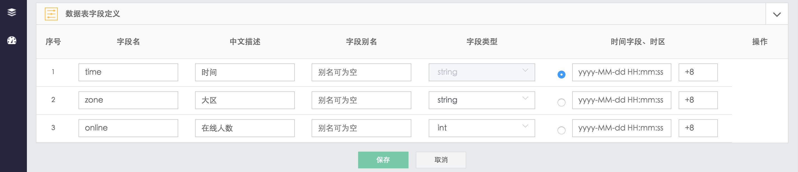

# 采集

实时捕获日志文件的变动（借助 Linux 的 inotify 事件)，通过分隔符完成日志格式清洗，将其作为时序数据做监控。

在`采集中心`中找到日志采集

图 1. 采集中心-日志采集

## 1. 按照提示，填写上报内容

图 2. 日志采集-参数填写

## 2. 保存后，可以在列表页找到采集项

图 3. 日志采集-列表

## 3. 点击预览，可以查看数据的上报情况

图 4. 日志采集数据上报情况

> 日志采集的当前版本不支持跨云、Windows，同时数据落地为 MySQL。后续版本会改造以支持。
