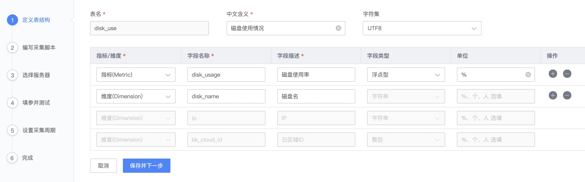
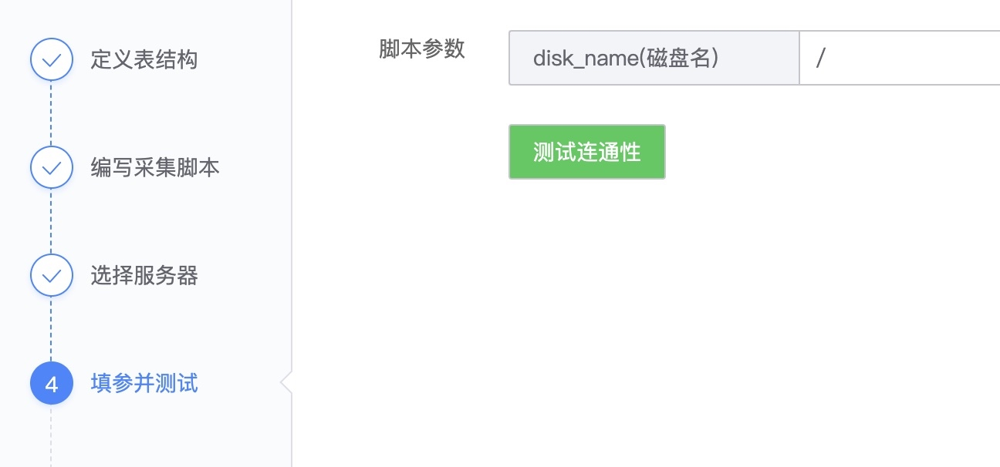
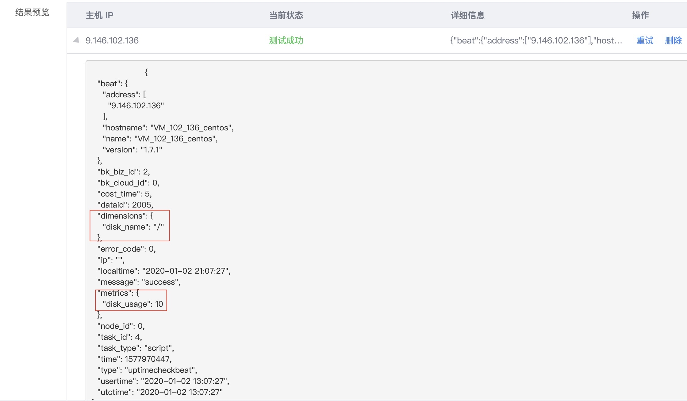
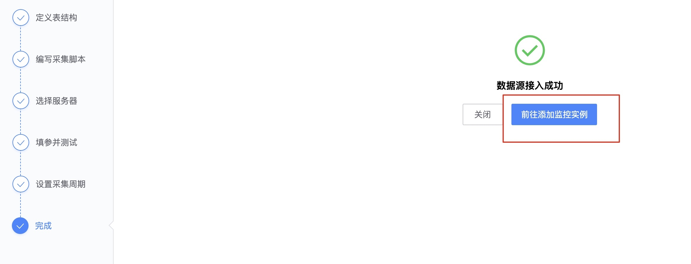
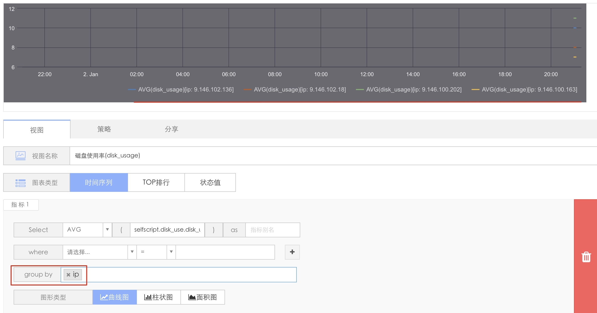
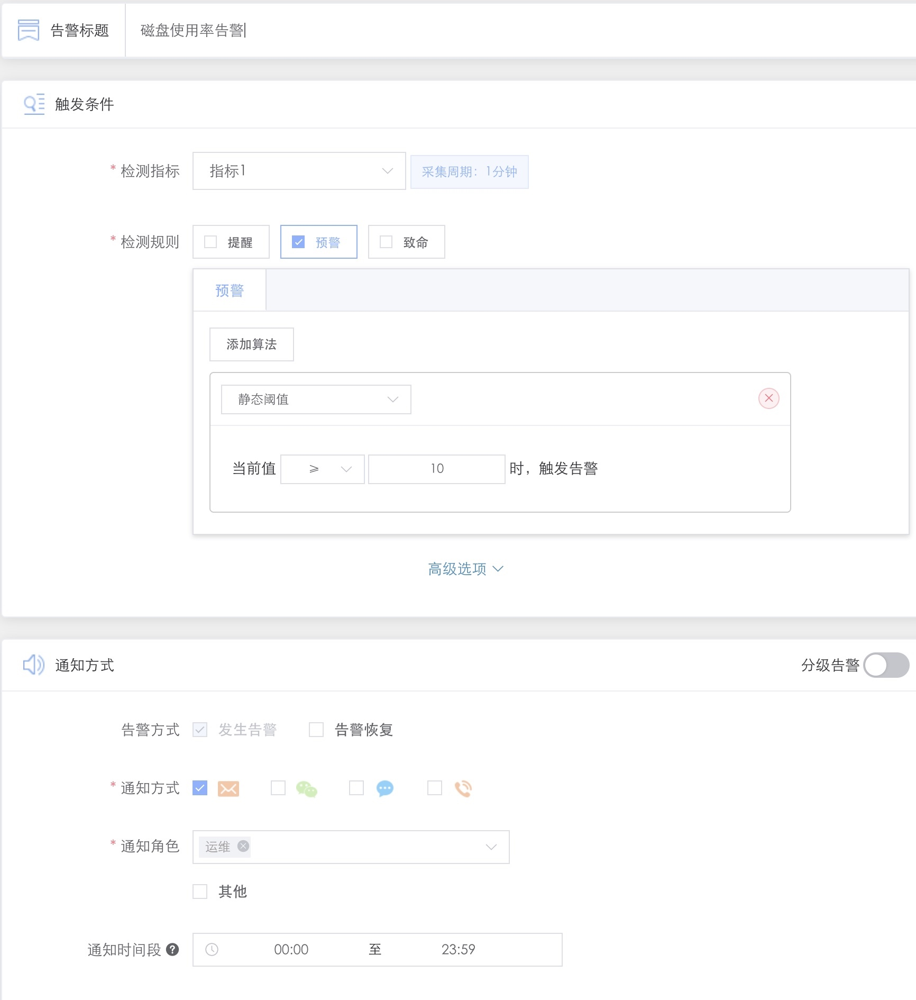
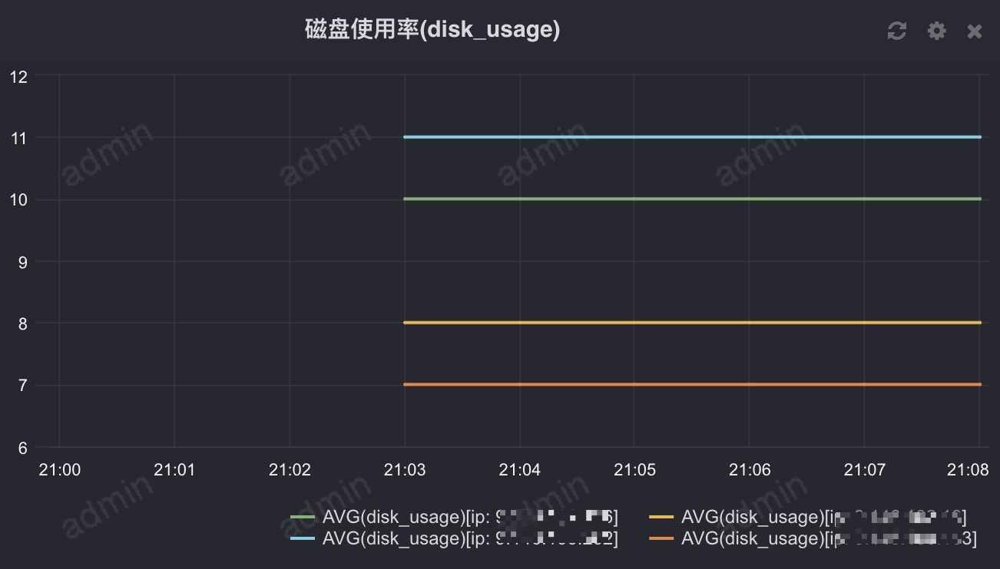
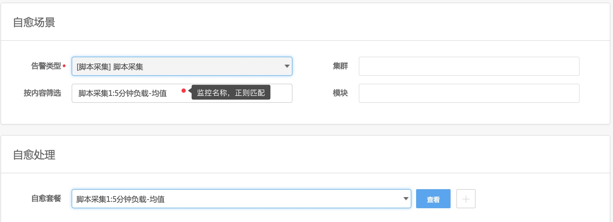

# 脚本采集

运维在蓝鲸监控 SaaS 上编写 Shell 脚本，集中下发并周期调度，实现数据采集、入库蓝鲸数据平台 influxdb、出图、监控。


接下来以 `上报CPU Loadavg` 为例实现脚本采集以及指标监控

## 新建脚本采集

功能位置: 采集中心 -> 脚本 -> 接入数据源


### 1) 定义表结构

请提前了解 [指标和维度的含义](5.1/蓝鲸监控/术语解释/Concepts_Terminology.md)


注：默认有一个维度为 IP 和云区域 ID。

### 2) 编写采集脚本

请使用 BASH 脚本对维度和指标赋值，脚本解释器默认为 `/bin/bash`

> 提示：由于解析指标和维度存在 Json 序列化过程，采集所在服务器上需要提前部署 jq （后续版本会优化）

```bash
 yum install jq -y  // CentOS部署jq参考方法
```

```bash
#!/bin/bash

#获取磁盘使用率
disk_name="$1"
diskUsage=`df -h | grep ${disk_name} | awk -F '[ %]+' '{print $5}'`

echo "disk_usage{disk_name=\"${disk_name}\"} ${diskUsage}"
```

添加参数: 参数为位置参数 如 shell 的 `$1`


### 3) 选择服务器并填写参数

> 注意: 这里的服务和下发都是测试联调



### 4) 确认联调结果



### 5) 设置采集和保存周期 完成调试



> 注意: 到这个阶段还只是完成是联调阶段,需要添加监控实例前是真正的采集.

### 6) 添加监控实例


## 仪表盘出图

在 `仪表盘` 菜单中 `新建视图`，在 `脚本采集` 服务名称中选择 [定义表结构](5.1/蓝鲸监控/快速入门/自定义监控/Shell_Scripts_Collection.md#定义表结构) 中定义的 `中文含义`


- 然后设置出图



## 配置告警策略



## 效果



## 告警自动化处理

在 [故障自愈](5.1/FTA/Intro/README.md)中接入自愈，告警类型选择 `脚本采集`，通过 `按内容筛选` 功能区分不同的监控配置，在 `自愈处理`中选择创建好的自愈套餐（一般你可以使用作业平台套餐，自己编写好作业）



在事件中心可以找到触发告警的监控名称。


以下是脚本采集配置的监控项触发自愈的执行历史


## 常见问题

- 问：如何一次插入多条数据？

    答：你可以使用Shell的循环语句for、while等来一次上报多条数据，只要符合Shell语法即可。


- 问：脚本下发到服务器上后，存放在哪里？

    答：脚本位于：/data/MapleLeaf/plugins/shell/目录
    注册在 GseAgent 的进程调度配置中：/usr/local/gse/gseagent/conf/base/procinfo.json
