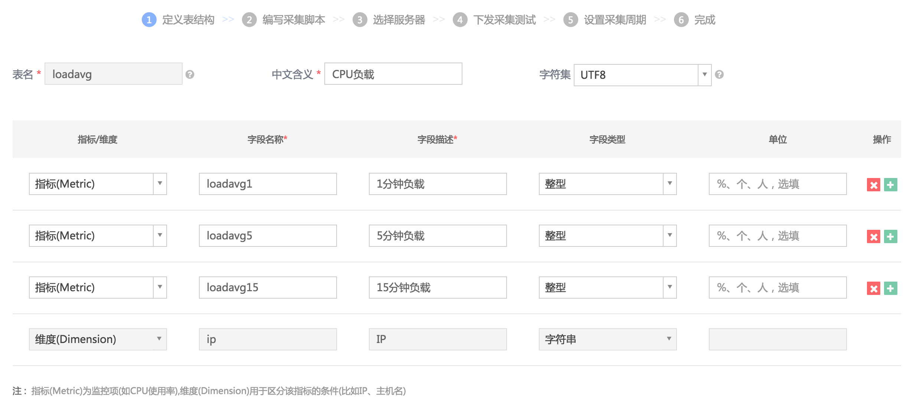
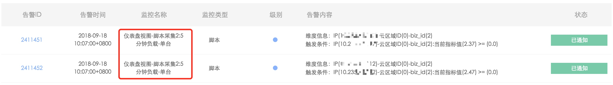
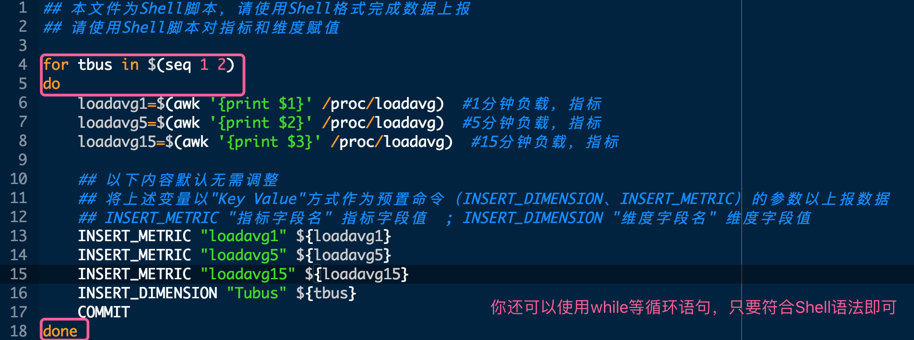

# 脚本采集

运维在蓝鲸监控 SaaS 上编写 Shell 脚本，集中下发并周期调度，实现数据采集、入库蓝鲸数据平台 influxdb、出图、监控。


接下来以 `上报CPU Loadavg` 为例实现脚本采集以及指标监控

## 1. 定义表结构
点击`数据源接入` 菜单 的 `接入数据源` ，定义表结构。

请提前了解 [指标和维度的含义](5.1/蓝鲸监控/术语解释/Concepts_Terminology.md)

注：默认有一个维度为 IP。

## 2. 编写采集脚本

请使用 BASH 脚本对维度和指标赋值，脚本解释器默认为 `/bin/bash`

> 提示：由于解析指标和维度存在 Json 序列化过程，采集所在服务器上需要提前部署 jq （后续版本会优化）

```bash
 yum install jq -y  // CentOS部署jq参考方法
```


## 3. 选择服务器 和 下发采集器测试

`选择服务器` 后，进行 `下发采集器测试`


## 4. 设置采集周期

设置 `脚本采集周期` 、`原始数据保存周期`、`趋势数据保存周期`


- 采集周期：脚本周期调度的频率
- 原始数据保存周期：原始数据所有采集点的保存周期
- 趋势数据保存周期（功能开发中）：为节省存储空间和加快监控指标出图速度，当时间接近 `原始数据保存周期` 时，会自动完成数据聚合（每小时的采集点聚合为 3 个点，最大值、最小值、平均值）

## 5. 仪表盘出图

在 `仪表盘` 菜单中 `新建视图`，在 `脚本采集` 服务名称中选择 [5.1.3.1 定义表结构](5.1/蓝鲸监控/快速入门/自定义监控/Shell_Scripts_Collection.md) 中定义的 `中文含义`


- 然后设置出图


## 6. 配置告警策略


## 7. 效果


## 8. 告警自动化处理

在 [故障自愈](5.1/FTA/Intro/README.md)中接入自愈，告警类型选择 `脚本采集`，通过 `按内容筛选` 功能区分不同的监控配置，在 `自愈处理`中选择创建好的自愈套餐（一般你可以使用作业平台套餐，自己编写好作业）


在事件中心可以找到触发告警的监控名称。


以下是脚本采集配置的监控项触发自愈的执行历史


## 9. 常见问题
- 问：如何一次插入多条数据？

    答：你可以使用Shell的循环语句for、while等来一次上报多条数据，只要符合Shell语法即可。


- 问：脚本下发到服务器上后，存放在哪里？

    答：脚本位于：/data/MapleLeaf/plugins/shell/目录
    注册在 GseAgent 的进程调度配置中：/usr/local/gse/gseagent/conf/base/procinfo.json
