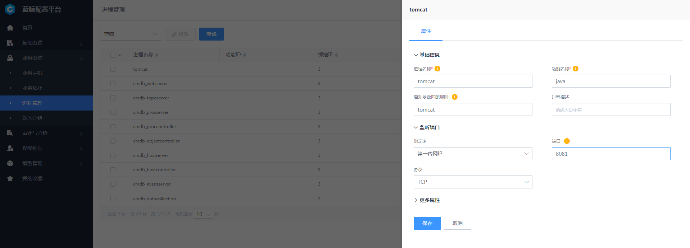

# 配置平台注册进程

- 进程信息配置

  
  图 1. 配置平台配置进程信息

  - 进程名称（必填）：对外显示的服务名，用户自定义，一般与进程实际服务名称对应，会在蓝鲸监控-主机监控-主机详情-进程服务中用于区分不同进程。

  - 功能名称（必填）：程序的二进制名称，比如 Kafka 的二进制是 java ，就填写 java 。

  - 启动参数匹配规则（非必填、重点）：实现精确匹配进程的重要规则，主要应用于如 Java 或 Python 等二进制名重复的进程， Agent 端采集器会通过该规则去识别进程 `cmdline` 符合参数的唯一进程。如果填入的参数不唯一就会识别到多个进程，如果进程二进制名本身唯一，可不填。

  - 绑定 IP（非必填）：进程实际监听的 IP 地址，可不填，如果填必须是准确对应 IP 的 地址，如 IP 错误，采集器会无法匹配进程导致数据上报异常。

  - 端口（非必填）：同“绑定 IP”。

  - 协议（非必填）：同“绑定 IP”。

- 多同名二进制进程时，通过作业平台后者后台校验参数是否唯一。

  
  图 2. 作业平台检查进程 `cmdline` 是否唯一 **截图待替换**

- 检查完唯一后，将进程绑定至主机所属模块下

  
  图 3. 进程绑定模块
