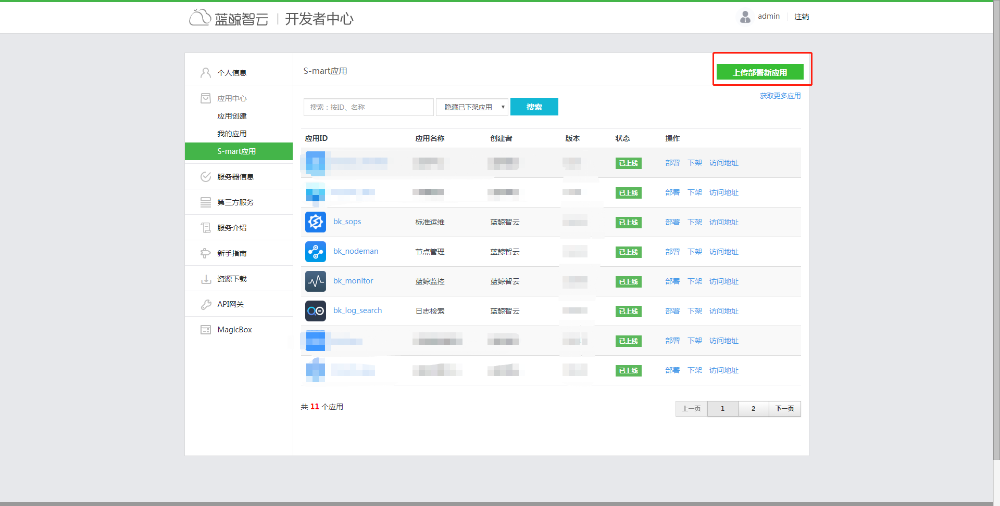
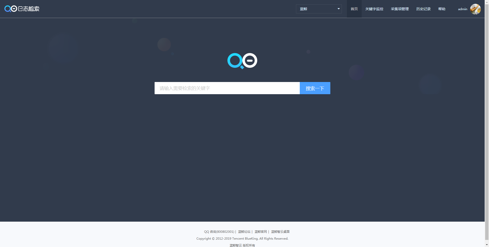
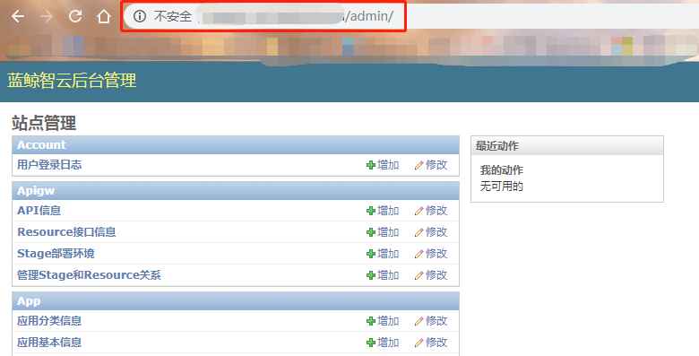
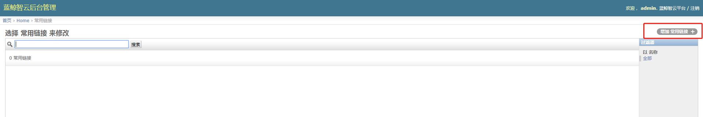
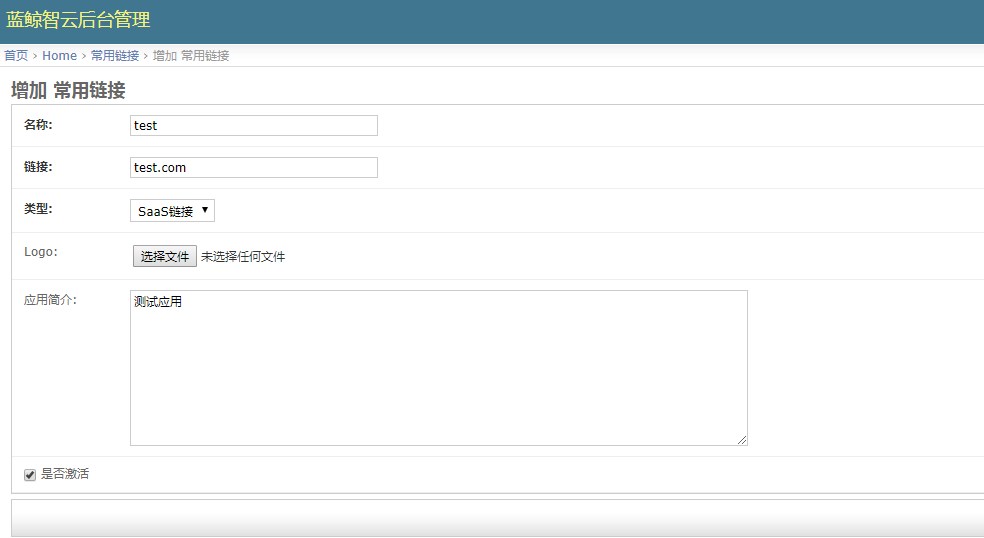

# SaaS 通用部署

## SaaS 说明

SaaS（Software as a Service）：软件即服务，是当前非常流行的一种软件交付模式，蓝鲸官方基于蓝鲸体系自研设计出底层通用的 PaaS，在此基础上可以开发成不同类型的 SaaS。

## 蓝鲸官方 SaaS

蓝鲸官方提供了多款 SaaS ，其特性是开箱即用，满足自动化运维体系最基础、最通用的 CI/CD 需求。

| SaaS|功能|
| ------ | ------ |
| 节点管理 | 一款用于在浏览器管理受控机后台服务的产品，是蓝鲸自动化运维体系的基础|
| 蓝鲸监控 | 蓝鲸智云推出的一款针对主机/容器和互联网应用进行监控的产品|
| 故障自愈 | 故障自愈是蓝鲸智云推出的行业领先的"故障自动化处理"解决方案，提升企业的服务可用性和降低故障处理的人力投入，实现故障自愈从 "人工处理" 到 "无人值守" 的变革 |
| 标准运维 | 标准运维是拥有可视化的图形界面，并进行任务流程编排和执行的系统|
| 日志检索 | 日志检索是蓝鲸智云为了解决运维场景中查询日志难的问题而推出的一款产品|
| ITSM| ITSM（IT 服务管理）是一套帮助企业对 IT 系统的规划、研发、实施和运营进行有效管理的方法论|

> 注：蓝鲸官方 SaaS 默认包含在官网下载的 src 包，解压到 /data 目录（路径：/data/src/official_saas/）中，可在安装蓝鲸基础包的过程中一键安装 **当前社区版对应的** 蓝鲸官方 SaaS，请参考 [标准部署](../../基础包安装/多机部署/quick_install.md)。

## 合作商软件包

合作商软件包，是由蓝鲸与合作伙伴提供的运维场景解决方案类的 SaaS 产品，如 Wman、OSKit、网络管理、CICDKit 等，该类型 SaaS 可在已有基础包的前提下，以“插件”的方式，面向用户提供更多个性化的场景解决方案。

| SaaS         | 开发合作伙伴 | 技术支持群（QQ） |
| ------------ | ------------ | ---------------- |
| 网络管理平台 | 可源信息科技 | 702497771 |
| CICDKit      | 嘉为科技     | 972825279        |

> 注：网络管理平台以及 CICDKIt 前往 [官网下载页](https://bk.tencent.com/download_sdk/) 下载。

## 更多 SaaS

蓝鲸授权服务商、蓝鲸社区用户根据企业需求 "定制化" 开发的 SaaS 应用，经过蓝鲸官方审核后会上线 S-mart 市场。

- 到 [官方 S-mart 市场](https://bk.tencent.com/s-mart/market?best_type=1) 选择下载：蓝鲸智云搭建的企业级应用生态市场。

- 蓝鲸用户自主开发：基于蓝鲸开发框架，用户可低成本自主开发 SaaS 满足企业需求，蓝鲸应用开发可参考文档中心的 [开发指南](5.1/开发指南/开发简介/README.md)。

## SaaS 安装

SaaS 安装说明：

- 官方 SaaS：官方 SaaS 可以在基础包标准安装过程中部署，也可以通过通用方式部署。

- 合作商软件包：社区版目前对外开放 [网络管理平台](../../合作方软件包安装/网络管理/net_man.md) 及 [CICDKit](../../合作方软件包安装/CICDKit/CICDKit.md)。

## SaaS 通用部署方式

>**注意：** SaaS 安装部署成功后，必须给 [SaaS 开组件 "免用户认证"的白名单](5.1/PaaS平台/场景案例/White.md)。

【蓝鲸工作台】 - 【开发者中心】 - 【S-mart 应用】。

 在S-mart应用，点击【上传 SaaS 包】。

将 SaaS 包上传之后，进行【一键部署】。

部署成功后，在蓝鲸工作台/桌面即可看到 SaaS，打开运行正常说明部署成功。

- 外链应用或通过域名访问的 SaaS ：    

通过浏览器登录社区版页面，在域名后添加  `admin`  进入 后台管理页面。

**Home - 常用链接 - 增加常用链接**，  `名称` 填入对应 SaaS 名称， `链接` 填入对应域名，`类型` 选择 `SaaS链接` ，上传对应 Logo 后保存，即可在蓝鲸工作台中访问该 SaaS。

> 用户自主开发的应用，蓝鲸暂不支持托管其后台服务蓝鲸官方 SaaS 需求的后台服务，已经集成在基础包安装文档中，无需单独额外安装蓝鲸官方 SaaS 一键部署参考 [官方 SaaS 说明](./saasdeploy.md#saas)。合作商软件包请参考文档中的合作商软件包安装指引。

## SaaS 升级

1. 获取到最新版本的 SaaS 包后，按照 SaaS 部署的步骤到 PaaS 平台中部署上线即可。

2. 需要后台服务支持的 SaaS 若后台有变更时，请先升级后台服务，再到 PaaS 平台中升级 SaaS，保持前后端版本一致性，否则功能会受影响。

Note：
> 前后端版本一致性：对社区版 SaaS 进行升级时，需确认清楚 SaaS 和后台版本是否对应，比如：社区版 V5.0 的蓝鲸监控 SaaS 版本是 1.4.23，后台服务版本是 0.2.7，若升级安装后，实际环境中前后台版本不对应，可能会导致应用使用异常。**因 Bug 修复其他原因进行过官方升级的除外**， **版本详情可参考对应社区版的版本日志或者咨询蓝鲸助手**。
