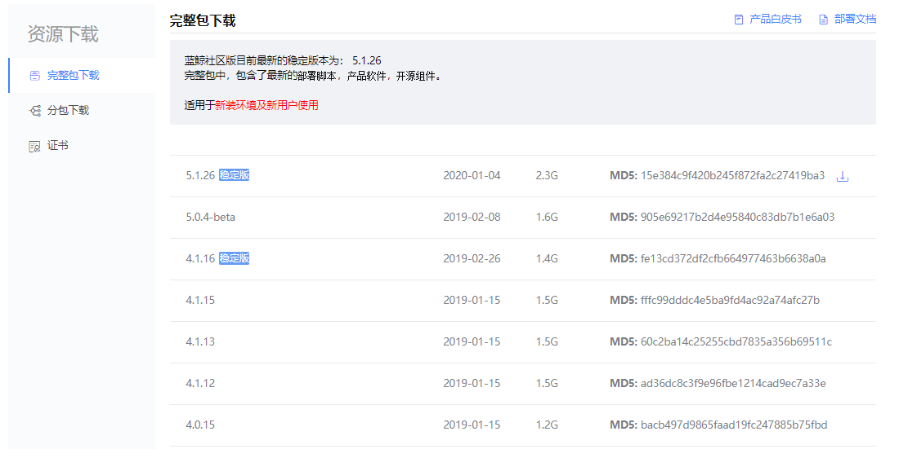

## 软件下载

安装软件需要[下载](https://bk.tencent.com/download/)2个文件：软件包、证书。

- 软件包（完整包和分包）
为了方便用户获取社区版软件包，提供了2种下载模式：完整包下载、分包下载。所以，社区版的“完整包”=“部署脚本”+“产品软件”+“开源组件”。用户可以根据自己的需要进行下载。

>部署脚本: 用于自动化安装和维护蓝鲸软件产品，属于蓝鲸软件的通用“安装和维护工具”，可以用于安装维护不同版本的产品软件，和不同版本的开源组件。
产品软件: 是蓝鲸所有自研产品/服务的集合，包括平台级产品和SaaS级产品。用户可以根据需要选择更新整个产品，或者更新部分模块。
开源组件: 提供了蓝鲸软件在使用过程中依赖的所有开源组件和配置模板，可根据需要选择下载，若涉及到开源组件的版权信息，请遵守开源协议要求。

说明：首次安装用户，建议下载完整包。

- 证书
软件安装过程中，需要提供证书文件，才能确保软件的正常启动，最多输入3个MAC地址。

