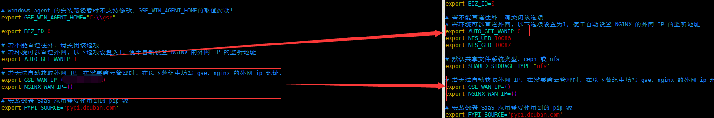

# 社区版 V5.0 升级至 V5.1 指引
- **[升级常见问题 FAQ ](#ce_update_51_faq.md)**
- **【风险提示】**
  - 熟读升级文档，避免造成文档不熟悉而误操作
  - 本升级指引仅适用于未做过任何改造的用户，若有定制化调整（如接入企业登陆，新增API以及接入其他企业内部系统），或部分产品为开源产品不适用本升级指引，需自行维护特殊化部分功能。
  - 原蓝鲸官方 SaaS 必须提前下架，否则将影响 SaaS 升级部署
  - MySQL/MongoDB 备份务必保证 MySQL/MongoDB 机器磁盘空间可用，否则将导致备份失败
  - 新 globals.env 文件的账户密码必须同备份的 globals.env 保持一致，否则将导致蓝鲸服务因为账户密码不一致异常
  - 确保升级前提前有使用蓝鲸监控创建主机告警策略，否则将导致升级 bkdata 失败 【针对从未使用过蓝鲸监控用户】
  - 非标准私有IP用户需在解压新的脚本后，需要按照以前修改非标准私有IP的方式重新修改
## 升级前准备

- 查看 MySQL 占用磁盘空间大小

  - 本次升级的开源组件有 `MySQL`、`Redis` 、`Nginx`、`consul`。

  - 当 MySQL 数据量超过 50G 以上的，可根据自身情况考虑是否清理部分日志表。

  - **库名： bkdata_monitor_alert 表名：ja_alarm_alarminstance 可以使用 truncate 清理数据，该表记录了监控告警数据**

  - 清理的方式：只用链接到 MySQL 数据库后使用 truncate 或 delete 的方式。

- **通过【开发者中心】->【S-mart应用】下架所有蓝鲸官方 `SaaS`，如：蓝鲸监控，标准运维，节点管理，故障自愈，日志检索。**

- 停进程

  ```bash
  cd /data/install
  echo fta bkdata appo appt gse  job cmdb paas redis nginx consul license  | xargs -n1 ./bkcec stop
  # 观察进程是否为 EXIT
  echo fta bkdata appo appt gse job cmdb paas redis nginx consul license  | xargs -n1 ./bkcec status
  ```

- 备份 src 目录

  ```bash
  # 中控机执行
  # (必须)请一定用 mv 备份 src 目录。
  cd /data
  mv src src.bak
  ```

- 备份 install 目录

  ```bash
  # 请不要使用 mv 命令备份，一定使用 cp 备份 install 目录，不然会导致 install/.app.token发生改变
  cp -a install install.bak
  ```

- 解压包

  ```bash
  tar xf bkce_src-5.x.x.tgz -C /data/  # 整包(含src，install目录)
  ```

- 恢复证书

  ```bash
  cp src.bak/cert/* src/cert/
  ```

## 升级部署脚本

- 还原部署配置 `(globals.env  ports.env)`

  - 恢复 `globals.env` 相关配置信息
    - **自行比对新老文件的差异，将旧的 `globals.env` 文件的 `#域名信息` `#DB信息` `#账户信息` `GSE\NGINX_WAN_IP` `#设置HTTP/HTTPS模式`同步修改到新的 `globals.env` 配置文件内，务必谨慎对比，账户密码信息至关重要，新配置文件的新增内容不可删除。**
    
    
  - 更新 `install.config`
    - 根据 `install.config.new.sample` 文件的 `[bkce-basic]` 格式更新 `install.config` 文件。
    - 示例：

      ```bash
      # 原 install.config格式
      10.0.0.1 nginx，appt，rabbitmq，kafka，zk，es，bkdata，consul，fta
      10.0.0.2 mongodb，appo，kafka，zk，es，mysql，beanstalk，consul
      10.0.0.3 paas，cmdb，job，gse，license，kafka，zk，es，redis，consul，influxdb
      # 变更后的格式
      [bkce-basic]
      10.0.0.1 nginx，appt，rabbitmq，kafka(config)，zk(config)，es，bkdata(databus)，bkdata(dataapi)，bkdata(monitor)，consul，fta
      10.0.0.2 mongodb，appo，kafka(config)，zk(config)，es，mysql，beanstalk，consul
      10.0.0.3 paas，cmdb，job，gse，license，kafka(config)，zk(config)，es，redis，consul，influxdb
      ```
    > Note:
    >
    > 原则是不改变原模块所在IP的机器，只新增格式zk(config)，kafka(config)，bkdata(databus)，bkdata(dataapi)，bkdata(monitor)。
    >
    > 另：install.config.new.sample内的其他bcs相关模块如需要安装请下载相关安装包解压并新增机器部署bcs，bcs部署机器不能复用[bkce-basic]的机器。

- 恢复 CICDKit 安装包

  ```bash
  # 如果你已经部署 CICDKit 请执行，若没有请忽略
  cp -a /data/src.bak/cicdkit src/
  cp -a /data/src.bak/service/mysql57 src/service
  ```

- 恢复 CICDKit 脚本包

  ```bash
  # 如果你已经部署 CICDKit 请执行，若没有请忽略
  cp -a install.bak/parse_config  install/
  cp -a install.bak/third/*  install/third/
  ```

- 升级前检查

  ```bash
  # 中控机查看
  cat /data/install/.path    # 查看安装路径是否为空
  ll /data/install/.migrate/ # 查看目录下 sql 标记文件是否存在
  ```

- 同步数据

  ```bash
  ./bkcec sync all  # 同步新的软件包，在同步过程中
  ```

  > Note: 执行同步过程中，可能有文件不存在的报错，报错文件是点号开头的隐藏文件，可以忽略，是因为并发
分发文件引起的，属于正常现象。

  

## 开始升级

### 升级开源组件

- 安装依赖

  ```bash
   ./bkcec install global_pypkg  # 安装依赖
  ```

- 更新 Consul

  ```bash
  ./bkcec install consul
  ./bkcec start consul
  ```

- 更新 Nginx

  ```bash
  # 更新 nginx paas、cmdb、job启用 https。脚本自动部署使用自签名证书\
  # 路径在：/data/src/cert/bk_domain.crt、 /data/src/cert/bk_domain.key
  # 升级 Nginx 版本，如果你系统是 Centos7.0 以下的版本需要自行编译 nginx1.11.9 版本安装，或者下载 nginx-1.11.9-1.el6.ngx.x86_64.rpm 版本替换 src/nginx/nginx-1.11.9-1.el7.ngx.x86_64.rpm 包

  ./bkcec install nginx
  ./bkcec start nginx
  ./bkcec status nginx
  ```
- 更新 Redis

  ```bash
  # 升级 Redis 版本
  ./bkcec install redis  # 升级 Redis 版本，另 Centos6 不支持升级，但可自行编译升级
  ./bkcec start redis
  ./bkcec status redis
  ```

- 更新 MySQL

  - 备份数据库，也可自行选择其他方式备份数据库。

  ```bash
  # 登陆 MySQL 机器执行
  ssh $MYSQL_IP
  source /data/install/utils.fc
  mkdir -p /data/dbbak
  cd /data/dbbak
  cat >dbbackup_mysql.sh <<EOF
  #!/bin/bash

  ignoredblist='mysql|information_schema|performance_schema|test'
  dblist="\$(mysql -u$MYSQL_USER -p$MYSQL_PASS -h$MYSQL_IP -P$MYSQL_PORT -Nse "show databases;"|grep -Ewv "\$ignoredblist"|xargs echo)"
  mysqldump -u$MYSQL_USER -p$MYSQL_PASS -h$MYSQL_IP -P$MYSQL_PORT  --skip-opt --create-options --default-character-set=utf8mb4 -R  -E -q --single-transaction --no-autocommit --master-data=2 --max-allowed-packet=1G  --hex-blob  -B  \$dblist > /data/dbbak/bk_mysql_alldata.sql
  EOF

  # 执行备份操作
  sh dbbackup_mysql.sh

  # 查看导出是否正确
  grep 'CREATE DATABASE' bk_mysql_alldata.sql
  ```

- 停 MySQL 进程

  ```bash
  # 中控机执行
  ./bkcec stop mysql
  ./bkcec status mysql
  ```

- 备份 MySQL5.5 软件和数据目录，配置文件等。

  ```bash
  # 备份，MySQL 机器执行
  ssh $MYSQL_IP
  mv /data/bkce/service/mysql /data/bkce/service/mysql55
  mv /data/bkce/public/mysql /data/bkce/public/mysql55
  mv /data/bkce/etc/my.cnf /data/bkce/etc/my.cnf.55
  mv /etc/my.cnf /etc/my.cnf.55
  ```

- 安装 MySQL

  ```bash
  # 中控机执行，升级 MySQL 版本
  ./bkcec install mysql
  ./bkcec start mysql
  ./bkcec status mysql
  ```

- 恢复备份数据

  ```bash
  # MySQL 机器执行
  ssh $MYSQL_IP
  cd /data/dbbak
  # 导入数据库
  mysql --default-character-set=utf8mb4<bk_mysql_alldata.sql #如果没有mysql命令，可以使用yum instal mysql 或者带上mysql命令的绝对路径即可
  # 中控机重新初始化 MySQL
  ./bkcec initdata mysql
  ```

- Check步骤： 确认当前 Job 库编码是否为 UTF8。
 - Job 库的字符集变更为 UTF8，此步骤适用于从低于 V4.1.16 升级上来的老用户,由于早期 Job 库是 latin 1 字符集

    ```bash
    source /data/install/utils.fc
    # 登陆 MySQL
    mysql -h$MYSQL_IP -u$MYSQL_USER -p$MYSQL_PASS
    # 查看 Job 库字符集是否为 UTF8
    > SHOW CREATE DATABASE job;
    # 变更 Job 库字符集编码为 UTF8
    > alter database job character set utf8;
    # 重新查看 Job 库字符集是否为 UTF8
    > SHOW CREATE DATABASE job;
    ```
-  Check步骤：确认 MongoDB是否为 rs0 模式，通过配置文件（mongodb.yaml）和 rs.status () 确认，如已经是 rs0 模式请忽略本步骤。
  - 将 MongoDB 节点手动切换至 rs 模式,此步骤适用于从低版本升级到 V4.1.16 的用户，由于 V4.1.16 早期版本是单实列模式。

    确认 `bkce/etc/mongodb.yaml` 配置文件是否支持 rs 模式

    

     节点切换 rs 模式
    ```bash
    # 登陆到 mongodb 机器
     source /data/install/utils.fc
    # 连接到 mongodb
     mongo -u $MONGODB_USER -p $MONGODB_PASS --port $MONGODB_PORT --authenticationDatabase admin
    # 查看 rs 状态
    > rs.status ()  # 确认该节点是否是 rs 模式
    # 初始化 Replica Set(RS)
    > rs.initiate()
    # 确认RS配置
    > rs.conf()
    # 确认状态
    > rs.status()
    > exit
    # 重新启动 mongodb 中控机器执行
    ./bkcec stop mongodb
    ./bkcec start mongodb
    ```

### 升级蓝鲸组件

- 更新 License

 ```bash
 ./bkcec install license
 ./bkcec start license
 ./bkcec status license
 ```

- 更新 PaaS

  ```bash
  # 登录 PaaS 机器
  ssh $PAAS_IP
  mv /data/bkce/open_paas /data/bkce/open_paas_50_bak
  # 中控机执行
  ./bkcec install paas
  ./bkcec upgrade paas
  ./bkcec start paas
  ./bkcec status paas
  ```

- 更新 CMDB

  ```bash
  ./bkcec install cmdb
  ./bkcec start cmdb
  ./bkcec status cmdb
  ./bkcec upgrade cmdb
  ```

- 更新 GSE

  ```bash
  ./bkcec install gse
  ./bkcec upgrade gse # No JSON object could be decode 报错属于正常
  ./bkcec start gse
  ./bkcec status gse  # 如果有个别进程显示 ERROR status 状态，是启动时间比较慢，可尝试多刷新几次
  ./bkcec pack gse_plugin # 登陆 Nginx 服务器查看 /data/bkce/miniweb/download/init_nodeman.json 是否生成，若没有在执行多一次。可加 参数 -u  
  ```

- 更新 JOB

  ```bash
  ./bkcec upgrade job
  ./bkcec start job
  ./bkcec status job
  ```

- 更新 PaaS_Agent

  ```bash
  # 更新 appo
  ./bkcec upgrade appo
  ./bkcec start appo
  ./bkcec status appo
  ./bkcec activate appo

  # 更新 appt
  ./bkcec upgrade appt
  ./bkcec start appt
  ./bkcec status appt
  ./bkcec activate appt
  ```

- 更新 BKDATA

  ```bash
  ./bkcec install bkdata
  ./bkcec upgrade bkdata
  ./bkcec start bkdata
  ./bkcec status  bkdata
  ```

- 更新 FTA

  ```bash
  ./bkcec install fta
  ./bkcec upgrade fta
  ./bkcec start fta
  ./bkcec status fta
  ```

### 升级 SaaS

- 升级 SaaS

  ```bash
  ./bkcec install  saas-o  # 安装 saas
  ```

### 升级 Agent

- 升级蓝鲸所在机器的 gse_agent
  在中控机执行

  ```bash
  cd /data/install
  ./bk_install gse_agent
  ./bkcec pack gse_plugin -u
  ```

- 升级 业务机器 的 gse agent

  - 请使用 【节点管理】 app 的 agent 升级功能


## 验证

- 各平台可正常访问
