# 快速使用

为了验证刚部署安装的环境是否正常，除了从后台验证，也需要从页面上进行功能性的验证。

## 创建业务

- 首先在配置平台(CMDB) 上新建一个任务，将 admin 添加至运维人员。

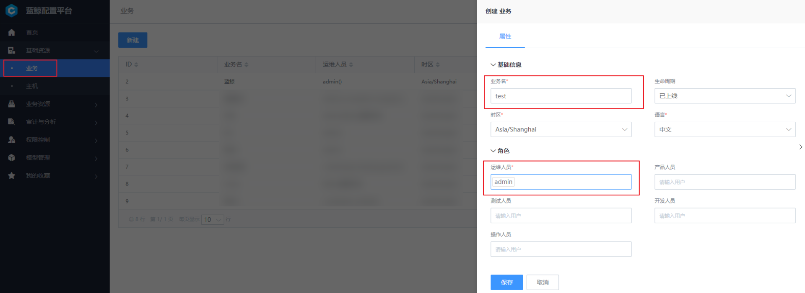

- 在业务下新建集群以及模块。(蓝鲸业务不支持集群及模块操作)
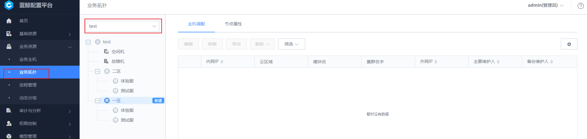

**下述步骤需在节点管理完成后操作。**

- 成功安装完 Agent后，在 配置平台(CMDB) 中的对应业务下，则会出现安装好 Agent 的主机。

- 将资源池下的主机移动到模块下。

## 安装 Agent

- 在对应业务下安装主机 Agent。
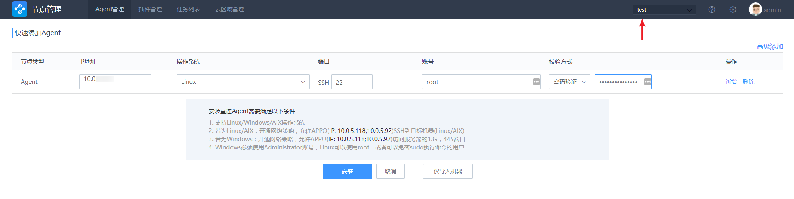
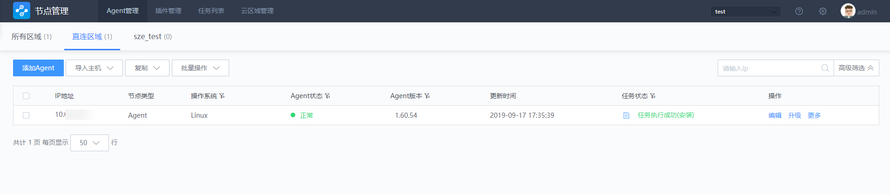

- Agent 安装成功后查看下采集器是否正常。

## 执行作业

- 测试快速执行脚本可用性。

- 查看作业执行情况。

- 测试快速分发文件可用性。

    上传测试文件，分发至目标主机。

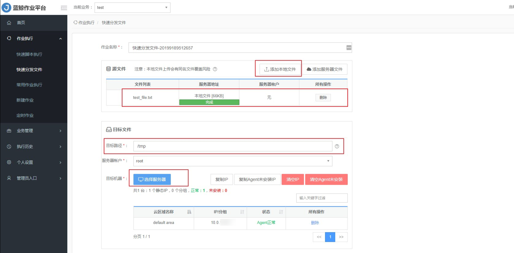

    查看文件分发情况。

    查看目标主机路径下是否存在该文件。

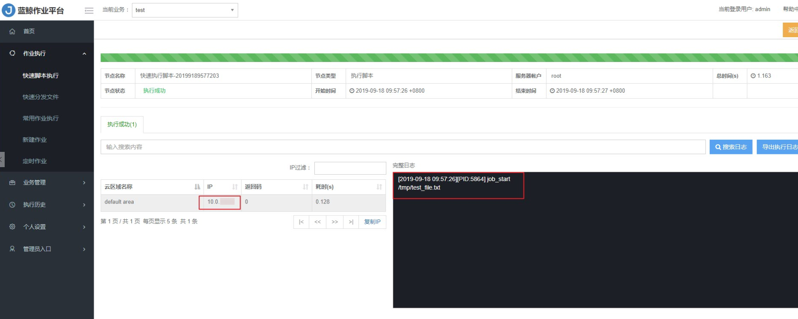

- 测试定时作业可用性。
    左侧导航栏选择【新建作业】，作业新建完成后，选择【定时作业】进行添加定时作业任务。然后启动任务。

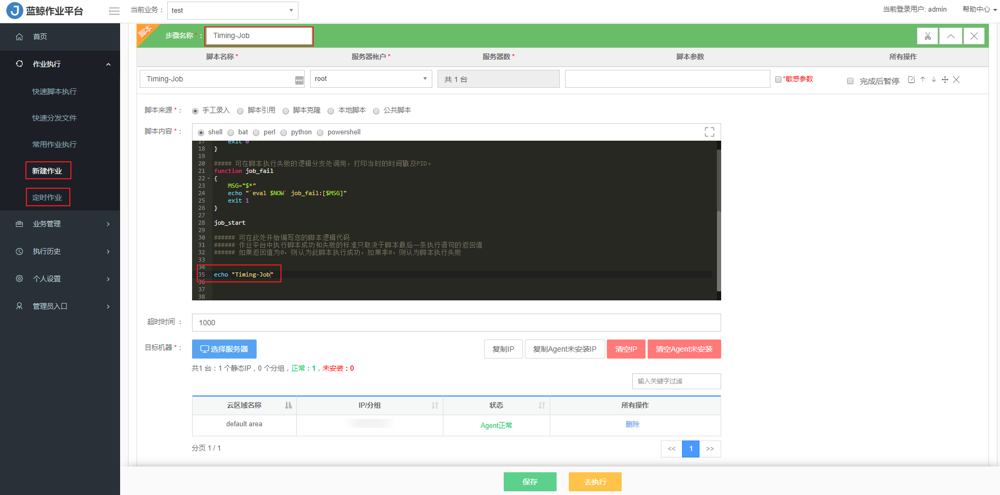

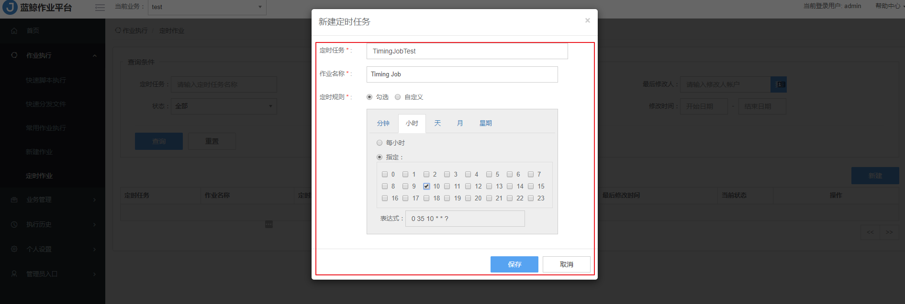

    左侧导航栏选择【执行历史】查看定时作业执行情况。
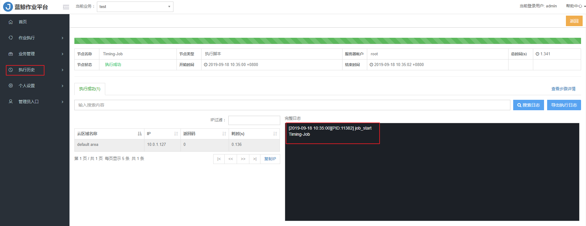

## 创建流程
- 新建一个业务流程模板。

    选择【快速执行脚本】，输入脚本内容，目标 IP 通过变量进行传入，类型选择【IP 选择器】，[IP 选择器（简单版）跟 IP 选择器的区别](https://github.com/Tencent/bk-sops/blob/V3.3.X/docs/features/variables_engine.md#ip%E9%80%89%E6%8B%A9%E5%99%A8%E7%AE%80%E5%8D%95%E7%89%88) 。

- 新建并认领流程任务。
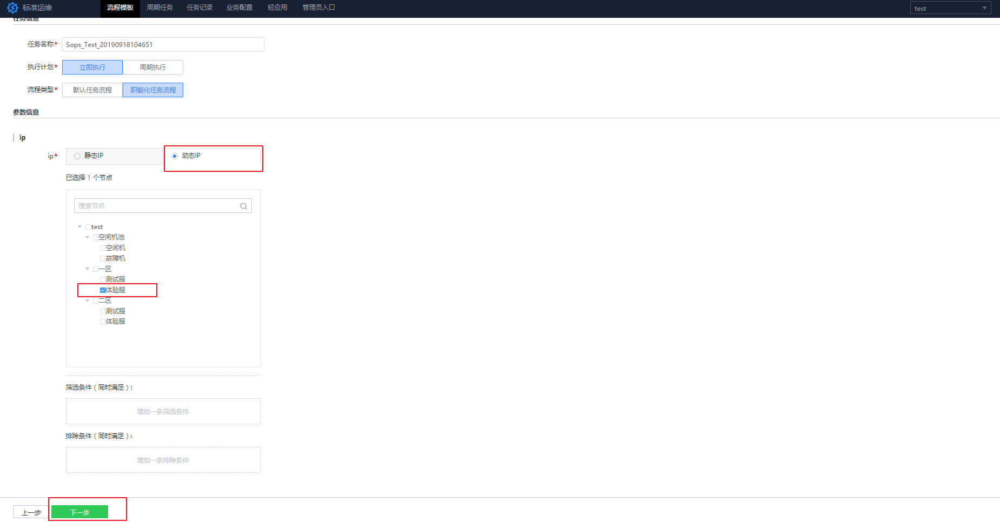

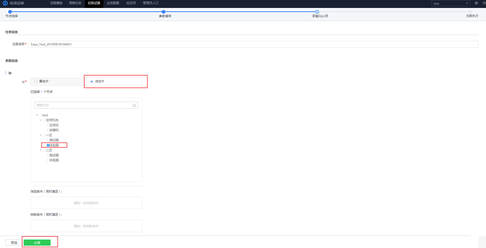

- 查看参数无误并执行任务。

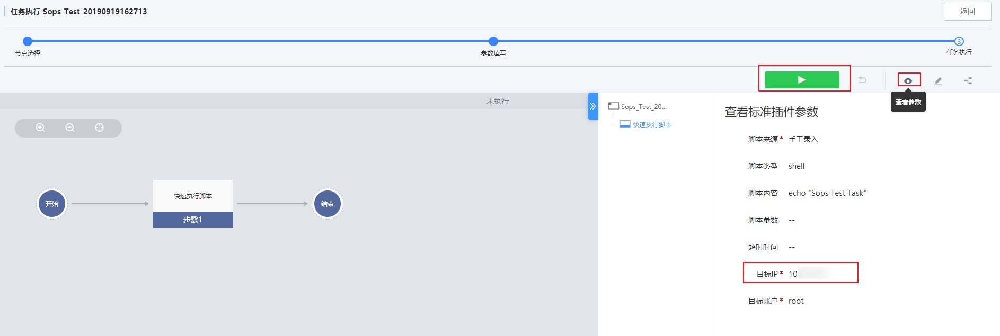

- 任务执行完成后，点击步骤可以查看执行的详细信息。点击对应链接可以跳转至作业平台查看作业执行情况及信息。

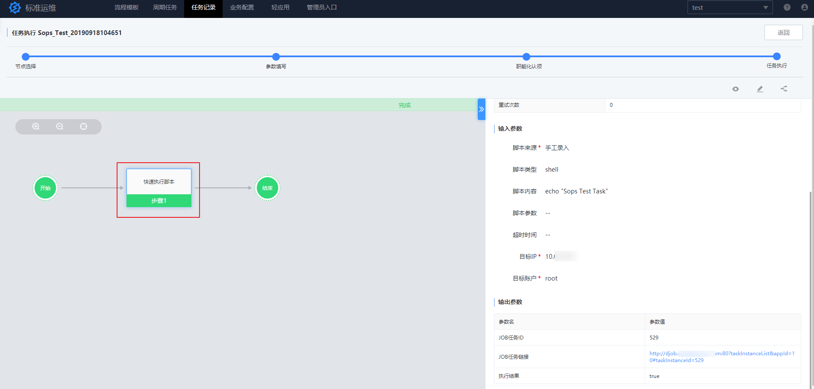

## 主机监控

- 查看蓝鲸获取主机信息，主机状态，主机监控，服务状态图情况。

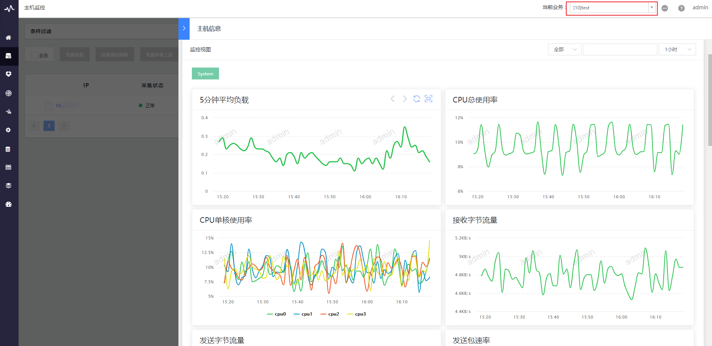

## 故障自愈

- 创建自愈套餐(如果不创建也可以自行使用默认套餐)。

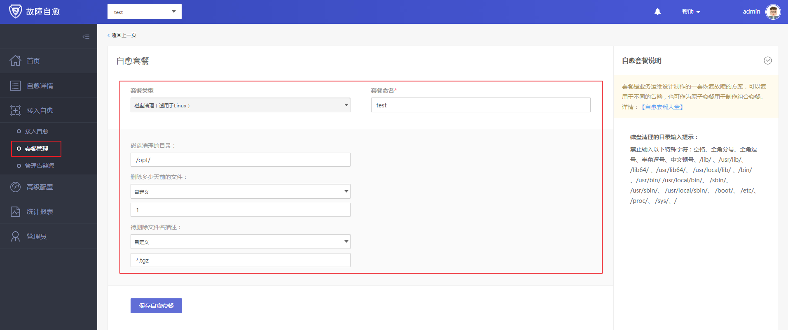

- 接入自愈。蓝鲸监控模拟告警，看故障自愈是否能够获取到告警并实现自愈。

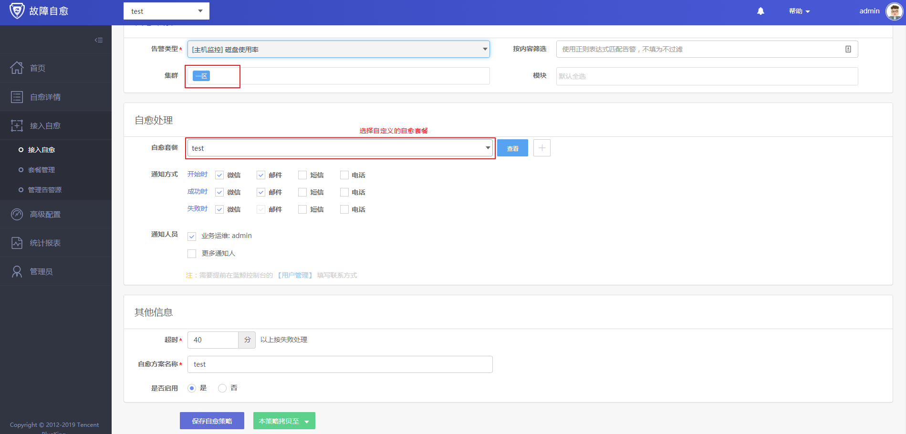

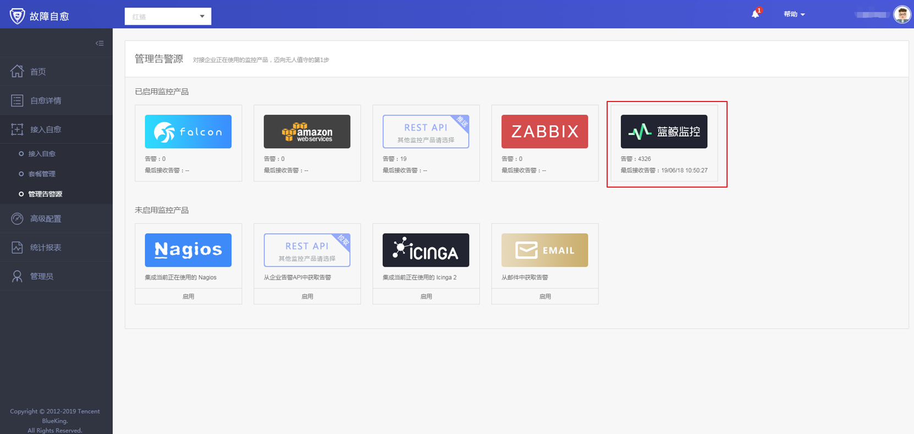
