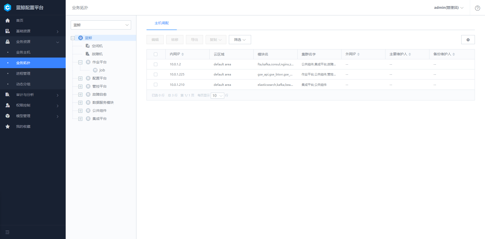
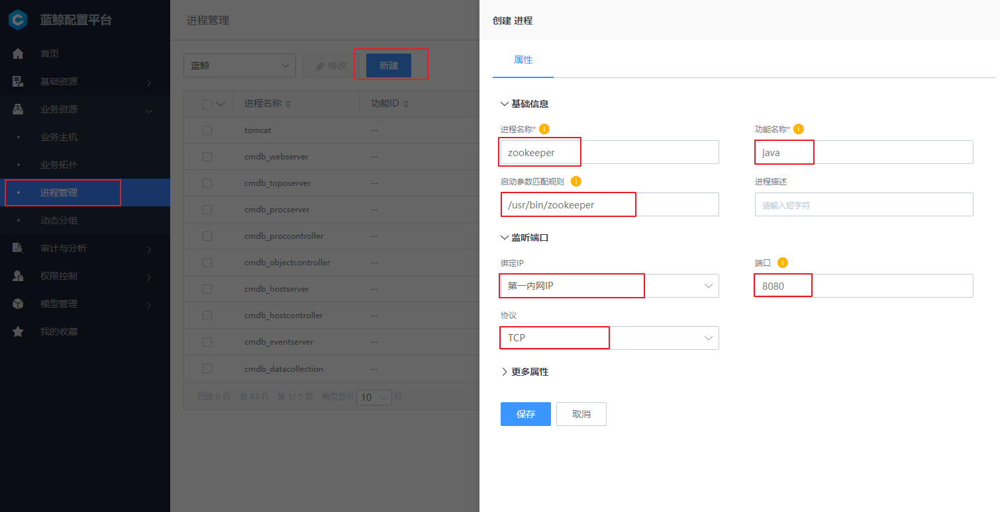
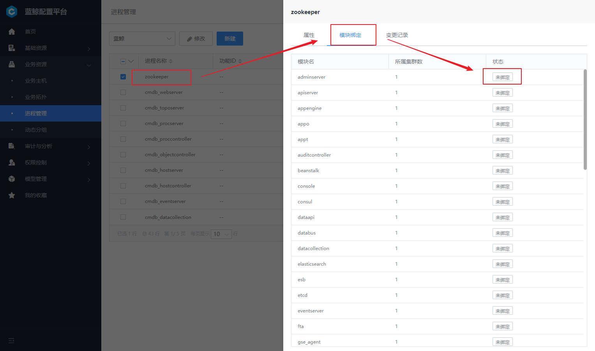
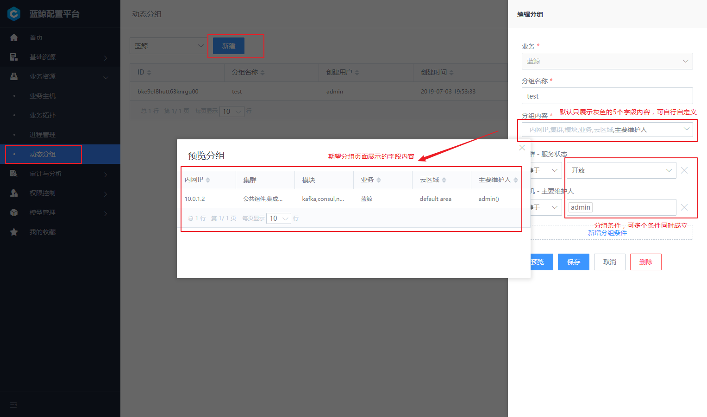

# 业务资源

业务资源是集合了对业务层管理的使用功能，包含业务主机、业务拓扑、进程管理、动态分组 4 个功能板块。实现业务的精细划分以及拓扑直观展示。

## 业务主机

默认从主机资源池分配到业务的主机会放到 "空闲机" 模块下，我们需要分配到具体的业务模块中，以进行合理的资源管理。

## 业务拓扑  

业务拓扑是对部署结构的一种抽象表示，是配置平台进行主机管理的基础，在业务架构以及类型越来越复杂的今天，只有建立合适的业务模型，才能结构化的管理好主机。配置平台提供用户结构自定义、拓扑属性自定义等功能。

-	拓扑结构自定义，配置平台支持用户定义 `业务-集群-模块` 此种三级的数据结构或者业务-模块这类两级数据结构，用户可以针对不同的场景选择性的建立适合于自己业务的结构。

-	集群、模块属性自定义，配置平台中集群、模块的属性除名称、负责人等标准属性外还提供自定义属性管理，用户可以通过各种自定属性的使用，进一步从各种维度对主机进行分类管理。

主机管理是配置平台的核心功能，在保留传统的列表管理同时还能结合拓扑进行跨云管理。主要具备以下功能点：

- 拓扑维度的主机概况展示，通过页面左边的拓扑树能展示主机在各集群和模块下的分布情况。

-	跨云管理主机，在配置平台可以便捷的管理不同云下的主机，不会受内网 IP 冲突等影响。

-	便捷的主机筛选，用户可以在配置平台通过各种自己想要的条件过滤主机。

-	丰富的增值功能，配置平台提供表格导出、实时数据查看、主机模块变更等供协助用户更好的管理主机。

-	主机属性自定义展示，在主机管理页面用户可以选择性的展示自己需要的主机字段，同时用户可以导入配置平台不提供的一些主机字段。

-	实时数据展示，在主机详情页面会展示主机详情、系统状态、计划任务、Hosts 文件、路由信息等主机快照数据。

**动态拓展的业务层级** 不同企业中的业务层级、名称、管理属性都有差异，动态拓展的业务层级让业务的管理更贴合习惯。

配置平台初始化以后，默认会创建名为 "蓝鲸" 的业务，需要注意的是，蓝鲸业务并非是示例业务，在部署都会依赖此配置，在配置平台中已经限制了对此业务的拓扑修改，用户在修改此业务下主机、进程等配置时候，需要充分理解蓝鲸的部署逻辑。否则可能会导致整体平台出现异常。

- 查看蓝鲸业务拓扑，可以通过点击导航 "业务资源 - 业务拓扑" ，左上角业务选择框中选择 "蓝鲸" 业务，可以看到下方展示了整个蓝鲸的部署拓扑。

## 进程管理  

模块被定义为一组强相关进程的集合，"进程管理" 功能可以帮助业务管理进程端口等基础信息，比较典型的应用场景有蓝鲸的监控系统对进程进行监控。

一个模块下的服务器通常执行的是同一个功能，由一个或者多个业务进程构成，"进程管理" 功能可以帮助业务管理进程以及其端口、进程和模块的绑定关系。在监控系统中也会用到此特性。

**a.**	新建进程，创建一个进程，支持三种模式
- 没有监听端口的进程
- 监听一个端口的进程
- 监听多个端口的进程

**b.**	在新增进程的高级属性下，可以保存进程更加详细的信息，包含：启动命令，停止命令，重启命令，自动拉起选项等。需要注意的是，配置平台只是作为进程端口信息的存储，在蓝鲸监控系统或者用户自定义的应用中实现具体功能。

**c.**	进程绑定模块，新增了一个自定义进程以后，可以通过 "绑定" 功能，把进程绑定到之前定义的业务模块上。在真实运营场景中，其他系统通过查询模块下的主机，可以最终得到哪些主机上运行了哪些进程。

### 1. 新增业务进程

通过左侧导航打开 "业务资源 - 进程管理" 功能页，点击 【新建】按钮。

进程相关的重要名词解释：

**进程名称**：进程的唯一标识，便于用户区分出业务下不同的进程，名称需要保证业务下唯一。

**功能名称**：程序的二进制名称，比如 Zookeeper 的二进制名称是 java，则填写 java。

**进程描述**：对于进程的进一步详细描述，也可以理解为此进程的备注信息。

**端口**：当进程启动会监听端口时，可以根据进程实际情况填写端口信息，填写规则有：

1. 单个进程填写 `80`；
2. 多个进程填写 `80,90`，表示进程监听了 80,90 两个端口，以逗号隔开；
3. 多个连续进程填写 `80-90`，表示进程监听了 80，81，82...89，90 一共 11 个端口；
4. 混合包含连续和不连续端口填写 `80,90-92`，表示监听了 80，90，91，92 一共 4 个端口；

**协议**：所监听端口的使用的协议，当前支持配置 TCP，UPD 两种协议。

**绑定 IP**： 所监听端口绑定在哪个 IP 下，可选项有 0.0.0.0、127.0.0.1、第一内网（ "内网 IP" 字段记录的 IP）、第一外网（ "外网 IP" 字段记录的 IP）。

此外，更多属性分组里可以配置进程的更多信息，如功能 ID、工作路径、启动命令、启动用户等，因对应的进程管理 SaaS 尚未内置到蓝鲸中，用户可选配置。

### 2. 绑定进程到模块

在配置平台设计中，主机资源一定属于某个业务模块，进程通过绑定到模块，可以很方便的批量把进程信息配置到主机之上。通过主机和进程的关系，进而实现主机上进程监控或者对进程进行启停等管理。

点击一个已经创建好的进程，切换到模块绑定 Tab 标签，点击目标模块后方的 【未绑定】 按钮，完成对模块的绑定。

## 动态分组  

当业务下的拓扑结构过于复杂的时候，可以通过动态分组功能，定义常用的查询条件。例如：集群属性的 “服务状态” 为 "开放" 的主机列表。这些动态分组可以直接在作业平台、标准运维中对主机进行查询的时候使用。

用户可以在配置平台点击新增一个动态分组，在新增时首先选择分组对象，是针对集群、模块还是主机以及分组期望的输出是什么。然后选择与或非逻辑是等于、不等于还是存在或者不存在，选择好与或逻辑之后输入期望的的值，点击预览则会展示当前分组的输出，同时分组支持多个条件的组合。

### 1. 动态分组列表

可以在 "业务资源 - 动态分组" 看到当前业务下的已经配置的查询列表。

### 2. 新增动态分组

通过点击 `新增` 增加一个动态分组。

配置分为两方面的内容：

- 分组内容：是指分组后期待页面显示的字段内容都有哪些。
- 分组条件：是指根据怎样的条件将主机划分到不同的组内。

