# 模型管理

配置平台提供了灵活的模型定义功能，支持企业根据自身的业务架构，进行自定义特定的信息模型。

配置平台中管理的信息实例，均是基于模型构造而成。目前内置的模型有业务、集群、模块、主机、进程、云区域。如果内置模型不能够满足，可以通过自定义新增、编辑模型，从而构造出企业特有的 CMDB。

需要注意的是，模型管理定位为配置平台的底层功能，需要配置平台管理员权限才可以操作。

## 模型

配置平台内置的模型有业务、集群、模块、主机、进程、云区域，此外还可以通过自定义新增模型。 支持现有模型查看、模型分组、模型创建、模型编辑、模型字段唯一校验、模型字段分组、模型删除、模型从停用恢复、模型字段导出和导入等。

### 现有模型查看

使用管理员账户登录以后，可以通过 "模型管理 - 模型" 中查看到当前系统中存在的模型。

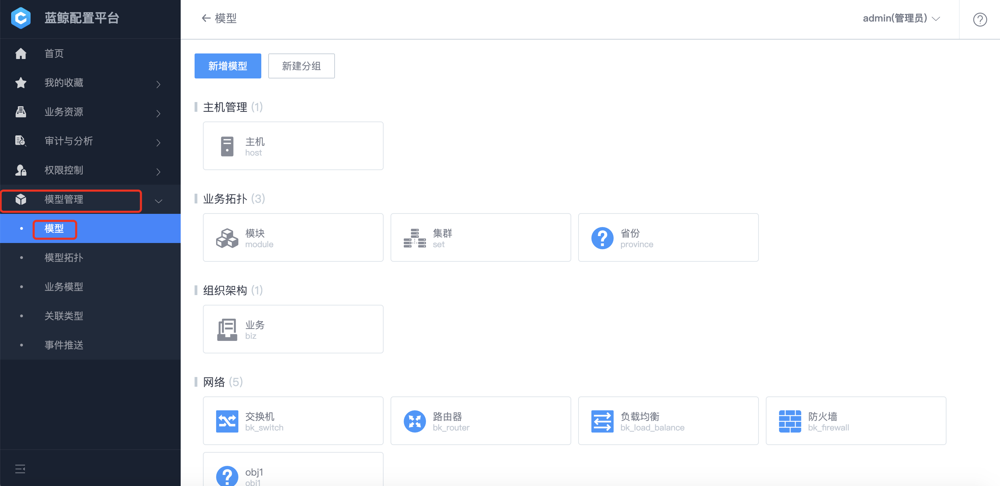

查看某个模型下的相关属性。

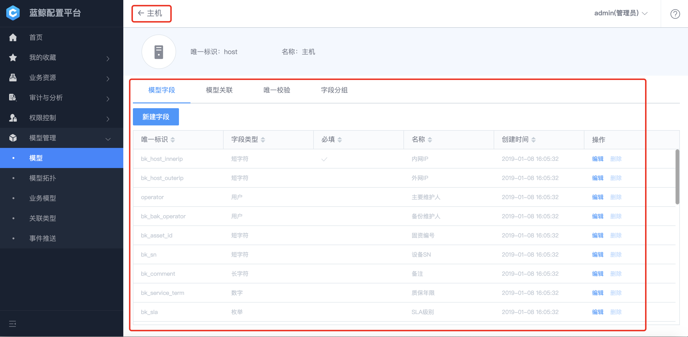

### 模型分组

系统支持对模型按照使用的功能进行分组。分组有 "系统内置" 和 "用户自定义" 两种类型，当前系统内置分组有 "主机管理"、"业务拓扑"、"组织机构"、"网络"、"中间件"。

a. 用户自定义分组：

新建分组：可以通过 【新建分组】 按钮进行新增。需要注意的是，分组名称在系统中具有唯一性。

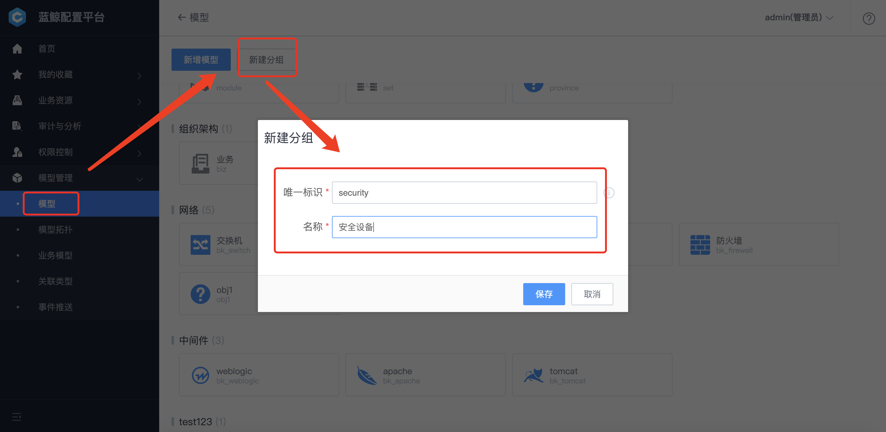

编辑分组：点击分组名右侧的 【编辑笔】 按钮对名称进行调整。

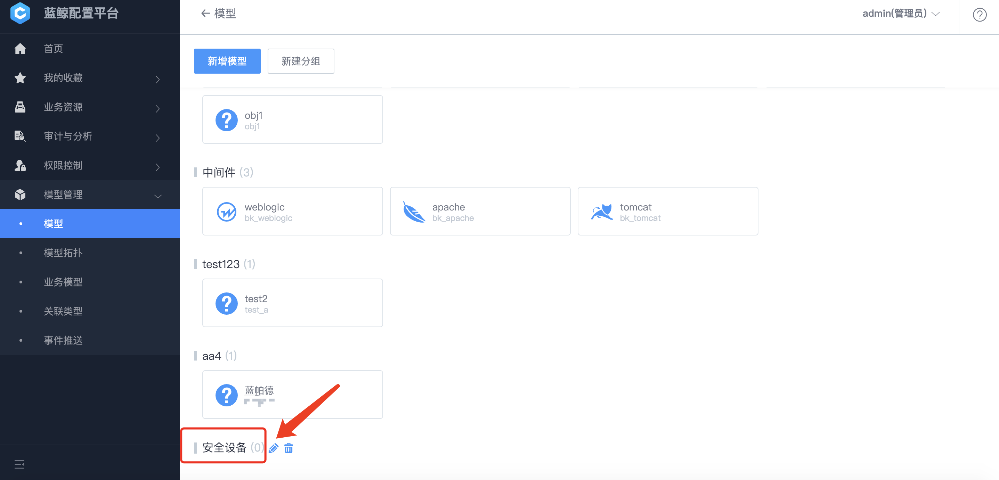

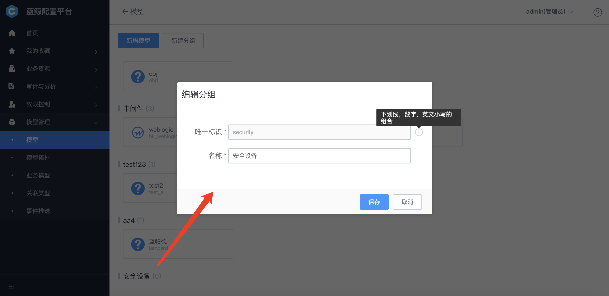

删除分组：选中目标分组，点击右侧 【删除】 按钮。需要注意的是，只有当分组下没有模型的时候，才可以删除此分组。

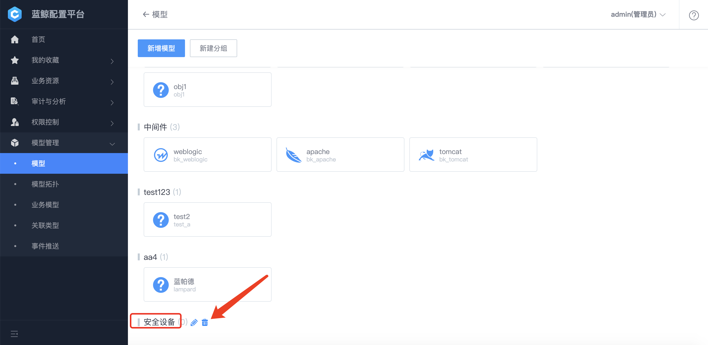

b. 系统内置分组：

目前包含 "主机管理"、"业务拓扑"、"组织构架"、"网络"、"中间件"，内置分组不可以编辑，但可以在其下建立模型。

### 模型创建

配置平台内置一些通用的模型，当现有的模型不能够满足需要的时候，可以通过新建的方式增加模型。

点击左上角的 【新建模型】 按钮，打开新增模型的对话框，然后选择所属分组，选择模型图标（后续可自定义图标），填写模型唯一标识以及名称，最后点击保存新建完成。

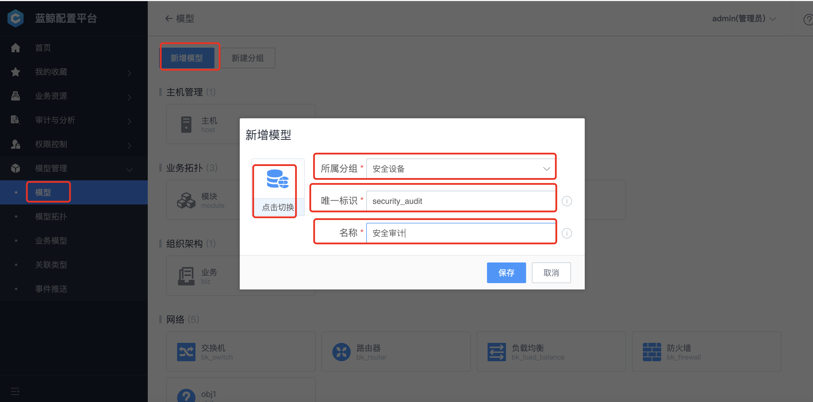

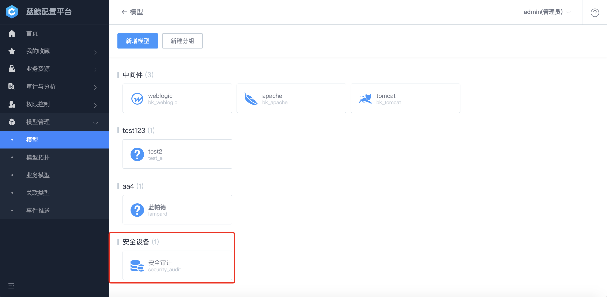


### 模型编辑

模型创建完之后，可以修改模型的名称、图标。但唯一标识不能修改。

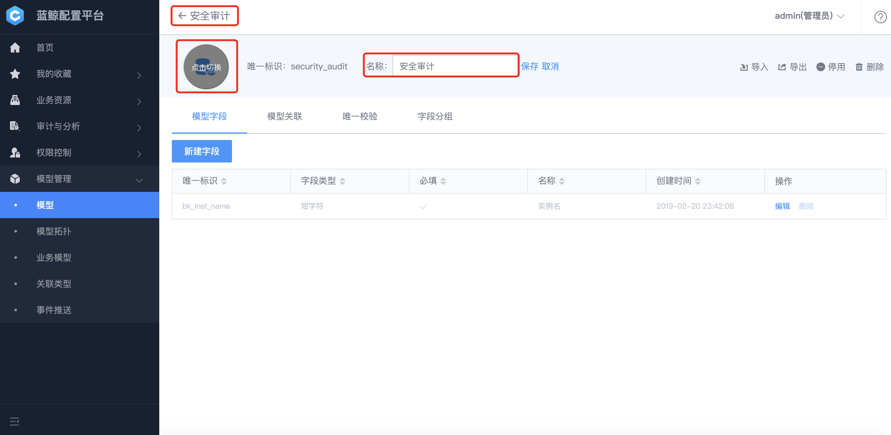

### 模型字段唯一校验

CMDB 设计了唯一性校验以避免出现重复的脏数据，即有以下逻辑：

1. 创建实例时，如果发现唯一校验规则出现重复，会认为是错误请求而阻止创建。
2. 编辑实例时，通过唯一规则找到确定的一个实例，如果发现匹配多个实例或者实例并不存在，系统会判定为一次错误编辑请求。

管理员在创建一个全新的自定义模型时，会自动内置 `bk_inst_name` 字段，并默认设定作为唯一校验字段。

管理员可以根据实际的数据实例管理需要，设定多种规则如下：

1. 多组规则独立判定。例如：对于服务器，同时设定数据实例必须满足 "固资编号" 和 "设备 SN" 同时满足全局唯一。
2. 单组规则包含多个字段，实现联合唯一判定。例如：对于机架，必须满足 "机房名 + 机架名 唯一"， "机房名：东莞机房，机架名：机架 1" 与 "机房名：东莞机房，机架名：机架 2" 认为合法。

通过以下步骤可以实现唯一校验规则的修改或新建：

1. 通过导航点击 "模型 - 选中需要修改的模型"，进入模型列表页面，找到需要修改的模型，点击进入对应的管理界面。
2. 切换到 "唯一校验" 功能面板，即可对需要调整的分组进行编辑，或者新增行的校验分组。


需要注意的是，校验分组有 "是否为必须校验" 的设定，一个模型只能够设定一组校验规则为 "必须校验"，其他分组为非必须。非必须分组当用户没有填写字段值时，不会触发校验。此外系统内置的关键模型为了保证系统的正常运作，不允许修改 "必须校验" 分组。

### 模型字段分组

实际应用中，对于模型的属性字段，我们需要对其进行归类排序，这时候可以使用字段分组功能。在模型编辑页面通过切换到 "字段分组" Tab 标签，可以进入此功能。

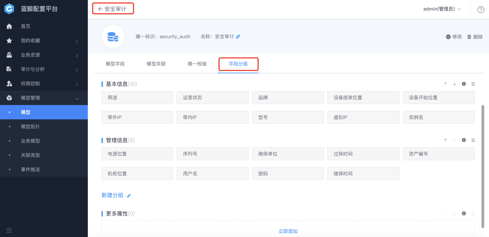

**字段排序**：鼠标悬停在目标字段上方，通过拖拽字段可以调整字段顺序以及字段的所属分组。

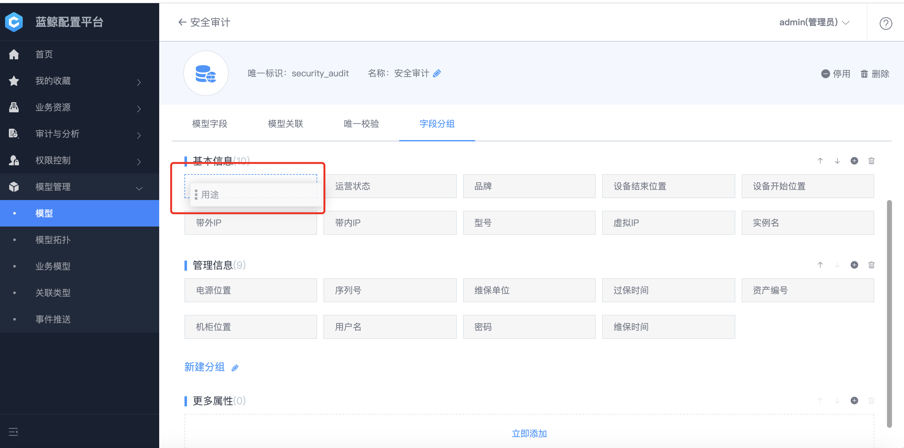

**分组编辑**：字段分组可以灵活的调整页面的上下排序位置，也可以新建和删除分组。

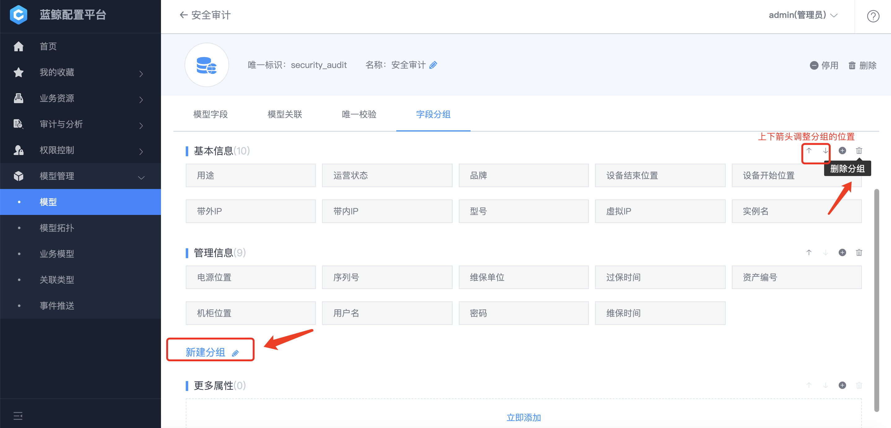

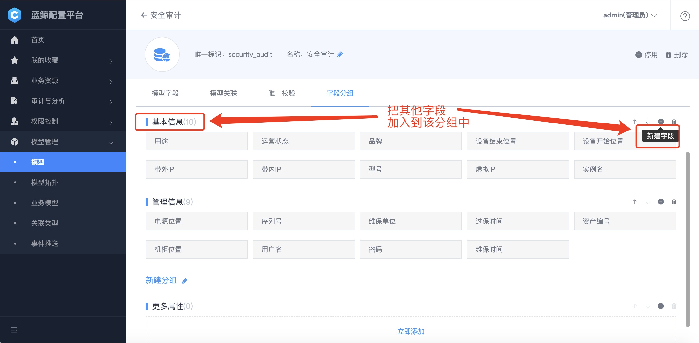

注意：用户在模型上新增的字段，会被自动放入到 "默认分组" 中。

### 模型删除

目前仅支持模型的 `停用` 和 `删除` 两种操作。

- **停用** 隐藏此模型和实例配置界面，但是实例数据仍然会保留。当用户只是暂时不需要暴露此类型的实例（或者禁止任何用户修改）可以使用此功能。

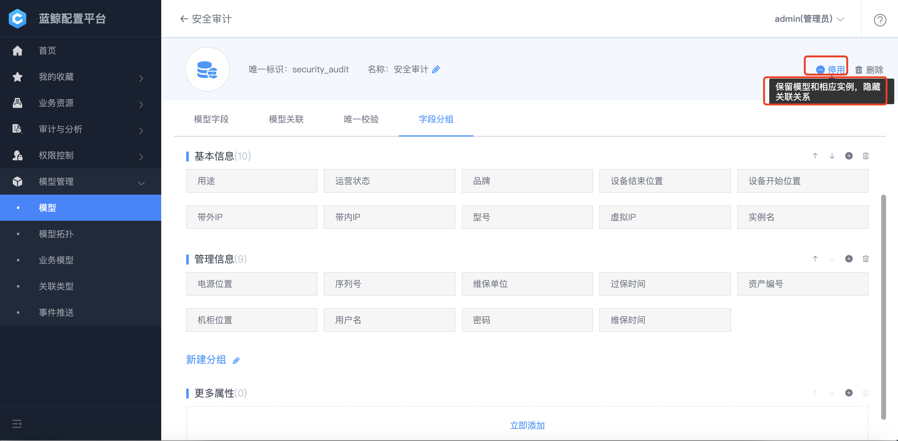

- **删除** 模型删除前需要确认实例均已经删除，否则模型删除失败。删除模型是不可逆操作，用户需谨慎决定。

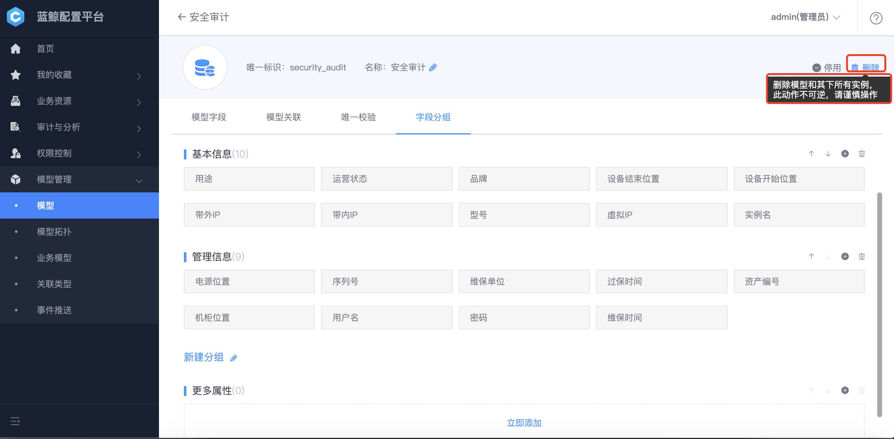

### 模型从停用恢复

当模型分组中存在被禁用的模型时，该模型图标右上角会显示红色的 "已停用"。点开模型编辑页面点击 "启用" 即可重新启用该模型。

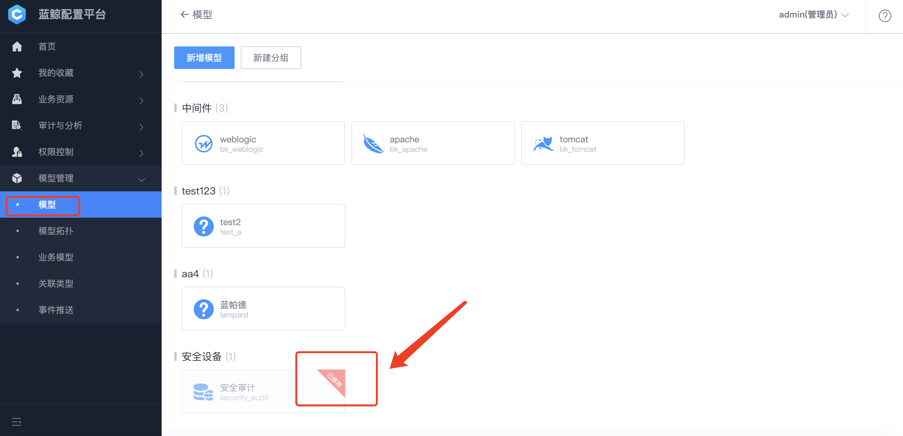

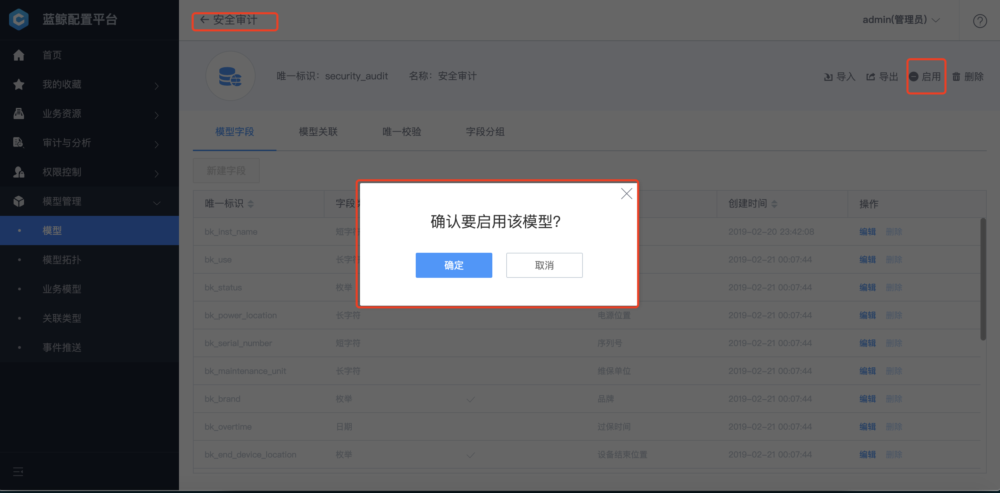

### 模型字段导出和导入

当用户需要创建类似的模型，或者对模型进行备份的时候，可以通过先将模型字段进行 "导出" 备份。然后新建一个模型，通过 "导入" 功能实现模型的复制。

需要注意的是，导出的 Excel 中可能会包含部分代码片段，没有专业指导的情况下请勿编辑这些代码，以免导入以后系统出现不可预知的异常。

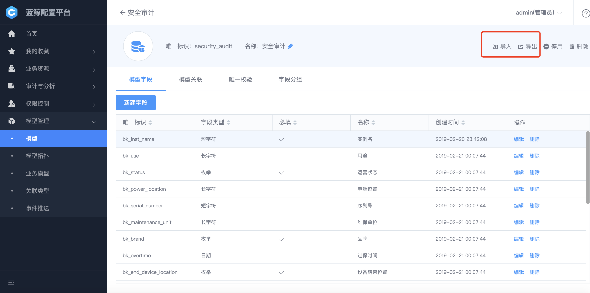

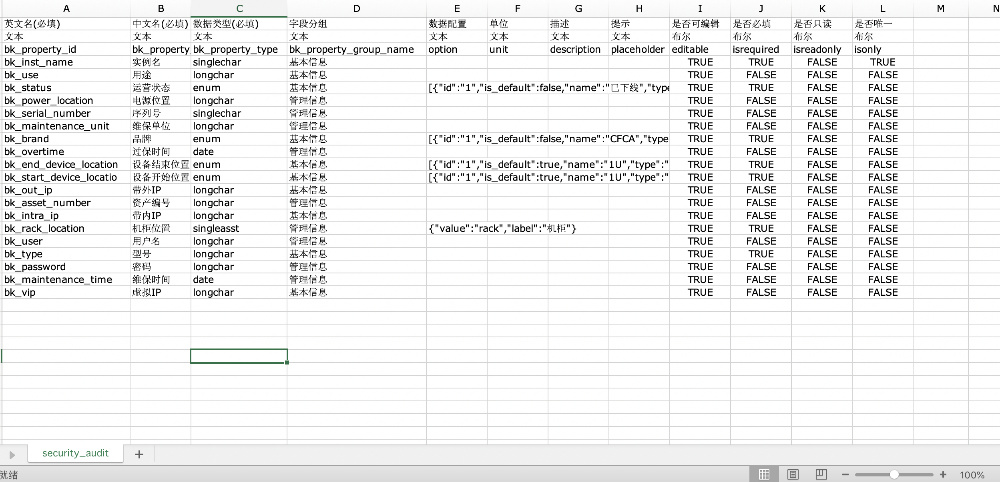

##  实例管理

实例指的是根据模型的定义创建出来的配置项，同一个模型的数据项，结构一致，属性值有差异。

当模型创建以后，用户可以在配置平台首页中，看到此模型名称，点击进入到实例管理页面。

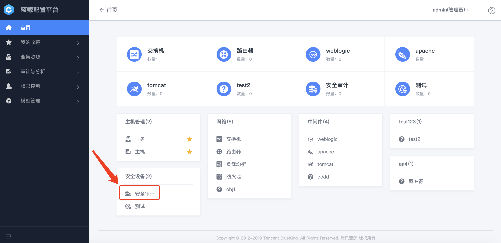

### 新增实例

进入到实例的管理界面中，通过点击上方的【立刻创建】 按钮新增实例。

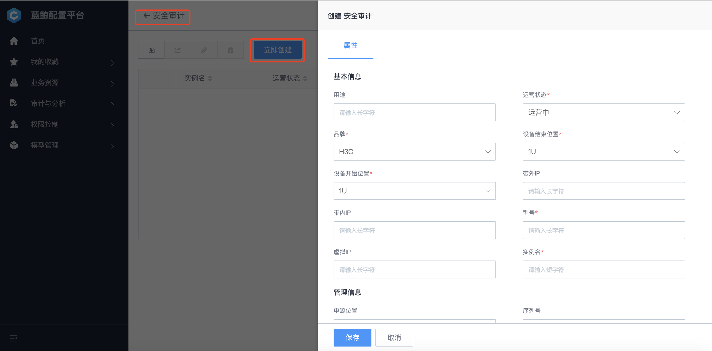

### 实例编辑和删除

实例仅支持 `编辑`、`删除` 有两种方式。

**单个实例**

通过点击列表中的单个实例，可以展开实例的查看页面。通过下方 【编辑】 按钮，可以进入到实例的编辑状态。点击删除则是删除实例，需要注意的是，实例删除以后不可撤销，但是可以通过实例 "删除历史查看" 功能查看到已经删除的实例信息

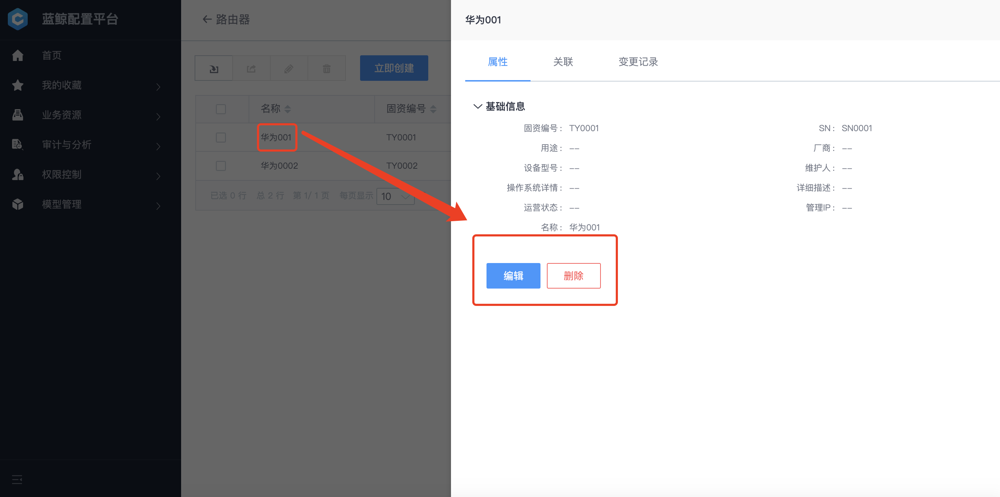

**多个实例**

列表中每个实例前都有一个勾选框，用户可以先勾选需要批量操作的实例。当勾选数量大于 1 个以后，上方的 【编辑】、【删除】 变成可用，用户可以通过这两个按钮对已选中实例进行批量修改和删除。

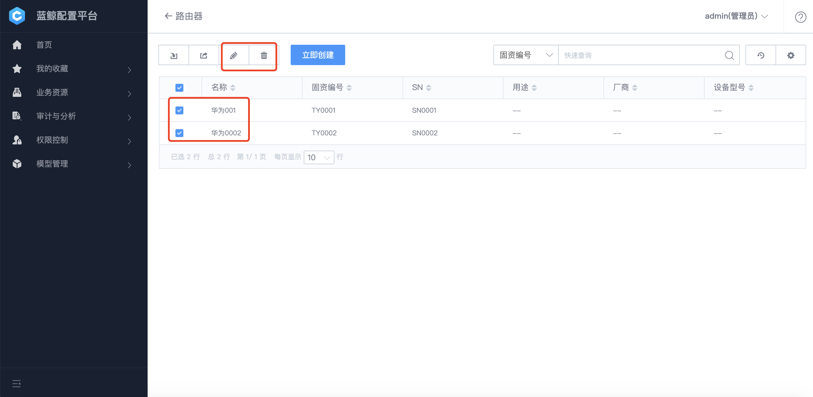

### 实例关联关系查看

关联关系和属性采用分离管理的方式，通过点击实例详情以后通过切换到 "关联" Tab，可以查看当前实例的关联。

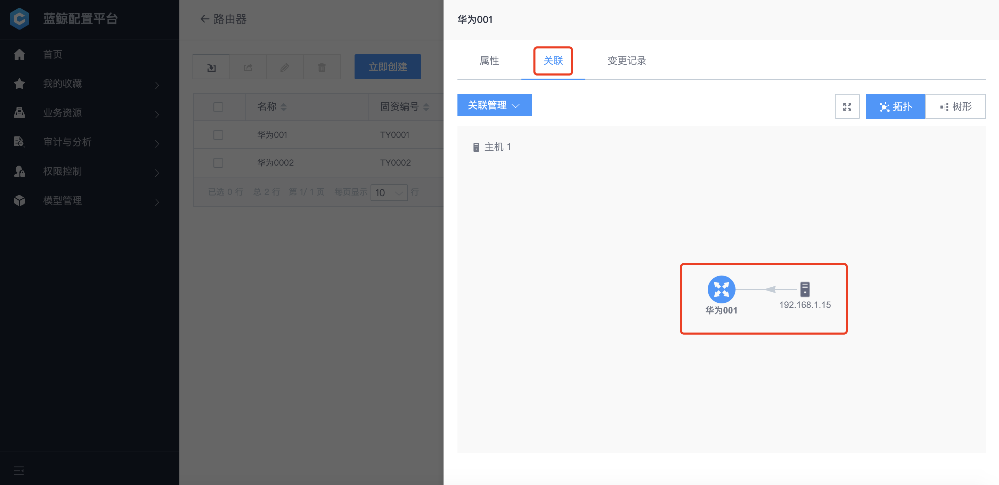


### 实例关联关系编辑

实例的关联关系构建依赖模型之间已存在关联关系。

**添加关联**（以主机管理路由器为例）：

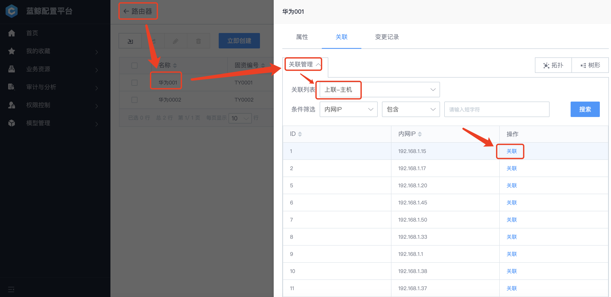

**删除关联**:

同添加关联操作一致，打开关联管理面板，找到当前关联实例，点击 "取消关联" 完成关联的删除。

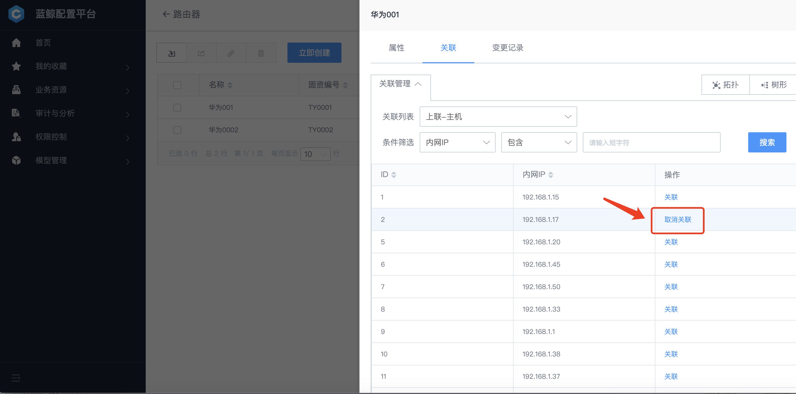

### 实例操作历史查看

对于 CMDB 里面管理的每个实例 (包含主机或者用户自定义实例)，均能够在实例详情中，看到其操作记录列表，默认按照时间倒叙排列。

用户可以通过时间范围和操作账号进行操作列表的筛选查看。

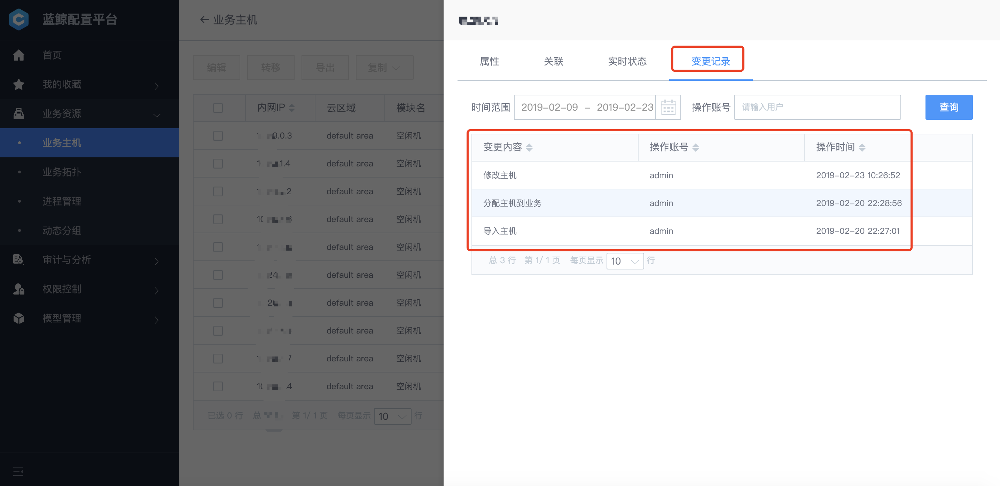

点击变更内容可以查看操作的详情。

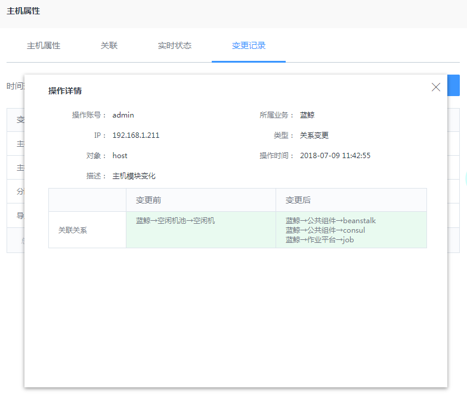

## 模型拓扑

模型拓扑是支持用户可视化查看当前模型关系的拓扑视图，并进行简单管理的功能。通过导航 "模型 - 模型拓扑" 进入功能界面。

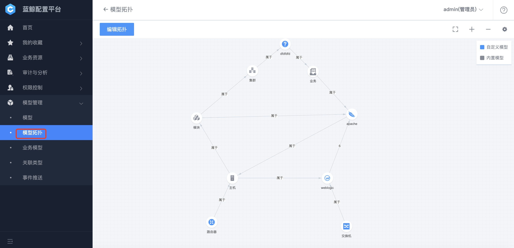

### 创建模型之间关联

1. 点击 "编辑拓扑" 进入可视化关联管理模式。
2. 画布左侧栏列出了当前系统的所有模型分组和模型，模型分组后面数字显示为 0，表示该模型分组下的所有模型都已经在模型拓扑画布里；数字为 m，表示该模型分组下还有 m 个模型没有在模型拓扑画布里，点开可以查看具体模型。


3. 将模型拖入画布中，鼠标移动到模型上方，在浮出的按钮中，点击 【创建关联】 按钮，此时从当前模型到鼠标之间会出现一条虚线，鼠标选中其他任意模型，单机即可完成连线。

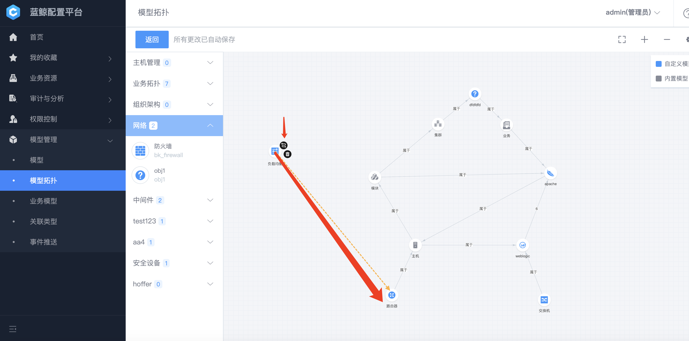

4. 在关联连线完成后弹出的对话框中，填写 "关联描述"，根据需要修改其他参数即可创建关联（关联类型的创建可查看 本章的 [新增关联类型]）。

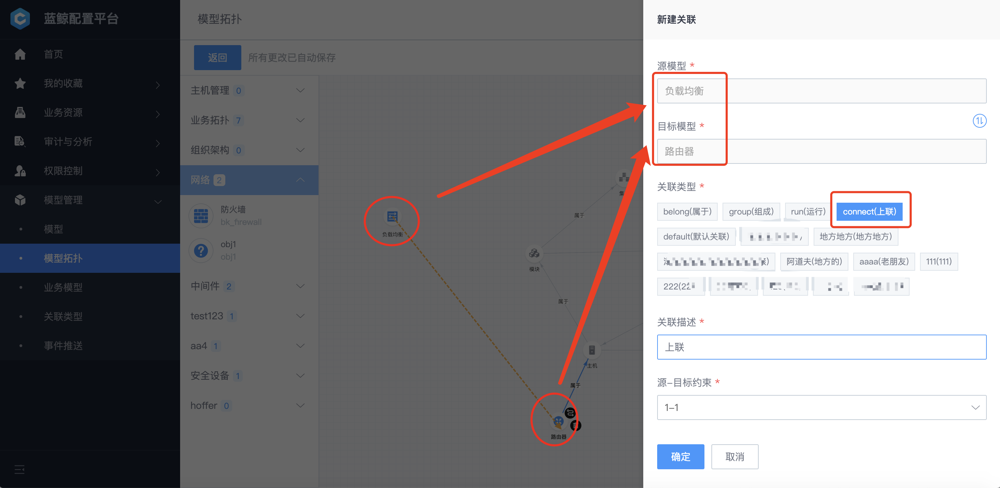

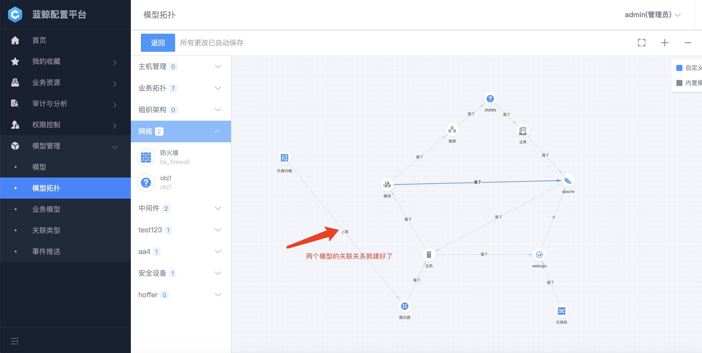

### 删除模型之间关联

1. 点击 编 "辑拓扑" 进入可视化关联管理模式。
2. 直接点击模型之间连线，打开关联详情。
3. 点击 "删除关联" 完成删除关联。


**注：** 如果两个模型之间有多种关联，鼠标指向模型关系的连线，在浮出的菜单中，选择需要编辑的关联进入到对应的详情页。

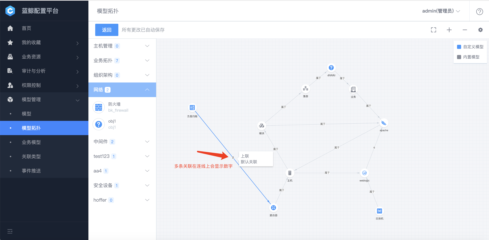

如点开数字 2 后删除 "默认关联" 这条，如下：

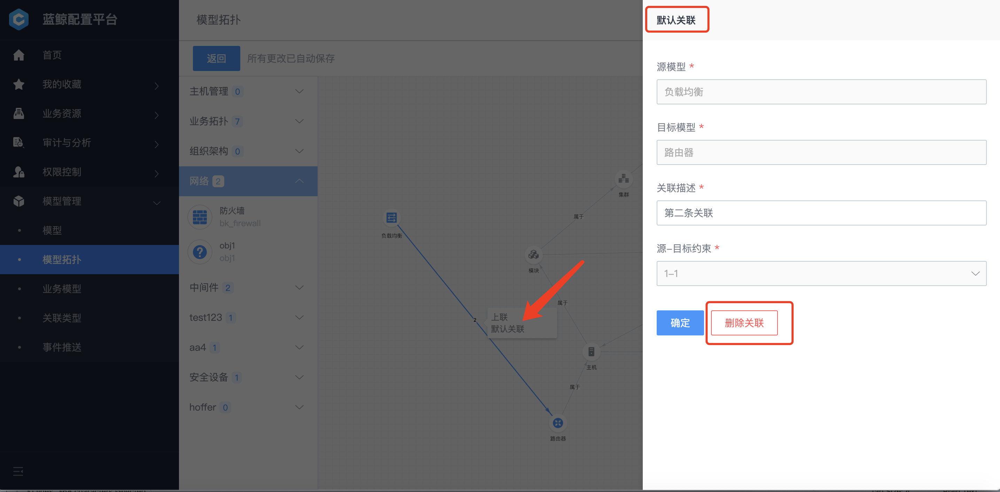

### 模型从拓扑视图移除

1. 点击 "编辑拓扑" 进入可视化关联管理模式。
2. 鼠标移动到模型上方，在浮出的按钮中，点击 【删除模型】 按钮。
   - 删除模型必须先清除模型的关联关系。
   - 模型已经实例化不能删除。
   - 删除模型只是把模型从画布里移回左边的模型分组栏，不会真正的从系统删除该模型。

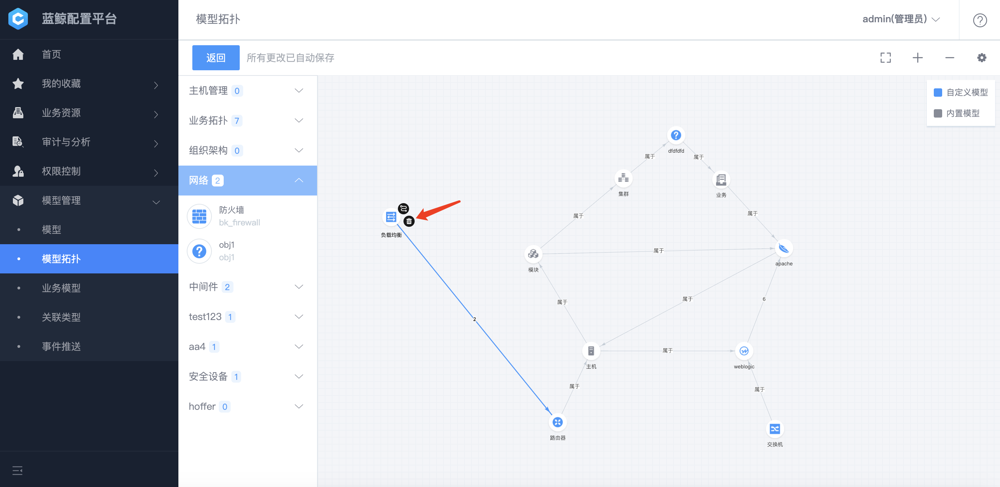

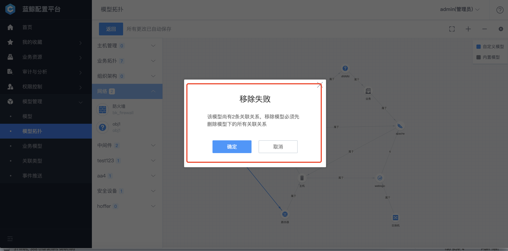

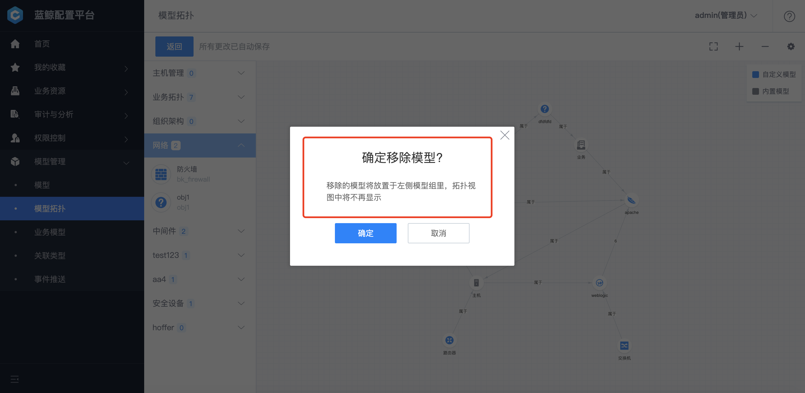

##  业务模型

蓝鲸配置平台中，默认的主线业务拓扑只有 `业务 - 集群 - 模块 - 主机` 四层，而在不同企业的实际场景里，往往是不能满足对一个业务或系统的拓扑规划，所以支持了在业务跟集群之间的自定义拓扑层级，目前系统设定最多可以新增 3 个拓扑层级，也就是主线拓扑最多可以达到 7 个层级。

### 默认业务拓扑层级

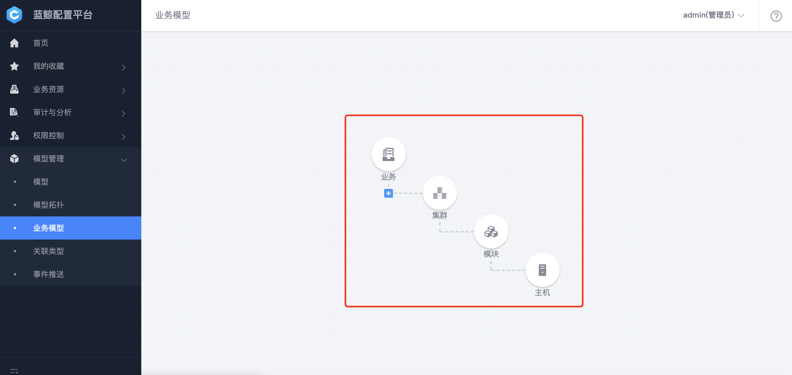

### 新增自定义层级

点击主线拓扑上 "业务" 下方的加号，弹出新建层级窗口，填写层级信息。

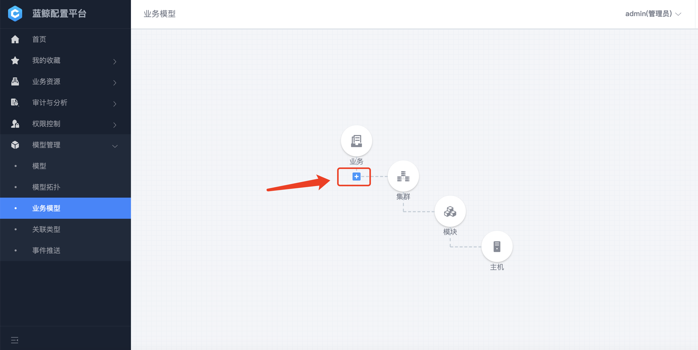

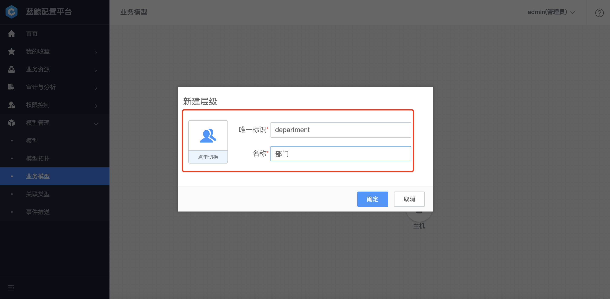


在业务拓扑页面也可以看到新增的拓扑层级，可以从此层级开始新建集群 - 模块。

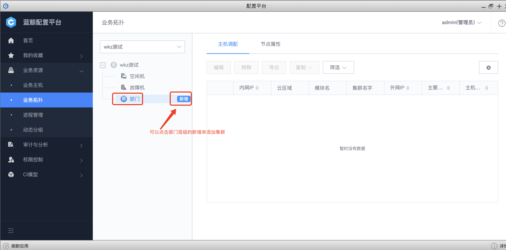

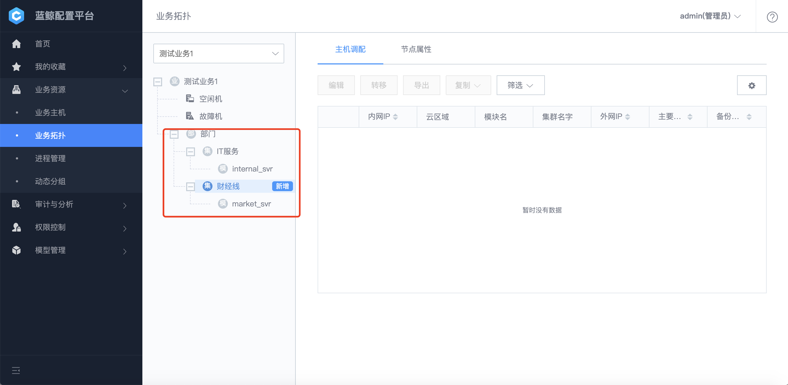

## 关联类型

模型关联是指两个模型之间的关联定义。只有定义了模型关联，才能够创建对应的数据实例之间的关系。

模型关联定义的关键概念解释如下：

1. 模型关联是独立的。即用户定义模型 A 和模型 B 之间的关联关系，此关系并不属于模型 A 或者模型 B 。
2. 关联类型。关联类型能够帮助用户识别同类关联，例如主机和交换机、主机和路由器均有关联，我们可以设定这两个关联都属于 "上联" 类型，在具体的主机实例中，可以通过查询具体主机的 "上联" 获取此主机所有上联的网络设备。
3. "源 - 目标约束"。在真实环境中，关系是存在约束定义的，例如一个硬盘只能够属于一个主机，一个主机可以有多个硬盘。为了避免用户录入数据出现错误，我们可以设定，主机到硬盘的关系中 "源 - 目标约束" 为 1-N。
4. 关联描述。对关联关系的补充描述，当关联关系类型不能够准确表达关联配置的时候，可以补充此描述。

模型之间的关系管理为了方便管理提供了两个入口，本小节主要介绍通过 "模型管理 - 模型" 功能进行关联管理。另外一种管理方式可以参考 本章的 [模型拓扑](5.1/配置平台/产品功能/ModelManagement.md#模型拓扑)小节描述。

### 关联类型首页

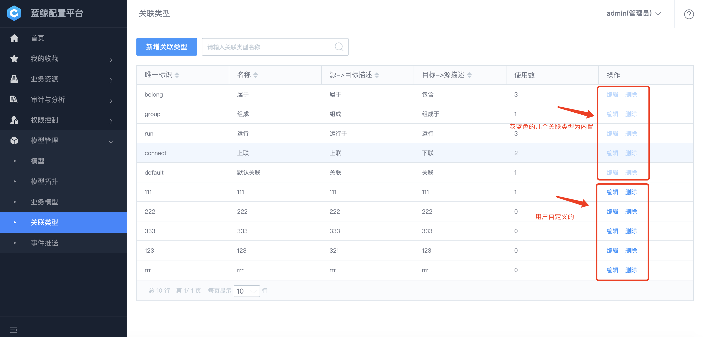

### 新增关联类型

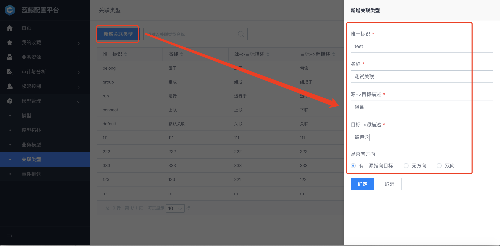

### 创建模型关联

这里假定我们需要创建模型 A 和模型 B 之间的关联。

1. 点击模型 A 或者模型 B 进入模型管理详情页面，上文提到关联是独立的，所以只需要操作 A 或 B 其中一种即可。
2. 切换到 "模型关联" 功能页，点击 【新建关联】 按钮。
3. 在弹出对话框中，配置源和目标模型，修改关联类型和约束保存即可。

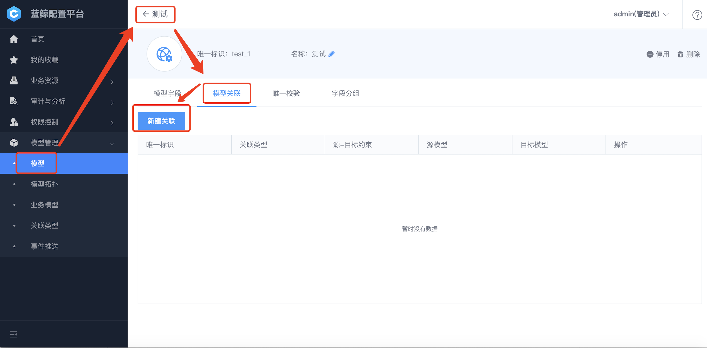

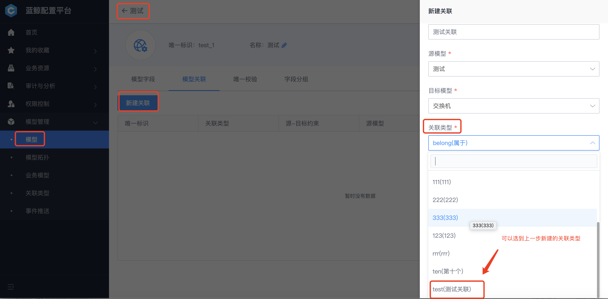

### 编辑模型关联

模型之间的关联创建以后，可以修改关联的描述信息：关联类型、关联描述。其他标识和约束不可以修改。

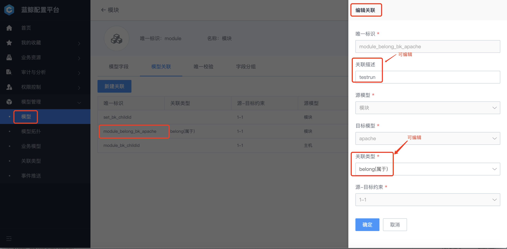

## 事件推送

**信息变更实时推送** 。实时推送功能解决了系统之间信息同步的频繁轮询和不实时问题。确定了订阅方式以后，当配置平台中相应模型发生变更时，订阅系统能够实时收到通知。

事件推送功能能够实现当配置信息发生变化的时候，实时通知到关联的系统中，目前支持 HTTP 的推送方式。

此功能属于高级功能，使用此功能前需要先为目标系统开发可接收 HTTP 请求的接口，接口接收的内容可参考如下 json：

```json
{
"event_id": 100,
"event_type": "instdata",
"action": "update",
"action_time": "2018-01-01 18:00 +08:00",
"obj_type": "set",
"cur_data": {},
"pre_data": {},
"dstb_id": 1,
"dstb_time": "2018-01-01 18:00 +08:00",
"subscription_id": 16
}
```

### 创建事件推送

目标系统接口完成开发以后，接下来需要在新增一个推送。

通过侧边导航打开 "模型管理 - 事件推送" ，点击 【新建】 按钮。

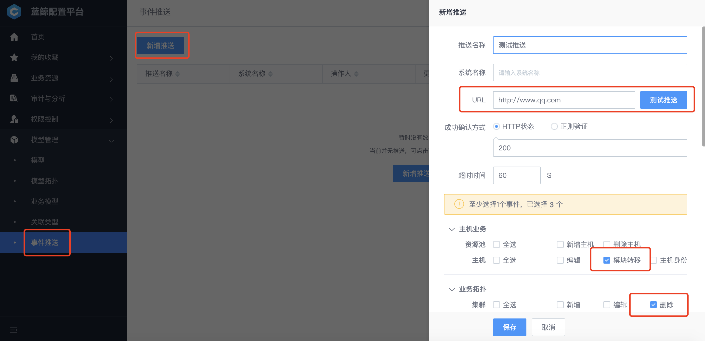

在新增推送的对话框中，主要关注完善三部分内容：
1. 推送名称：用于区分不同推送，同业务下需要保持唯一。
2. URL：目标系统接收推送请求的 URL，要求蓝鲸配置平台部署环境访问此 URL 链路畅通。
3. 事件订阅：根据目标系统的需要，可选择性勾选事件的内容。
当填写完成 URL 后，可以使用 "测试推送" 功能中查看到详细的推送信息和进行推送测试（调试配置平台是否能够访问到目标系统的 API）。


### 事件推送状态查询

创建好一个事件推送以后，可以在推送的列表中直观看到当前推送接收数量和失败情况。

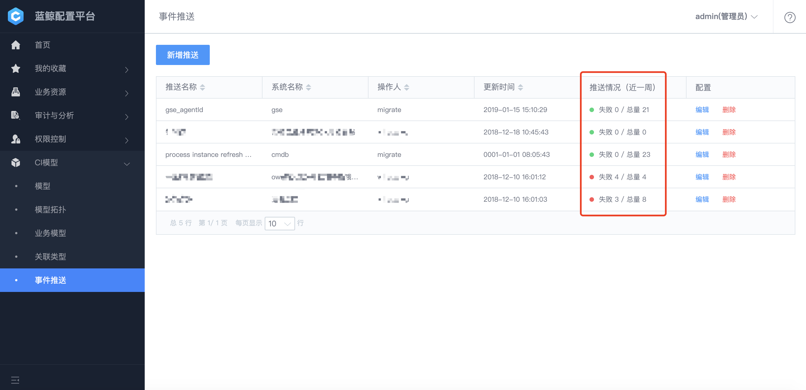
