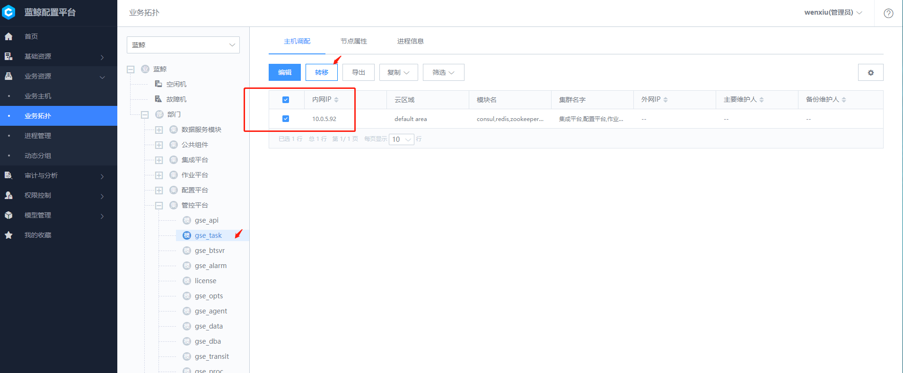
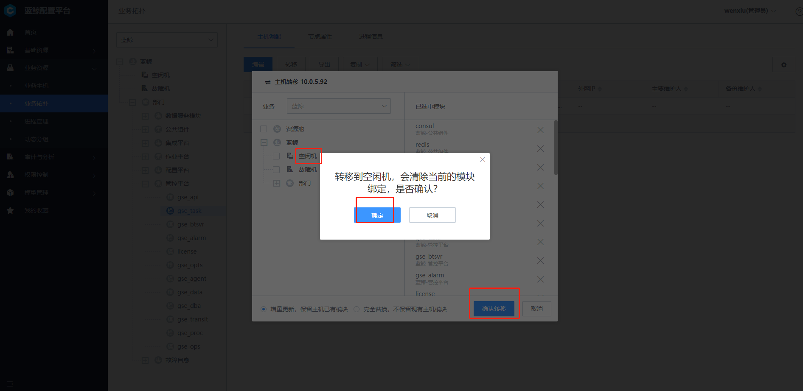
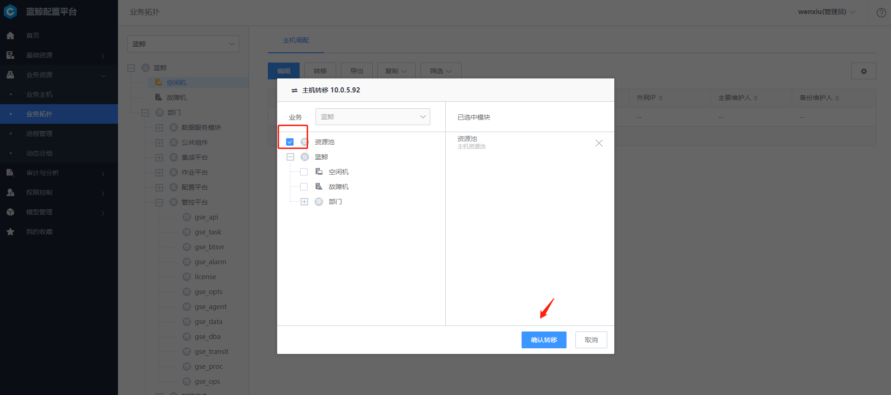
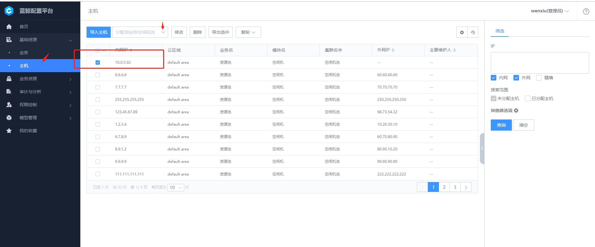
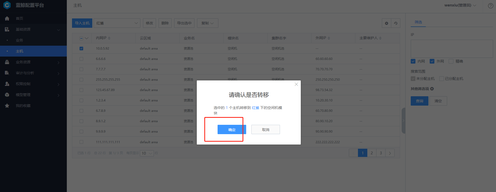
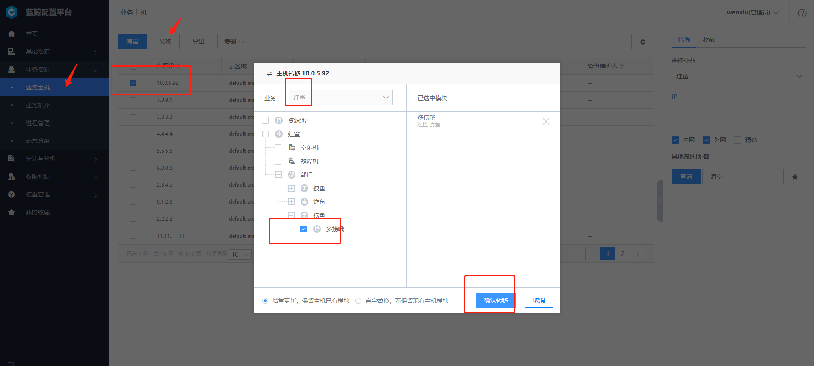

# 主机由 A 业务模块转移到 B 业务模块

具体步骤：

**主机分配到 A 业务空闲机池 -- 主机上交资源池 -- 主机分配到 B 业务空闲机池 -- 主机分配到 B 业务**

> Note：
> 主机的业务属性变更信息不会与节点管理同步，所以在主机转移之前请在节点管理卸载主机的 Agent ,主机转移之后再在节点管理重装 Agent 。

## (1) a1 模块下的主机分配到 A 业务空闲机池

导航栏进入 "业务资源 -- 业务拓扑" 页面。

查看 A 业务 a1 模块下的主机，勾选需要转移的主机，点击上方的 【转移】 按钮，在对话框中选择目标模块 "空闲机"，点击 【保存】 完成转移。

- 增量更新，保留主机已有模块：
  同一业务下的多个模块可以共享主机，如：主机既在 a1 模块下，又在 a2 模块下。

- 完全替换，不保留现有主机模块：
  主机只在转移后的模块下，之前的模块属性不被保留。

## (2) 主机上交资源池

导航进入 "业务资源 -- 业务拓扑" 页面

查看业务的 "空闲机" 模块，勾选刚刚转移过来的主机，点击上方的 【转移】 按钮，在对话框中选择 "资源池"，点击 【保存】 完成转移。

## (3) 主机分配到 B 业务空闲机池

详情参照 [如何创建业务并导入主机到业务中，（5）分配主机到业务空闲机池](5.1/配置平台/快速入门/case1.md)

## (4) 主机分配到 B 业务的模块

详情参照 [如何创建业务并导入主机到业务中，（6）分配主机到业务空模块](5.1/配置平台/快速入门/case1.md)

