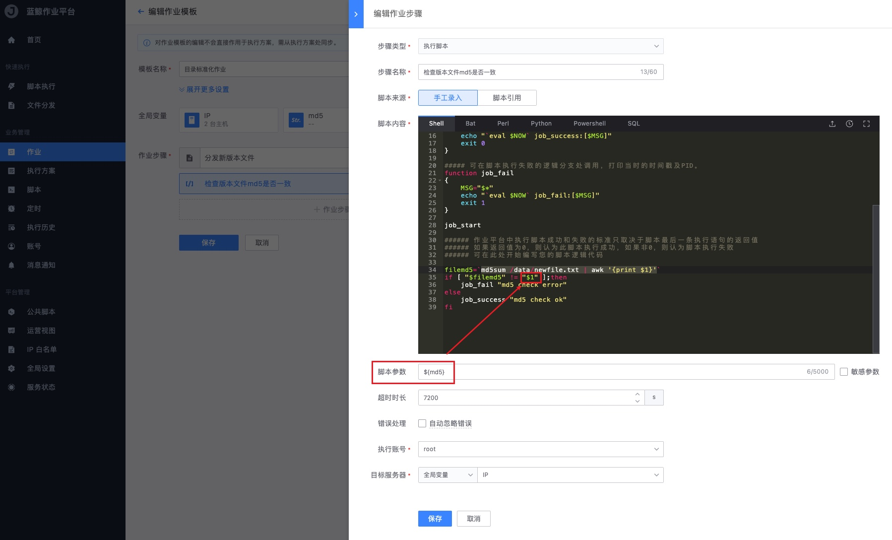

# 作业平台：批量完成多台服务器的文件分发和脚本检查

## 情景

对运行在多台服务器上的业务服务做新版本的文件分发，自动化的批量快速分发、执行脚本检查新版本文件的 md5。

## 前提条件

- 服务器已在 [CMDB 注册](../CMDB/CMDB_management_hosts.md)
- 拥有服务器所在 CMDB 中业务的运维权限

## 操作步骤

- 新建作业
- 执行和查看执行结果

### 新建作业

按照新版本发布的需求，我们需要将 `newfile.txt` 文件推送至 `/data/` 目录，为了确保万无一失，做 MD5 校验。

作业模板如下：

提示：我们配置两个全局变量，“主机列表”类型变量 IP（用于批量给作业步骤传输主机 ip 信息）和“字符串”类型变量 md5（用于进行新版本 md5 的填参）

IP 变量，可以通过“静态 ip 选择”、“动态拓扑选择”、“动态分组选择”和“手动输入”四种方式进行 ip 选择。

在步骤中通过选择目标服务器——全局变量——IP 的方式进行有引用。

md5 变量，可以在脚本参数中直接使用。

### 设置执行方案

保存作业后，需要将作业模板设置为一个执行方案，进行全局变量和执行步骤的选择，使其满足该单一场景的使用。该执行方案即可重复使用。

### 执行作业及查看执行结果

作业执行后，可以查看到执行步骤的进度。

每个步骤点击后，可以查看执行详情。切换步骤，可以切换执行详情。

