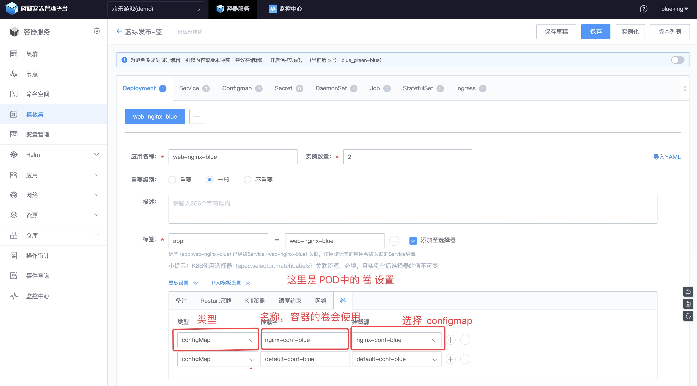
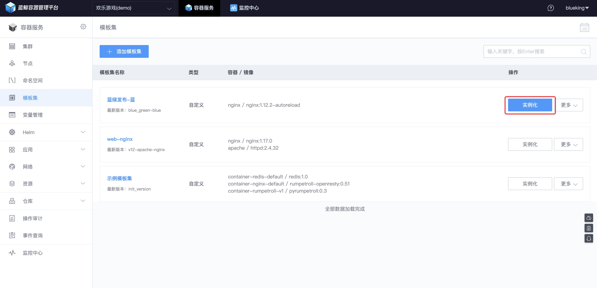

# 应用的蓝绿发布（原：研发测试环境管理）

## 情景

传统的应用更新方式是**停服更新**，用户在更新期间**无法使用服务**。

接下来，将以 Nginx 从 `1.12.2` 升级 `1.17.0` + 程序代码（index.html 的内容从 Nginx 默认页 更新为 1.17.0）为例，看 BCS 中的**蓝绿发布能力**是如何实现**不停机更新**，**用户无感知**。

## 前提条件

- [K8S 基本概念](https://kubernetes.io/zh/docs/concepts/)，包含 [Deployment](https://kubernetes.io/zh/docs/concepts/workloads/controllers/deployment/)、[Services](https://kubernetes.io/docs/concepts/services-networking/service/)；本节教程新增概念：[ConfigMap](https://kubernetes.io/docs/tasks/configure-pod-container/configure-pod-configmap/)、[Ingress](https://kubernetes.io/docs/concepts/services-networking/ingress/)、[Ingress Controllers](https://kubernetes.io/docs/concepts/services-networking/ingress-controllers/)。
- [完成 BCS 部署](../../../部署指南/产品白皮书/增强包安装/部署安装/BCS-V2.md)

## 操作步骤

- 应用的蓝绿发布逻辑介绍
- 使用 K8S 资源准备版本
- 使用 K8S 资源准备新版本
- 切换流量并观察

### 蓝绿发布逻辑介绍

#### 发布逻辑示意图

蓝绿发布，即准备当前运行版本 和 新版本 两组实例，正式发布的时候，修改服务的域名的 DNS 记录将，将其指向新版本的 Ingress 指向的地址 。


#### 版本更新流程中引入的对象

以 Nginx 从 `1.12.2` 升级 `1.17.0` + 程序代码（index.html 的内容从 Nginx 默认页 更新为 1.17.0）为例，使用以下几个 新的对象：

- 程序代码或可执行文件（index.html） ：Docker 镜像
- 程序或运行环境配置（nginx.conf） ：ConfigMap
- 负载均衡器 （LoadBalancer）+ Ingress ： 用户接入和负载均衡

其中 Deployment、Service 不再赘述。

### 使用 K8S 资源准备版本

#### 新增 LoadBalancer

Ingress 是 K8S 中描述用户接入的对象之一， 需要配合 LB 应用才能对外提供访问。

在 BCS 中，LoadBalancer 背后的技术是 K8S 维护的 **Nginx Ingress Controller**。

选择菜单【LoadBalancer】，点击【新建 LoadBalancer】，选择一个节点作为 LB 对外提供网络接入服务。


> 建议业务 Pod 不调度至 LB 所在的节点，可使用 节点亲和性（nodeAffinity）实现。

#### Configmap ： 存放 nginx.conf

在【模板集】菜单中，选择【Configmap】，新建 nginx.conf 和 default.conf 两个 configmap，实现**应用程序和配置的解耦**。


#### 创建 K8S 对象 Deployment 、Service、Ingress

- 创建 Deployment

在【Deployment】中，填写 名称、标签（Label）、容器镜像、挂载卷（挂载 Configmap）。




- 创建 Service

在【Service】中关联 Deployment 以及服务名称、暴露的端口。


- 新建 Ingress

在【Ingress】中填写 【主机名】、【路径】以及绑定 【Service】。


#### 实例化模板集

保存模板集后，实例化模板集。



可以看到对应资源已生成好。

- Deployment


- Service


- Ingress


修改域名解析或修改 PC 上 hosts 文件（Mac 下路径为 /etc/hosts），将 Ingress 中配置的主机名解析到 LoadBalancer 中节点的外网 IP，然后打开浏览器访问。


以上作为线上环境运行的版本，接下来部署新版本。

### 使用 K8S 资源准备新版本

本次新版本参照微服务更新的最佳实践：将应用程序打入 Docker Image，**更新 Deployment 中的镜像即更新版本**。

#### 制作新版本的 Docker Image

以 index.html 为应用程序，将其打入镜像，由于新版本的运行时是 Ningx 1.17.0，故以  Nginx 1.17.0 为基础镜像。

- 准备 dockerfile

```bash
$ ll
total 16
-rw-r--r--  1 breaking  staff    49B  9 10 10:55 dockerfile
-rw-r--r--  1 breaking  staff    40B  9 10 10:54 index.html

$ cat index.html

Welcome to BCS.

Nginx Version: 1.17.0

$ cat dockerfile
FROM nginx:1.17.0
COPY index.html /usr/share/nginx/html
```

- 构建 Docker Image

```bash
$ docker build -t bcs_nginx:1.17.0 .
Sending build context to Docker daemon  3.072kB
Step 1/2 : FROM nginx:1.17.0
 ---> 719cd2e3ed04
Step 2/2 : COPY index.html /usr/share/nginx/html
 ---> 9e1342027c80
Successfully built 9e1342027c80
Successfully tagged bcs_nginx:1.17.0

$ docker images
REPOSITORY                                              TAG                   IMAGE ID            CREATED             SIZE
bcs_nginx                                               1.17.0                9e1342027c80        18 seconds ago      109MB
```

- 推送镜像到仓库

```bash
$ docker tag bcs_nginx:1.17.0 <Registry_URL>/joyfulgame/bcs_nginx:1.17.0

$ docker push <Registry_URL>/joyfulgame/bcs_nginx:1.17.0
The push refers to repository [<Registry_URL>/joyfulgame/bcs_nginx]
8b2c2f2923c8: Pushed
d7acf794921f: Mounted from joyfulgame/nginx
d9569ca04881: Mounted from joyfulgame/nginx
cf5b3c6798f7: Mounted from joyfulgame/nginx
1.17.0: digest: sha256:b608ac54ca92dd092529f9b86403d3a539eab030103e2e0c1a984787ece448c9 size: 1155
```

> 更多 Docker Image 的构建方法可以参考 [docker-nginx](https://github.com/nginxinc/docker-nginx/blob/master/stable/alpine/Dockerfile)。

#### 克隆模板集为新版本

由于新版本主要在 Deployment 的镜像版本、Ingress 绑定的主机名，以及这几个 K8S 对象的命名差别（同一个命名空间不允许重名），所以克隆模板集，然后修改即可。

点击【复制模板集】，会克隆一个模板集，命名为：蓝绿发布-绿


- 修改【Deployment】中的名称、标签以及镜像版本。


- 修改【Service】中的名称、关联标签。


- 修改 Ingress，主机名不能上一个版本一样。


最后保存模板集，然后开始实例化模板集。

修改域名解析或修改 PC 上 hosts 文件（Mac 下路径为 /etc/hosts）后，访问 Ingress 中配置的主机名。


### 切换流量并观察

如果是客户端业务，将请求的后端地址指向为新版本的主机名即可，如果客户端不方便更新配置，可以使用 CNAME 将域名指向到新的版本的主机名。

观察一段时间，如果没有异常，删除原版本的实例即可。


- 蓝绿发布的好处：新版本如果发现异常，可以快速的切换到老版本。

- 蓝绿发布的坏处：预备双倍的资源，直到下线老版本。不过如果有云平台，成本可控。

企业可以结合自身实际情况，选择合适的版本发布方式。
