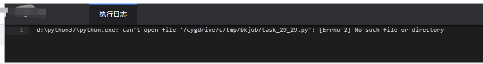

# 常见 FAQ
### 在 windows 服务器上尝试通过作业平台运行 python 脚本，提示文件不存在
一开始是指定了 Python 的位置，但运行时直接提示找不到文件：

**解决方案：**
[https://bk.tencent.com/s-mart/community/question/8150?type=answer](https://bk.tencent.com/s-mart/community/question/8150?type=answer)

