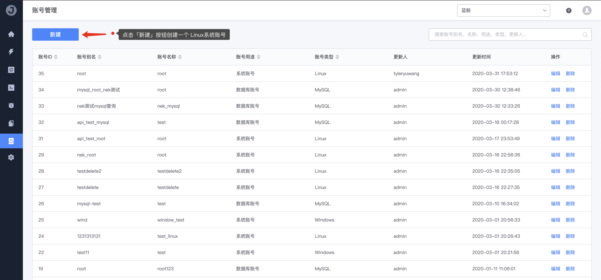
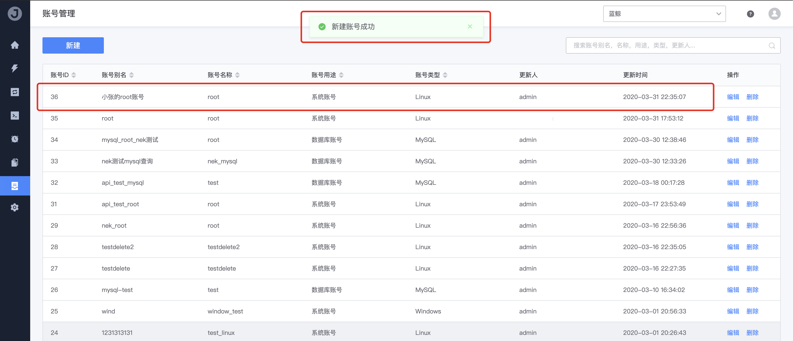

# 1. 创建系统账号

## 前置条件

```bash
无
```

## 操作步骤

1. 前往 **业务管理 - 账号** 点击 `新建` 按钮

   

2. **填写账号信息**

   

   - 用途

     作业平台支持管理 `系统账号` 和 `数据库账号`

   - 类型

     对于系统账号，又分为 `Linux账号` 或 `Windows账号`

   - 名称

     名称就是对应的服务器上真实的执行账号名（如：root、Administrator、user00 等等）

   - 别名

     因为不同服务器相同名称的账号可能会存在不同密码的情况，所以这里的别名就是为了解决这个问题

   - 描述

     用于该账号的备注描述信息

3. **账号创建完成**

   

   系统提示新建成功后，我们就可以在列表中看到刚刚创建的账号记录了。