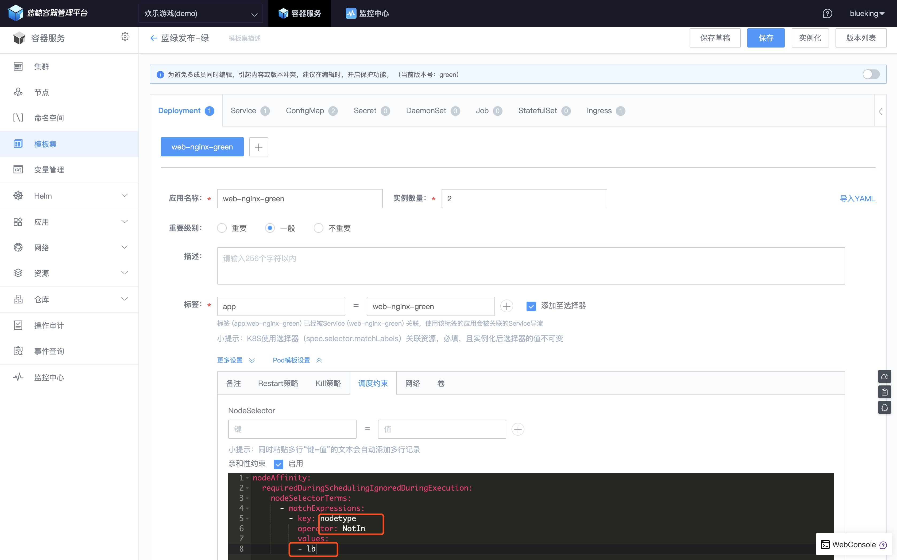

# LoadBalancer

[Ingress](../../../Function/k8s/service/ingress.md) 一节中提到 Ingress 描述资源对外的访问方式，背后需要 Ingress Controller 支撑，本节介绍 BCS 中的使用的 Ingress Controller。

[Ingress Controller](https://kubernetes.io/docs/concepts/services-networking/ingress-controllers/) 有很多种实现，比如 Traefik、Nginx Ingress Controller、 HAProxy Ingress Controller 等，在 BCS 中定义 LoadBalancer， 采用 K8S 官方维护的 Nginx Ingress Controller。

## 如何创建 LoadBalancer

在【LoadBalancer】菜单中，点击【新建 LoadBalancer】，添加一台或多台节点作为 LoadBalancer，点击【保存】即可。


## LoadBalancer 的背后技术

### Nginx Ingress Controller

实际是创建了 2 个 Deployment

```bash
# kubectl get deploy -n dev
NAME                                     DESIRED   CURRENT   UP-TO-DATE   AVAILABLE   AGE
blueking-nginx-ingress-controller        1         1         1            1           32h
blueking-nginx-ingress-default-backend   1         1         1            1           32h
```

查看 nginx-ingress-controller 的配置文件，可以看到我们在场景案例 [应用的蓝绿发布](../../../Scenes/Bcs_blue_green_deployment.md) 中定义的 Ingress 。

```bash
# kubectl  exec blueking-nginx-ingress-controller-79c687dc95-c4k5b -n dev -- cat /etc/nginx/nginx.conf

    ## start server blue.bk.tencent.com
    server {
        server_name blue.bk.tencent.com ;

        listen 80;

        listen [::]:80;

        set $proxy_upstream_name "-";

        location / {

            port_in_redirect off;

            set $proxy_upstream_name "dev-web-nginx-blue-80";

            set $namespace      "dev";
            set $ingress_name   "web-nginx-blue";
            set $service_name   "web-nginx-blue";

            client_max_body_size                    "500m";

            proxy_set_header Host                   $best_http_host;

            # Pass the extracted client certificate to the backend

            proxy_set_header ssl-client-cert        "";
            proxy_set_header ssl-client-verify      "";
            proxy_set_header ssl-client-dn          "";

            # Allow websocket connections
            proxy_set_header                        Upgrade           $http_upgrade;

            proxy_set_header                        Connection        $connection_upgrade;

            proxy_set_header X-Real-IP              $the_real_ip;

            proxy_set_header X-Forwarded-For        $the_real_ip;

            proxy_set_header X-Forwarded-Host       $best_http_host;
            proxy_set_header X-Forwarded-Port       $pass_port;
            proxy_set_header X-Forwarded-Proto      $pass_access_scheme;
            proxy_set_header X-Original-URI         $request_uri;
            proxy_set_header X-Scheme               $pass_access_scheme;

            # Pass the original X-Forwarded-For
            proxy_set_header X-Original-Forwarded-For $http_x_forwarded_for;

            # mitigate HTTPoxy Vulnerability
            # https://www.nginx.com/blog/mitigating-the-httpoxy-vulnerability-with-nginx/
            proxy_set_header Proxy                  "";

            # Custom headers to proxied server

            proxy_connect_timeout                   5s;
            proxy_send_timeout                      60s;
            proxy_read_timeout                      60s;

            proxy_buffering                         "off";
            proxy_buffer_size                       "4k";
            proxy_buffers                           4 "4k";
            proxy_request_buffering                 "on";

            proxy_http_version                      1.1;

            proxy_cookie_domain                     off;
            proxy_cookie_path                       off;

            # In case of errors try the next upstream server before returning an error
            proxy_next_upstream                     error timeout invalid_header http_502 http_503 http_504;

            proxy_pass http://dev-web-nginx-blue-80;

            proxy_redirect                          off;

        }

    }
    ## end server blue.bk.tencent.com
```

### 使用建议

一般我们建议选择多台专属节点作为 LoadBalancer，不要分配其他 Pod 到该节点。

可以通过 节点 **亲和性约束** 实现。


