# 快速入门

> 如还未部署蓝鲸社区版，请参考[社区版 6.0 基础包快速部署](https://bk.tencent.com/docs/document/6.0/127/5830)

## 一分钟感性认识蓝鲸社区版

- 应用面板

  以应用的方式展示社区版完整部署之后的所有产品（包括后续自己开发的 SaaS），可以通过排序来自定义 SaaS 位置。

  

- 开发者中心

  面向开发人员，提供了丰富的“SaaS 开发者服务”，如前后台开发框架、API 网关(ESB)、调度引擎、公共组件等，让开发者可以简单、快速地创建、部署和管理 SaaS。
  
  

  

- 侧边栏（常用链接）

  包含蓝鲸官网提供的资源，如教程文档、MagicBox（前端开发工具集，速搭建前端页面），以及自定义的快捷访问链接。

  

## 一分钟快速预览蓝鲸各产品功能

| 产品                                                         | 功能简述                                                     |
| ------------------------------------------------------------ | ------------------------------------------------------------ |
| [用户管理](https://bk.tencent.com/docs/markdown/用户管理/产品白皮书/产品白皮书/产品简介/README.md) | 蓝鲸提供的企业组织架构、多用户目录等集中的用户管理解决方案   |
| [权限中心](https://bk.tencent.com/docs/markdown/权限中心/产品白皮书/产品白皮书/产品简介/README.md) | 蓝鲸体系集中权限管理服务，细化到资源实例级别的访问权限控制   |
| [配置平台](https://bk.tencent.com/docs/markdown/配置平台/产品白皮书/产品简介/Overview.md) | 提供主机、进程、模型等各种运维场景的配置数据服务管理，是蓝鲸体系的基石 |
| [节点管理](https://bk.tencent.com/docs/markdown/节点管理/产品白皮书/Introduce/Overview.md) | 批量快速地部署蓝鲸 Agent，覆盖 Linux、Windows 操作系统     |
| [作业平台](https://bk.tencent.com/docs/markdown/作业平台/产品白皮书/Introduction/What-is-Job.md) | 提供批量脚本执行、文件分发、文件拉取、定时任务等基础操作的原子平台 |
| [标准运维](https://bk.tencent.com/docs/markdown/标准运维/产品白皮书/产品简介/README.md) | 可视化的图形界面流程编排、跨系统调度利器                     |
| [监控平台](https://bk.tencent.com/docs/markdown/监控平台/产品白皮书/intro/README.md) | 提供丰富的数据采集能力、大规模的数据处理能力，致力于满足不同场景的监控需求 |
| [日志平台](https://bk.tencent.com/docs/markdown/日志平台/产品白皮书/intro/README.md) | 基于业界主流的全文检索引擎，提供多种场景化的采集、查询功能   |
| [故障自愈](https://bk.tencent.com/docs/markdown/故障自愈/产品白皮书/产品简介/Overview.md) | 实时发现告警，预诊断分析，自动恢复故障，并打通周边系统实现整个流程的闭环 |
| [流程服务](https://bk.tencent.com/docs/markdown/流程服务/产品白皮书/产品简介/README.md) | 灵活自定义设计流程模块，覆盖 IT 服务中的不同管理流程或应用场景 |
| [管控平台](https://bk.tencent.com/docs/markdown/管控平台/产品白皮书/产品简介/README.md) | 蓝鲸体系的底层管控系统，是蓝鲸所有其他服务的基础（GseAgent） |

## 开启蓝鲸之旅

> 运维的职能包括 **应用发布** 、 **变更** 、 **故障处理** 以及 **日常需求处理**等 ，覆盖研发运营生命周期的 **持续集成** （CI）、 **持续部署** （CD）、 **持续运营** （CO）三个阶段，从研发代码构建到测试包交付再到测试环境部署，将验证通过的版本部署到生产环境，以及提供业务上线后的运维基础支撑和增值服务。

接下来从`管理员`视角来看如何从 0 到 1 的开启蓝鲸之旅！

### 一、【用户管理】账号分配

> 社区版部署完成之后只有一个系统默认内置的 admin 账号，也即管理员账号，拥有蓝鲸体系所有产品的权限。

如果需要不同角色人员来使用蓝鲸体系产品，则到【用户管理】添加用户即可。详见：[用户管理产品白皮书：新增本地用户目录](https://bk.tencent.com/docs/markdown/用户管理/产品白皮书/产品简介/README.md)

Ps：如果要在蓝鲸自带的用户鉴权体系上扩展，可以接入第三方的组织架构以及鉴权体系，详情可以参考：[社区版: 蓝鲸登录接入企业内部登录](https://bk.tencent.com/docs/document/6.0/130/5924)

### 二、【配置平台】创建业务

> 配置平台是构建其他所有流程的基石，所以在配置平台创建业务是重要的前置步骤。

#### 1、创建业务

*`业务`是蓝鲸 CD 体系中比较重要的概念和维度，日常使用中主机、进程、业务拓扑的管理都需要依赖已经存在业务，其他蓝鲸体系产品也基本上都是围绕`业务`的维度来提供对应的服务和相关的鉴权。*

打开【蓝鲸配置平台】，选择`资源`-->`业务`-->`新建`

#### 2、创建业务拓扑

*`业务拓扑`是配置平台进行主机管理的基础，合适的业务模型，可以结构化的管理好主机。*

业务创建成功后在`业务`菜单中，可以看到下拉列表有了刚刚新增的业务，默认有一个`空闲机池`的 set 和三个模块，如下：

点击拓扑顶点的业务，新建集群

有两种方式创建集群，这里以直接创建为例（同下面创建模块），从集群模板创建详见：[集群模板](https://bk.tencent.com/docs/document/6.0/152/6944)

从模板新建模块和服务分类的详细说明，可详见：[服务模板](https://bk.tencent.com/docs/document/6.0/152/6953)  [服务分类](https://bk.tencent.com/docs/document/6.0/152/6956)

至此，业务拓扑即创建完毕。

*Ps:业务拓扑默认三层，业务-->集群-->模块；如果实际应用场景不满足，可以新增自定义层级（最多支持7层），详见：[模型关系](https://bk.tencent.com/docs/document/6.0/152/6947)*

#### 3、导入主机

> 主机是配置平台管控最常见的资源，也是运维日常主要的管控对象；更多 CMDB 配置模型管理见：[模型管理](https://bk.tencent.com/docs/document/6.0/152/6954)

（1）方式一：手动导入，`资源`-->`主机`-->`导入主机`，批量从 Excel 导入（注意：批量导入只能导入直连区的主机，跨云区域的需要通过 Agent 安装导入，云区域说明详见：[基本概念：云区域](https://bk.tencent.com/docs/document/6.0/157/7018)）

​	（2）方式二：安装 Agent 自动注册（推荐）

### 三、【节点管理】Agent 安装

> 蓝鲸 Agent，是实现主机与蓝鲸通讯的专用程序，在主机上安装了蓝鲸 Agent 以后，可以通过蓝鲸对主机进行管控，包含文件分发、作业执行、数据上报、基础信息采集等，是所有上层服务的基础。

安装工具：**[节点管理](https://bk.tencent.com/docs/markdown/节点管理/产品白皮书/Introduce/Overview.md)**（批量快速地部署蓝鲸 Agent，覆盖 Linux、Windows）

以安装直连区域为例（非直连安装可详见：[安装蓝鲸Agent（自定义云区域）](https://bk.tencent.com/docs/document/6.0/157/7015)）

打开【节点管理】，选择`Agent管理`菜单，点击安装 Agent-->普通安装

安装过程可以看到每个步骤的详情

安装成功后，在`Agent管理`菜单可以看到状态正常，即完成Agent的安装

### 四、【作业平台】作业执行&文件分发

> Agent 安装完之后，即可用[作业平台](https://bk.tencent.com/docs/markdown/作业平台/产品白皮书/Introduction/What-is-Job.md)进行批量脚本执行、文件分发、文件拉取、定时任务等基础运维操作

#### 1、快速脚本执行

打开[作业平台](https://bk.tencent.com/docs/markdown/作业平台/产品白皮书/Introduction/What-is-Job.md)，选择左边菜单栏的`脚本执行`

#### 2、快速文件分发

打开[作业平台](https://bk.tencent.com/docs/markdown/作业平台/产品白皮书/Introduction/What-is-Job.md)，选择左边菜单栏的`文件分发`

至此，我们完成了作业平台的两大核心功能`脚本执行`和`文件分发`的操作；通常情况，我们往往是需要组合这两个操作原子，并进行编排，比如版本包分发到服务器之后，需要解压，然后需要修改配置并拉起进程，这种场景我们可以通过作业平台的`作业`功能来实现，可详见：[作业管理](https://bk.tencent.com/docs/document/6.0/125/5757) 。

### 五、【标准运维】任务流程编排

> **标准运维**是通过可视化的图形界面进行多系统间的“任务流程编排”和“执行”的系统，将企业内部多系统间的工作整合到一个流程模版中，实现一键自动化调度。

标准运维使用`项目流程`作为任务编排模板，通过`项目流程`模板可以反复新建、执行“任务”实例，从而实现“反复多次一键自动化调度”运维日常任务的功能。

我们准备编排一个简单的流程：**去服务器 IP1 上执行脚本（基于蓝鲸作业平台），然后发邮件通知（基于蓝鲸 PaaS 平台）告诉用户 userA：脚本执行完成**；并能够反复多次一键自动化调度使用。

#### 1、创建项目流程

标准运维使用`项目流程`进行调度编排。进入标准运维后，选择`项目流程`，选择服务器 IP1 所在的业务。

在项目流程页面，点击左上角新建按钮，新建项目流程。

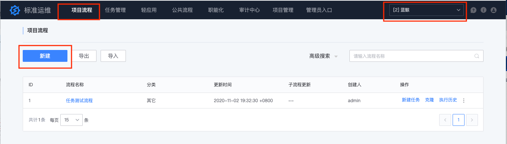

#### 2、编排项目流程

流程编排页面的总体界面介绍：

**上方：标题和流程功能区。** 命名标题和编辑流程的 4 项功能：设置全局变量、基础信息、本地快照、模板数据。

**左侧：插件节点。** 选择已经对接的系统功能插件、和流程逻辑按钮。

**中间：画布。** 将左侧原子、流程逻辑按钮，拖拽到画布上，连接，进行任务编排。

（1）拖拽左侧节点`作业平台(job)—快速执行作业`和`蓝鲸服务(BK)—发送通知`插件，到中间画布区域。

（2）通过连线，将节点以`开始`-->`快速执行作业`-->`发送通知`-->`结束`的方式进行编排。

（3）点击`快速执行脚本`节点，页面右侧弹出`节点配置`页面，在其中配置要执行的脚本、服务器ip、目标账户等信息。填写好参数后，点击`保存`按钮。**该步骤将蓝鲸作业平台的[快速执行脚本]的功能，编排入本流程中。**

（4）点击`发动通知`节点，页面右侧弹出`节点配置`页面，在其中配置通知方式、通知人员、主题、内容等信息。填写好参数后，点击“保存”按钮。**该步骤将蓝鲸 PaaS 平台的`发送通知`的功能，编排入本流程中。**（如果需要真实的发送通知，详见：[如何配置通知渠道，如邮件、微信、短信等？](https://bk.tencent.com/docs/document/6.0/148/6699)）

（5）至此，我们就编排好了一个流程，将【蓝鲸作业平台】和【蓝鲸PaaS平台】的两个功能进行串联。现在我们便可以一键式的自动调度执行这个流程。

#### 3、执行流程任务

在项目流程页面，可以查看已经保存的项目流程，通过点击右侧的`新建任务`链接，可以进入该项目流程的执行页面。

（1）第1步：查看到这个项目的全部步骤，如果配置了可选节点，可以选择要执行的节点。本例中，我们无须配置，直接点击`下一步`按钮。

（2）第2步：选择项目的执行信息和填写流程中需要的参数信息，本例中我们无须配置，直接点击`下一步`按钮。

（3）第3步：确认节点、参数，无误后，点击右上角的`执行`按钮，基于该流程的一条新任务实例开始执行。

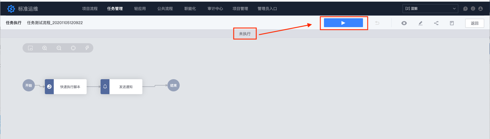

（4）在执行页面，可以直观看到每个节点的执行状态。

（5）点击节点，右侧弹窗会显示该节点详细的输入参数和输出返回的结果。当执行出错时，我们可以依据输入输出参数信息，定位出调用该系统时，执行出错的原因。

（6）节点的调用执行都成功以后，整个任务执行成功。我们可以在【蓝鲸作业平台】上看到服务器脚本的执行记录，也可以收到【蓝鲸 PaaS 平台】发送的邮件通知消息。

至此，我们完成了使用标准运维编排出了多系统调度的自动化流程，并且成功的一键式触发了执行。抛砖引玉，我们可以根据自己的业务场景来编排不同的任务流程。更多标准运维场景使用见：[标准运维产品白皮书](https://bk.tencent.com/docs/markdown/标准运维/产品白皮书/产品简介/README.md)。

### 六、【监控平台】监控告警配置

> 上面的步骤我们完成了运维的基本管控操作，接下来可能就需要对运维环境进行监控告警配置等，第一时间了解线上环境的运行情况，也是运维提供持续运营（CO）的职能体现。

通过【节点管理】安装 Agent 之后，默认即可使用主机监控，无需额外的配置。

#### 1、监控平台首页

打开监控平台后，会首先进入首页，相关功能见图所示。

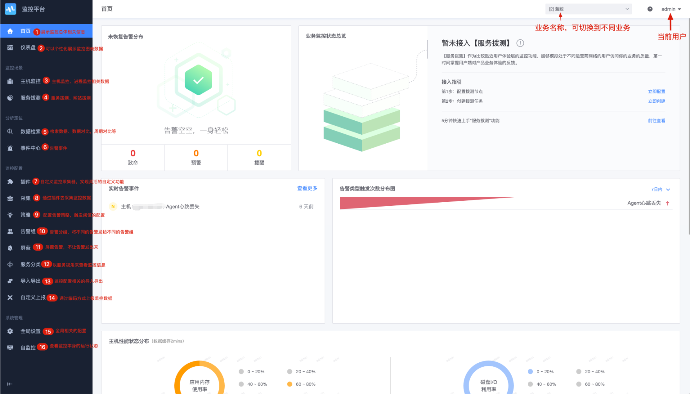

#### 2、主机监控

主机监控是监控的核心功能之一，可采集到完整的操作系统主机相关指标，如下图所示

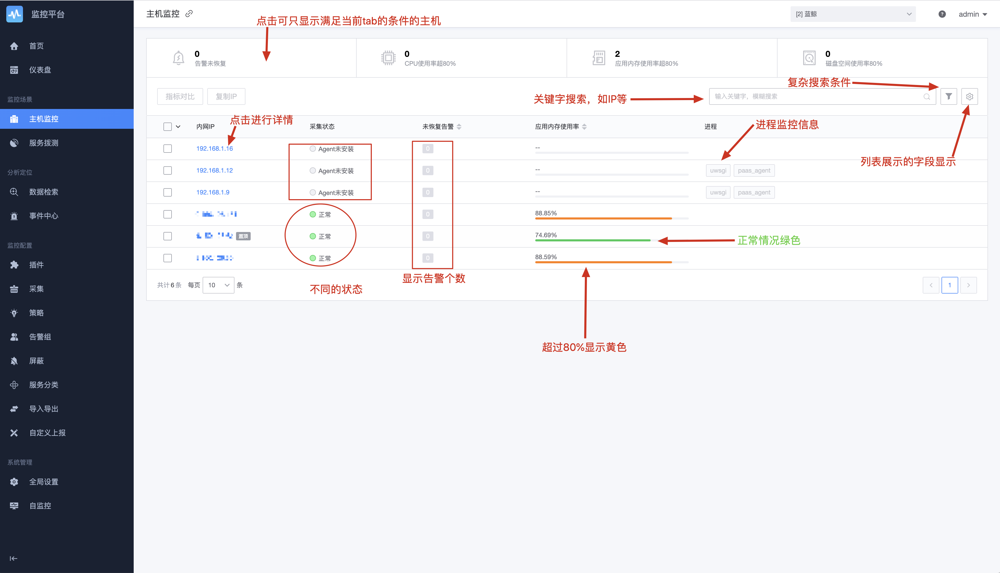

#### 3、主机监控视图

点击主机，可查看主机监控的详细视图

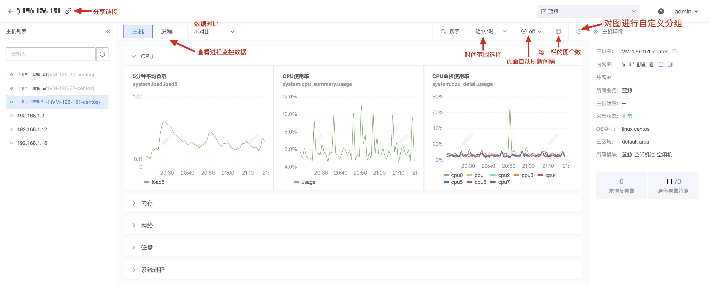

如需要对监控图进行大屏汇总，可使用仪表盘功能进行汇聚展示。

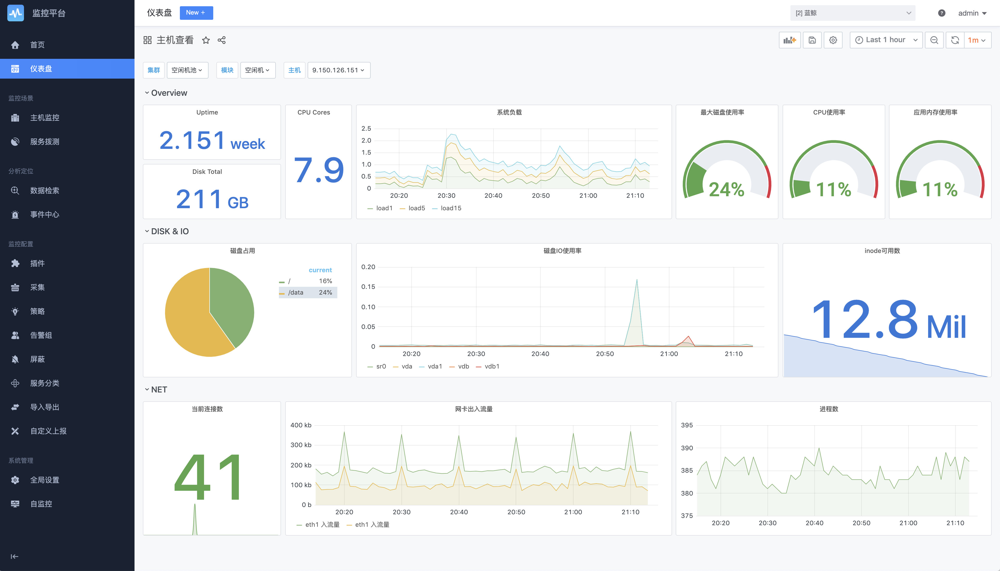

#### 4、告警策略配置

监控的重要功能是发送告警，通过配置监控策略，即可发送告警出来

#### 5、事件中心

在告警发送后，通过事件中心可查看告警

#### 6、告警屏蔽

由于主机的变更，已知的主机故障等情况导致的告警，可将告警进行屏蔽，如下图所示

#### 7、更多功能

​除了默认的监控数据采集功能外，还支持灵活的扩展方式接入监控数据，可以通过以下方式接入数据，详见[监控平台产品白皮书](https://bk.tencent.com/docs/markdown/监控平台/产品白皮书/intro/README.md)。

- 灵活的自定义脚本采集
- 日志关键字监控
- JMX 支持 java 程序监控
- 兼容 Prometheus 的 Exporter 数据采集
- 兼容 Datadog Agent 的数据采集
- 可编程上报监控数据，支持 HTTP，命令行上报数据
- 支持日志平台数据源接入
- 服务拨测、网站监控

### 七、【日志平台】日志检索

> 对于线上运行环境的监控，往往少不了关键字告警的场景；同时，排查故障时要快速检索错误日志也是运维经常面临的，研发团队对此也是有强烈的需求。

【蓝鲸日志平台】可以快速接入日志，并可对接监控平台。与`ELK`日志套件相比，具有上手简单，接入成本低等特点。

我们将采集/var/log/messages 作为演示日志如何接入:

#### 1、日志平台功能概览 

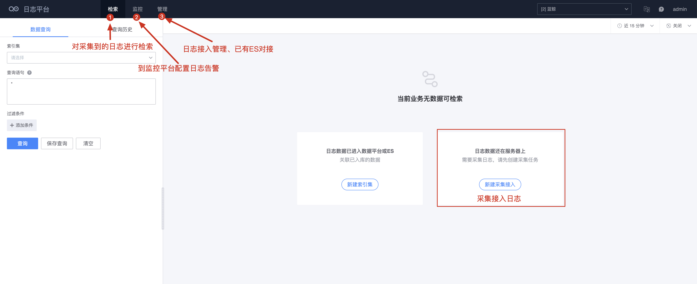

#### 2、接入日志 

点击菜单 `管理->采集接入-新建`

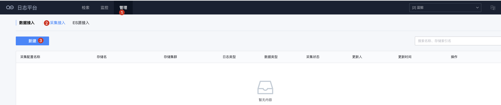

输入采集的日志路径

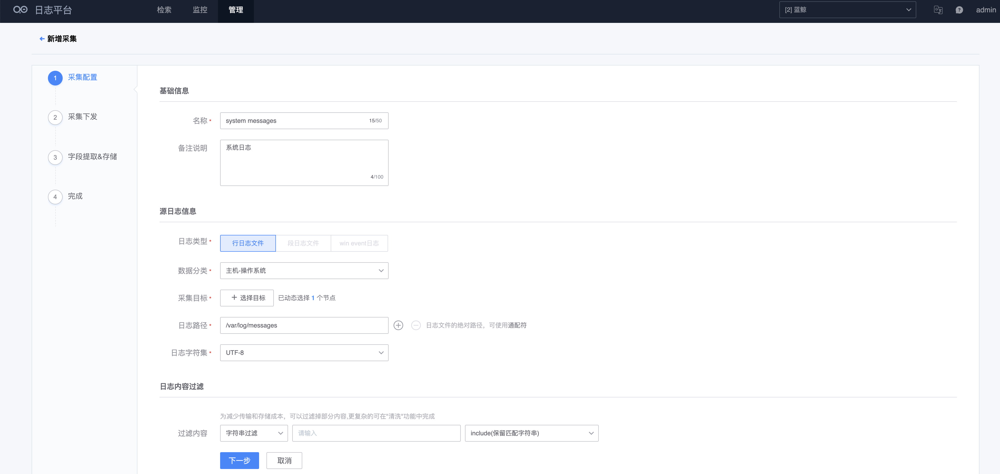

下发采集配置

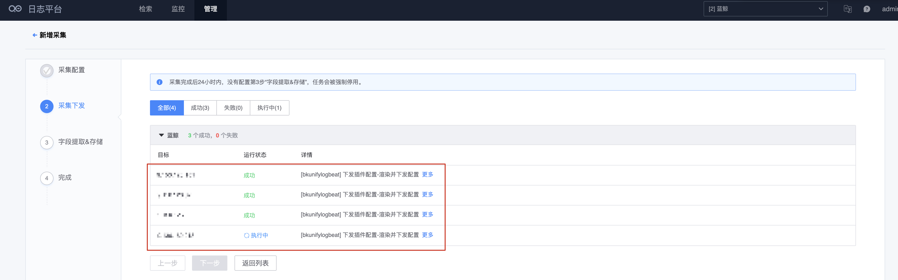

配置 ES 存储、索引名称，存储周期等，可根据实际存储周期要求配置

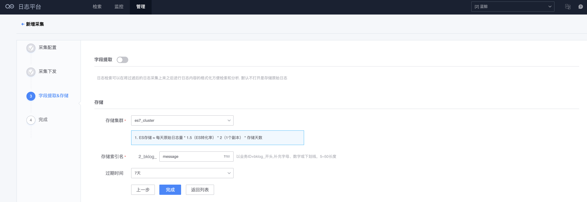

采集完成后，即可检索日志

#### 3、检索日志 

查看采集到的日志

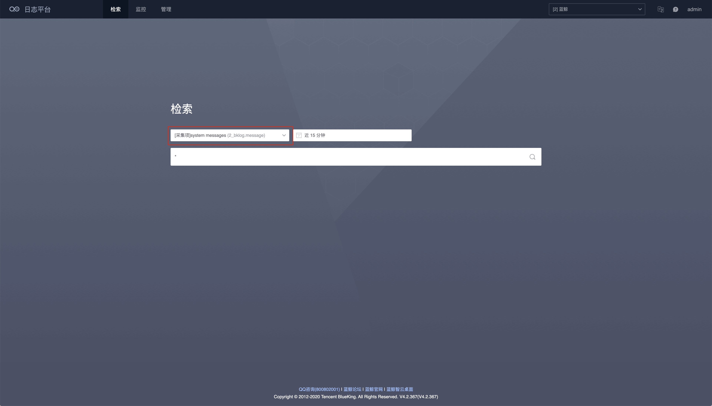

检索出的日志如下所示

至此，我们就完成了一个简单的日志采集&检索的场景。更多日志平台功能详见：[日志平台产品白皮书](https://bk.tencent.com/docs/markdown/日志平台/产品白皮书/intro/README.md)。

### 八、【权限中心】权限管理

> 以管理员的身份完成了以上的所有相关配置及操作之后，如果公司组织里其他人员需要使用蓝鲸体系产品，该如何进行权限的授权和申请呢？

蓝鲸权限中心（BKIAM）是蓝鲸智云提供的集中权限管理服务，提供权限接入服务，细化到资源实例级别的访问权限控制。用户可以在权限中心通过自定义操作权限、用户组来实现人员权限的管理。

#### 1、配置权限模板&用户组

管理员到【权限中心】配置好权限模板及创建好用户组，比如步骤二里创建的业务`测试专用`，建一个[测试专用业务运维用户组]，该用户组包含了设定的各个系统相关的运维权限，详细操作见：[权限中心产品白皮书：创建用户组](https://bk.tencent.com/docs/markdown/权限中心/产品白皮书/产品简介/README.md)。

#### 2、管理员直接给用户组添加人员或者普通用户直接去申请权限

- 主动授权

- 申请权限（推荐申请用户组，如果不满足可以申请自定义权限）

至此，非管理员也具备了使用蓝鲸体系的权限，可以根据具体场景来使用不同的产品。