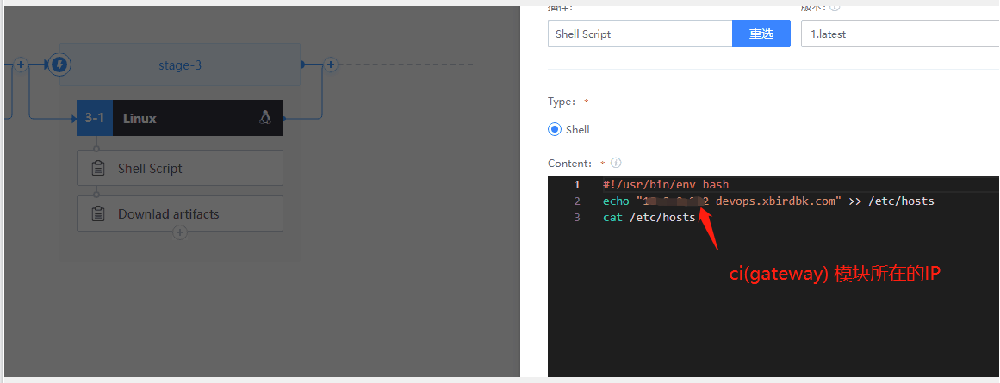
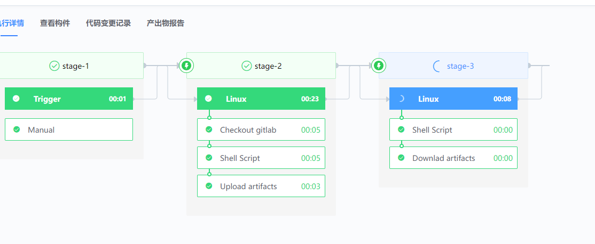

### 使用 Downlad artifacts 下载构件报错

```bash
archive get notFoundContinue: false
find the file(http://devops.xxxrdbk.com/ms/artifactory/api/bui ld/artifactories/file/down1oad2filePath=%2Fbk- archive%2FdemoX2Fp- 0311522845ca1caa374393e81f4%2Fb-18aabeb817174aa19cd4bb751067e8bdX2Fopms.tar.gz) in repo!
total 1 file(s) found
java.net.HttpRetryException: Fail to request( Request{ method=GET, url=http://devops.xbirdbk.com/ms/artifactory/api//build/artifactories/file/download?filePath=%2Fbk-archive%2Fdemo%2Fp-09371152cc20455ca1caa374393e81f4%2Fb- 18aabeb017174aa19cd4bb751067e8bd%2Fopms.tar.gz, tags={}}), try to retry 5 

```


### 原因 "构建机 docker 内解析域名失败"

查看构建日志
公共构建机（dockerhost）在每个容器启动后开始记录日志。 路径为 $BK_HOME/logs/ci/docker/BUILD_ID/RETRY/docker.log , BUILD_ID 是流水线 URL 里 b- 开头的整段内容（包含 b-），每次 “执行” 流水线则生成一个新的 ID 。 RETRY 则是重试次数，第一次运行即为 1 ，在流水线出错时，可以点击插件或 job 右侧的重试链接，此时 RETRY 计数增加。 假设 BUILD_ID 为 b-ca389ac9a9b3426687f0b7f63dc02532，初次运行，则其路径如下 （仅在调度到的构建机上存在。）：
```bash
/data/bkce/logs/ci/docker/b-ca389ac9a9b3426687f0b7f63dc02532/1/agent.log
```


### 解决方案 

1、在 Downlad artifacts 插件前添加一个 Shell Scripy 插件




2、再次执行，下载成功

