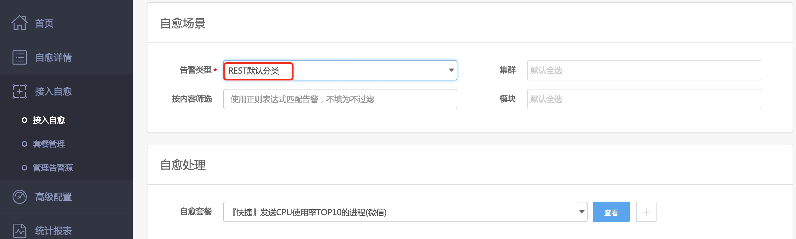
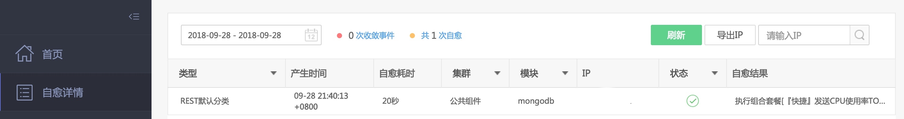
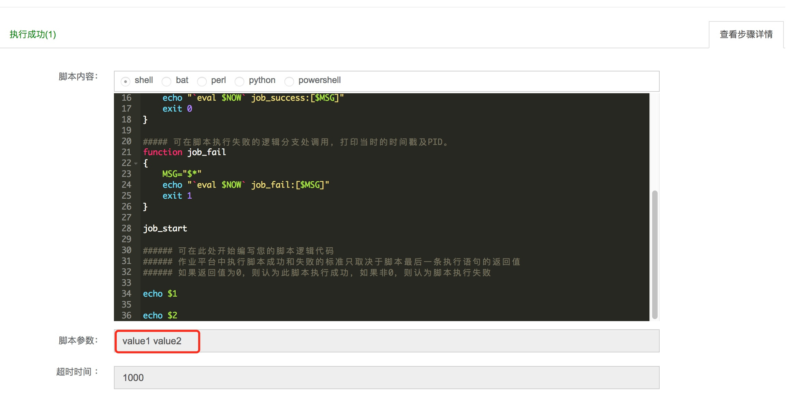

# 集成 REST API 推送

如果你所在企业使用的监控产品故障自愈未集成，则可以使用 `REST API推送`(监控产品把告警推送至故障自愈)或 `REST API拉取`(故障自愈定期从监控产品的告警拉取 API 中获取告警)

本文介绍 集成`REST API推送`的流程.

## 接入流程

图 1. REST API 推送接入流程

## 接入示例

调用 REST API 推送的接口，完成一次自愈。

### 启用 REST API 推送 告警源

在管理告警源页面启用 REST API 推送 告警源。

图 2. 启用 REST API 推送

### 接入自愈

在接入自愈流程中，告警类型选择 `REST默认分类`

图 3. 接入自愈

### 调用 REST API

复制图 1 中调用示例的代码，将 IP 修改为在 CMDB 中登记的，当前业务下的主机。

图 4. 准备调用命令

在能解析 PaaS URL 的主机上(本地或蓝鲸业务下的主机)执行上述 curl 命令

图 5. 执行调用命令

> 如果 PaaS 使用自行签发的证书，请在 curl 命令后添加-k 参数，取消证书校验。

在自愈详情中可以看到一条自愈记录。

图 6. 自愈历史

### 高级特性：传参

在图 4 中定义了参数 key1、key2，可以传递给作业平台或标准运维，引用方式：`${alarm_context|key1}`

以下是在作业平台套餐中引用参数。

图 7. 作业平台套餐中配置自定义参数

自愈时，可以看到已将两个参数的值 value1 和 value2 传递到作业中。

图 8. 自愈执行时传递参数效果

