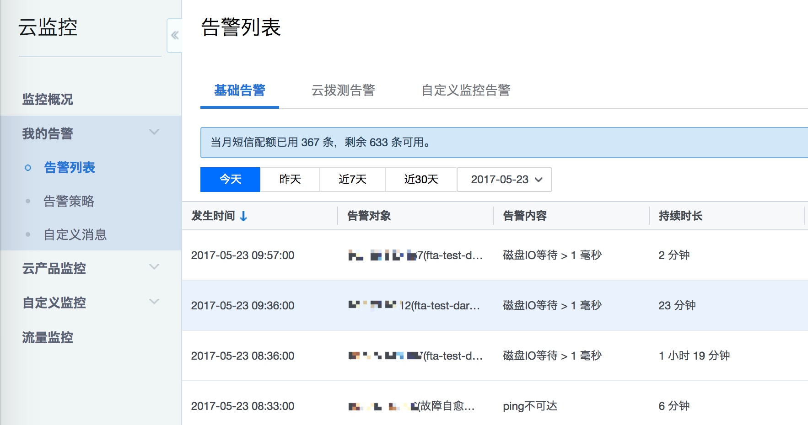
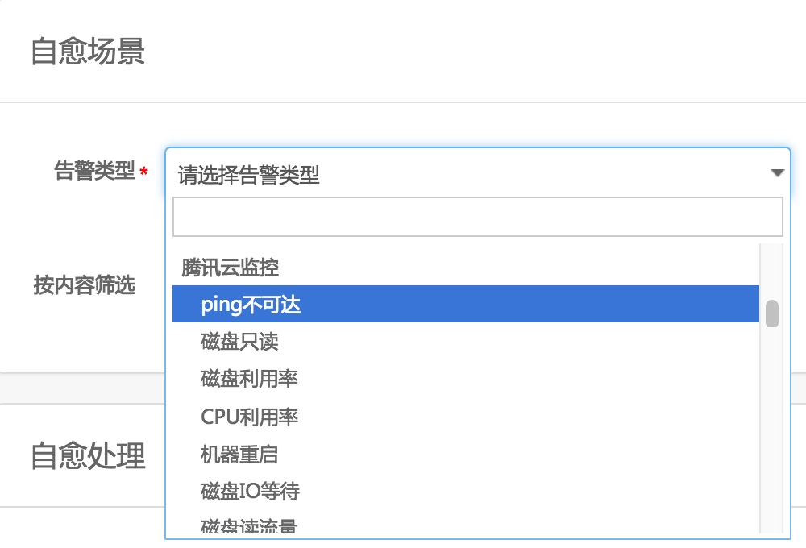

# 集成腾讯云云监控

故障自愈的腾讯云版本默认集成腾讯云监控，定时从腾讯云云监控拉取告警。

**提示：该功能仅在腾讯云版的蓝鲸上支持**

## 设置告警策略并关联告警对象

在腾讯云设置对应的`告警策略`并`关联告警对象`。

在产生腾讯云告警时，你能在告警列表中找到对应的告警，这样故障自愈才能处理。

## 把腾讯云告警接入到自愈
在接入自愈选择告警类型时可以找到`腾讯云监控`对应的`告警类型`

## 腾讯云云监控自愈执行历史

