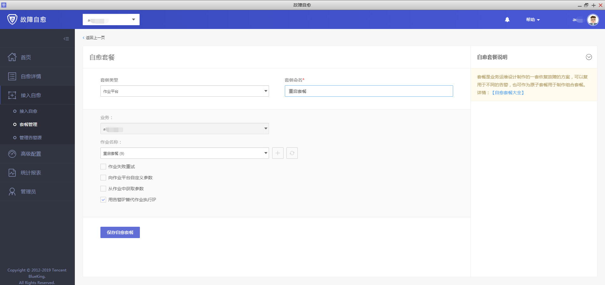

# 带审批 Ping 告警组合套餐接入流程
## 情景

产生 Ping 告警，服务器故障，首先要做故障检查(再次 Ping 一次，或者调用一次)，发送审核通知(包含故障检查的内容)，用户审核即可重启。 (适用保守的传统企业)

## 前提条件

- 需要先配置企业微信，注册链接：[企业微信首页](https://work.weixin.qq.com/)，注意：开启微信端口 80443。

- 蓝鲸故障自愈 APP 已经正常运行 创建故障自愈 APP 请参照 [微信审批接入流程](../guide/WeChat_approval_access_process.md)。

## 准备好组合套餐中每个原子(节点)的套餐
### 配置 Ping 检测的原子套餐

在作业平台写个简单的 Ping 检测脚本，再去故障自愈中配置 Ping 检测的自愈套餐。

### Ping 检测没有异常，则发送正常通知

如 Ping 检测异常，则发送审批通知，用户审批通过即可重启，审批如果不通过，则发送审批失败通知。

- 配置 Ping 检测正常通知

- 配置审批套餐

- 配置重启套餐，因为是简单模拟，所以只是 echo 了一下重启成功，实际应用时要调用在 ESB 上注册重启服务器接口(物理机)，如果是虚拟机，需要自己写脚本来调用虚拟机的接口

## 配置组合套餐，并接入故障自愈

接入故障自愈这里选择 REST 默认分类是为了方便触发告警，实际应用选择 Ping 不可达告警类型。

(Ping 告警组合套餐)

(接入自愈)

## 触发告警，完成自愈
### 触发告警

由于这里是做测试，就不拿生产环境了，用 REST API 可以更方便的产生告警，完整流程请参照 [REST API 推送](../functions/REST_API_PUSH_Alarm_processing_automation.md)。

### 审核

Ping 检测没有异常，则发送正常通知。如 Ping 检测异常，则发送审批通知，用户审批通过即可重启，审批如果不通过，则发送审批失败通知。

- Ping 检测异常，发送审批通知，用户审批通过即可重启

- 回到故障自愈中，查看自愈详情

