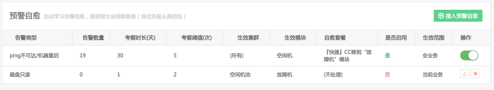
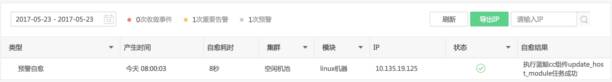

# 预警自愈

预警自愈是健康诊断的一个延伸功能，会回溯最近发生异常告警事件，通过自愈方案提前帮你解决风险，在“高级设置”菜单下即可找到。

图 1. 接入预警自愈

故障自愈默认开启了一个预警自愈套餐(空闲机模块下同一台主机，30 天内出现 5 次`PING不可达`或`机器重启`告警，则把此主机移动到`故障机`模块下)

预警自愈为每天早上 8:00 做自愈的回溯分析，而后执行预警自愈操作。

图 2. 预警自愈执行历史

