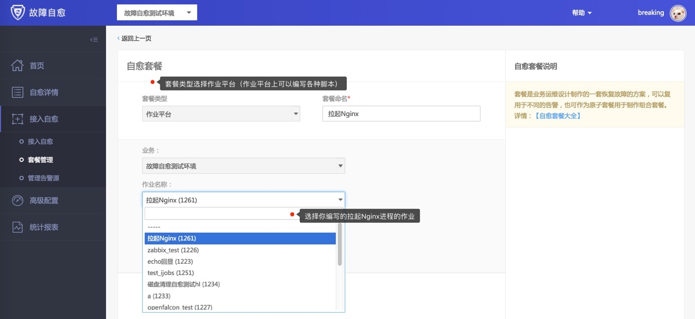
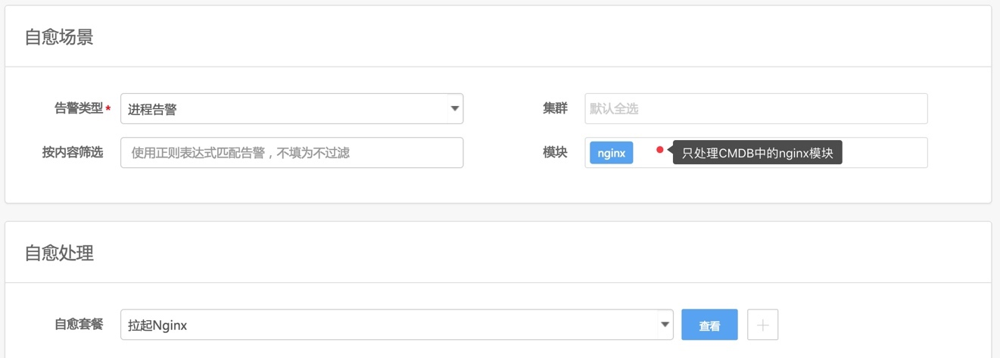

# 基础场景

这里我们以运维常见的告警场景来介绍下如何接入故障自愈。

## 进程告警

故障自愈除了能处理单机性能告警外，还能处理服务类的告警，比如进程告警，Nginx 进程挂掉了，你需要拉起 Nginx 进程。

接下来以 Nginx 进程告警接入自愈为例

### 编写拉起Nginx进程的作业

在作业平台编写拉起 Nginx 进程的脚本(脚本中除了拉起进程，你还可以考虑增加进程检测的逻辑，保证拉起进程这个过程无误)

图49. 编写拉起Nginx进程的作业

### 创建拉起Nginx的自愈套餐

图50. 创建拉起Nginx的自愈套餐

### 接入自愈

在接入自愈页面将进程告警关联拉起 Nginx 套餐，自愈范围选中 Nginx 模块

(集群、模块筛选，用于相同告警类型，不同模块可以有不同的处理方式)

图51. 接入Nginx进程告警的自愈方案

