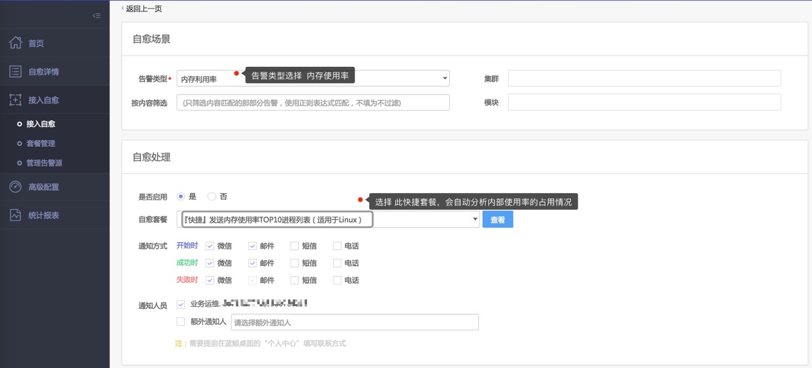

# 内存使用率告警

一般出现内存使用率告警后，我们很想知道是哪个进程造成的？

于是，我们内置了一个分析内存使用率的快捷套餐『快捷』发送内存使用率TOP10进程列表(适用于 Linux)

接入方法，如下 

52. 接入内存使用率告警的自愈方案

下面是推送到你的微信上的内存使用率分析结果 ，可以看到占有内存使用率最高是 AgentWorker。

53. 接入内存使用率告警的自愈方案的效果

