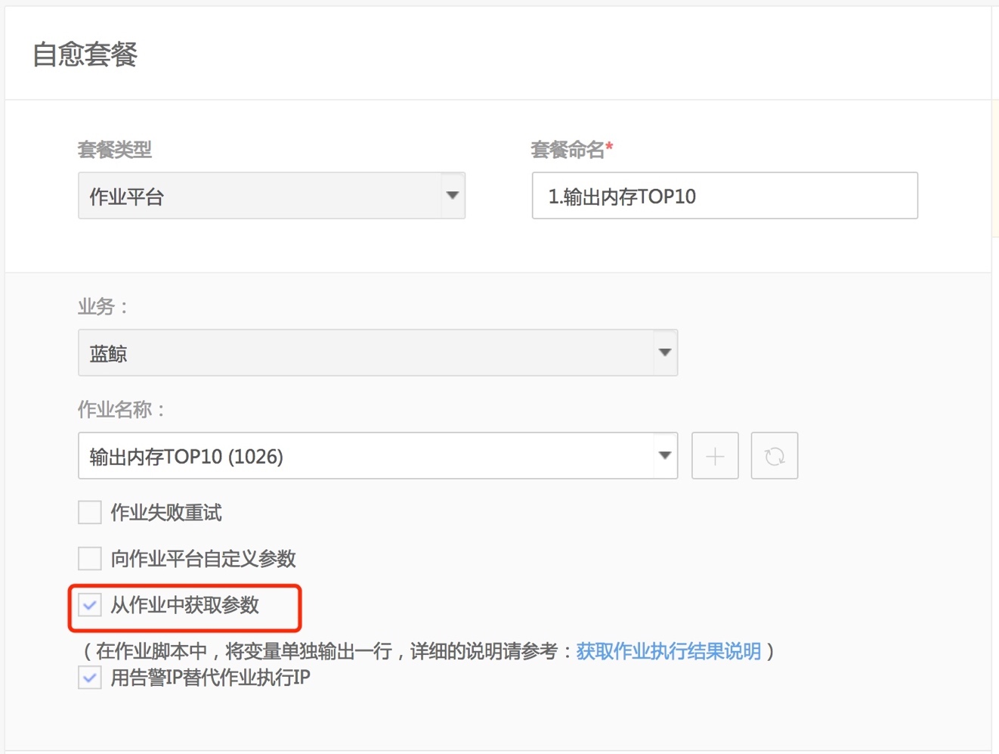
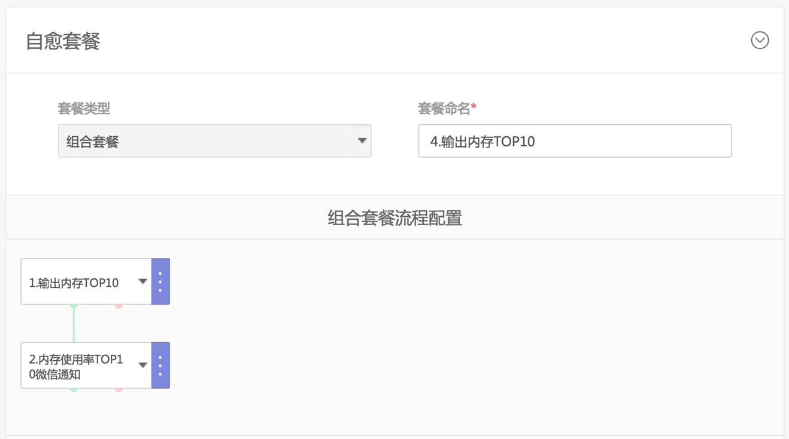
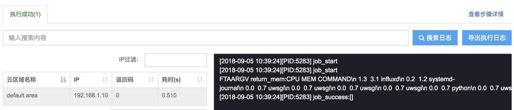
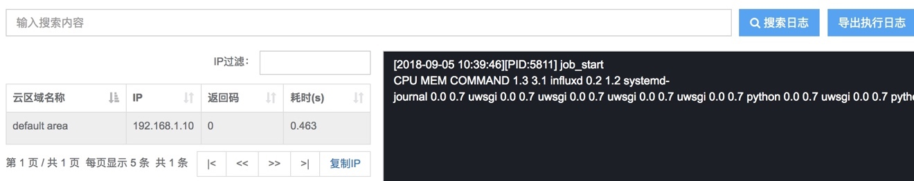
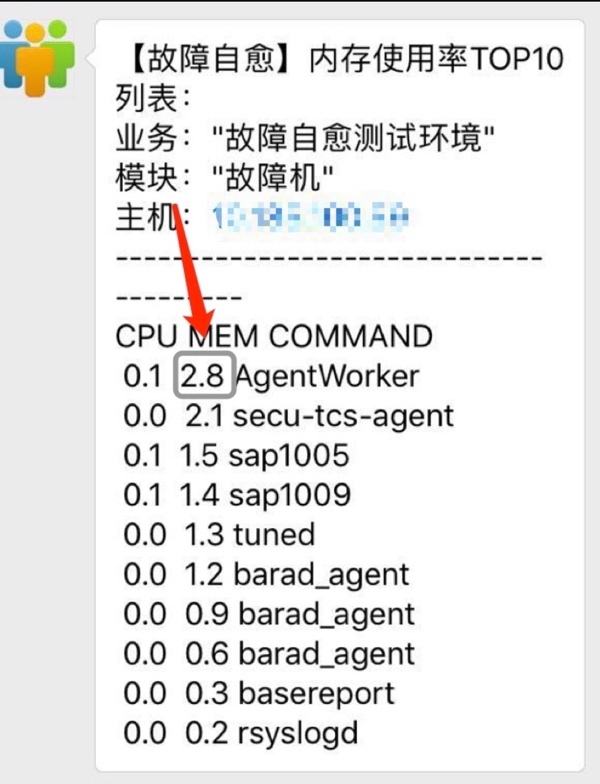

# 上下文传参

上下文传参一般用于组合套餐中，将上一个节点的输出作为下一个节点的输入。

目前支持将作业平台套餐的输出作为任意下一个节点(作业平台、通知、标准运维等)的输入。

## 使用场景

故障自愈的默认套餐『快捷』发送 CPU 使用率 TOP10 的进程(微信)、『快捷』发送内存使用率 TOP10 的进程(微信) 实际上是一个使用上下文传参的组合套餐。

第1步：创建输出 CPU、内存使用率的 TOP10 的作业

第2步：创建作业平台套餐

第3步：创建通知套餐，引用上一步输出的结果，以微信的方式发送出来

第4步：使用组合套餐，将两个套餐串起来

## 在作业平台中定义传递的参数

在作业平台的作业中按照如下格式将传递的参数定义好

`echo "FTAARGV 变量:值"`

以『快捷』发送内存使用率 TOP10 的进程(微信) 套餐中的第1步的脚本为例：
```bash
#!/bin/bash
# USAGE: ./get_top_proc_mem.sh <cpu|mem> <number>#
# DESCRIPTION: 输出系统当前占用资源(cpu、内存)最多的TopN进程
#===================================================================
set -o nounset  # Treat unset variables as an error

fields="pcpu,pmem,comm"

usage() {
    cat <<EOF
    get_top_proc_in_oneline.sh <cpu|mem> <number of top proc>
EOF
    exit 1
}

join() {
    local IFS="$1"
    shift; echo "$*"
}

if (( $# < 1 )) || (( $# > 2 )) ; then
    usage
fi

case $1 in
    cpu) sort_field=pcpu ;;
    mem) sort_field=rss ;;
    *) usage ;;
esac

if [[ $# -eq 2 ]]; then
    top_n=$2
else
    top_n=6
fi

return_mem=$(ps -eo "$fields" --sort=-"$sort_field" | head -$(( top_n + 1 )) | awk 'NR==1 { gsub(/%/,"") } {printf "%s\\n", $0 }')

echo "FTAARGV return_mem:${return_mem}"
```

上面示例中，return_mem 为传递给下一个原子节点的变量，\${return_mem} 为变量的值.


<center>图69. 创建输出传参(传递给下一个步骤的参数)的作业</center>

## 创建作业平台套餐

创建自愈套餐，套餐类型选择作业平台，选择上一步创建的作，并勾选从作业中获取参数 


<center>图70. 创建输出传参(传递给下一个步骤的参数)的套餐</center>

## 创建使用上一步输出参数的套餐

创建通知套餐或作业平台套餐来使用上一步输出的参数。

如果你没配置通知套餐，也可以通过作业平台套餐来测试.


<center>图71. 创建通知套餐，引用上一步输出的参数</center>


<center>图72. 创建作业，引用作业平台套餐传递的参数</center>


<center>图73. 创建作业平台套餐，引用上一步输出的参数</center>

## 创建组合套餐

通过组合套餐，将输出参数和使用参数的原子套餐串起来。


<center>图74. 创建组合套餐</center>

## 测试

如果故障自愈不是很方便获取监控的告警，可以使用 [REST API推送](../../快速入门/集成告警源/BK_20.md) 方式，来验证故障自愈的执行。

## 作业间传参效果


<center>图75. 模拟自愈，执行上一步创建的组合套餐(包含上下文传参特性)</center>


<center>图76. 该自愈的执行详情</center>


<center>图77. #0 步 输出参数</center>


<center>图78. #1 步 获取参数</center>


<center>图79. #2 步 作业执行时传递参数内容</center>

作业 + 通知 组合套餐的输出结果：


<center>图80. 作业+通知 组合套餐的输出结果</center>

> 注：如果参数仅在作业平台中传递，可以使用[作业平台的上下文传参功能](http://docs.bk.tencent.com/product_white_paper/job/?q=%E4%B8%8A%E4%B8%8B%E6%96%87)。
