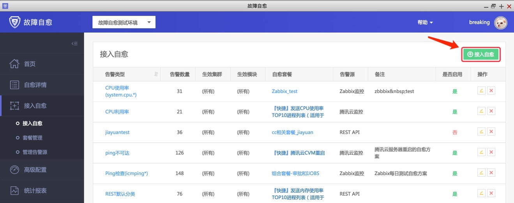

# 接入磁盘清理自愈方案

上一步我们创建了[磁盘清理自愈套餐](./BK_22.md)，接下来我们让磁盘使用率告警接入这个套餐。

点击接入自愈 

图43. 接入自愈

进入接入自愈页面，做如下配置。

特别留意，自愈套餐选择上一步我们创建的套餐 /data/log/ 目录的磁盘清理套餐 

图44. 接入磁盘清理自愈方案

如此，完成磁盘清理告警接入故障自愈。 

图45. 接入磁盘清理自愈方案完成

