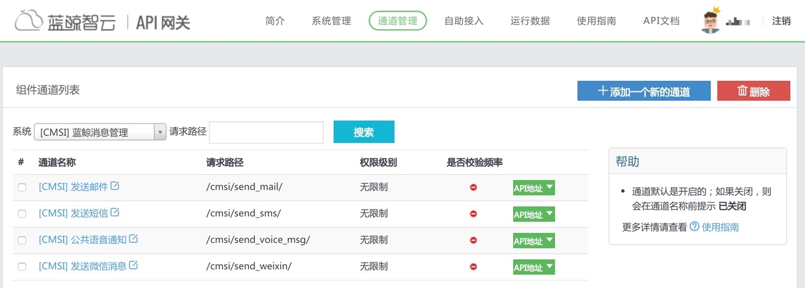

# 告警通知渠道

故障自愈是蓝鲸 PaaS 上一个 SaaS，通知渠道使用 PaaS 的通知 ESB 组件，在蓝鲸的独立部署版本(企业版、社区版)需要在开发者中心后台设置。

## 在通知ESB组件中配置通知渠道

图46. 蓝鲸集成平台(PaaS)的消息管理通知设置

详细设置请访问蓝鲸PaaS提供的设置文档：

-   [如何配置通知渠道，如邮件、微信、短信等?](http://docs.bk.tencent.com/product_white_paper/paas/CaseScenario.html#noticeWay)

-   [经验分享][测试邮件服务是否正常](http://bk.tencent.com/s-mart/community/question/95#/)

## 告警通知效果

通知渠道有4种：微信、电话、邮件、短信

图47. 故障自愈使用邮件通知效果

图48. 故障自愈使用微信通知效果

