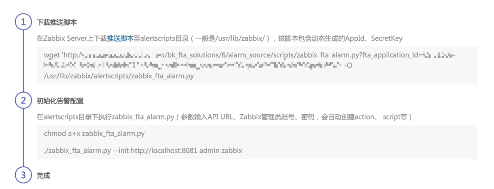
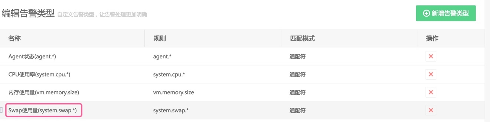
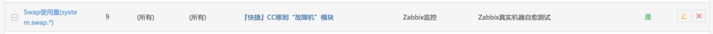
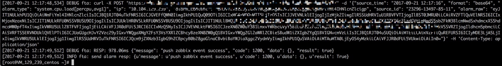

# 集成Zabbix

图25. 集成Zabbix统计数据展示

## 运行初始化脚本

图26. 集成Zabbix的接入流程

如此简单，即完成了故障自愈与 Zabbix 告警的对接。

## Zabbix是如何发送消息给故障自愈的

执行了初始化脚本后，自愈会自动创建如下操作。

自动创建名为 FTA_Act 的 Action 

图27. Zabbix是如何发送消息给故障自愈的(1)

FTA_Act 这个 Action 的 Operation 会通知 FTA_Mgr 用户，FTA_Mgr 的通知媒介就是调用 /usr/lib/zabbix/alertscripts/zabbix_fta_alarm.py

图28. Zabbix是如何发送消息给故障自愈的(2)

告警产生后在 Action log 中可以看到发给 FTA_Act 的 Message 

图29. Zabbix是如何发送消息给故障自愈的(3)

## 自愈集成Zabbix告警注意事项

自愈处理告警是把 {HOST.IP} 作为故障主机 IP，{ITEM.KEY} 作为告警类型，请确保 {HOST.IP} 在配置平台中注册，同时 ITEM.KEY 能被你接入的告警类型所匹配。

上图的 ITEM.KEY 为 system.swap.size[,pfree]被下图的 Swap使用量(system.swap.\*) 的规则所匹配。

图30. 编辑告警类型

图31. 关联告警和处理套餐(接入自愈)

在 /tmp/zabbix_fta_alarm.log 中可以查看到日志信息 

图32. Zabbix告警自愈日志

## Zabbix告警自愈历史

图33. Zabbix告警自愈历史

