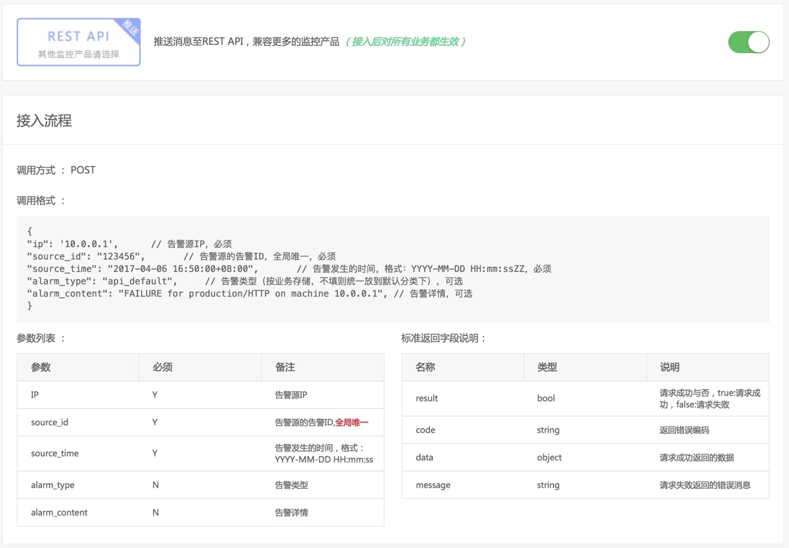

# 集成REST API推送

如果你所在企业使用的监控产品故障自愈未集成，则可以使用 REST API 推送(监控产品把告警推送至故障自愈)或 REST API 拉取(故障自愈定期从监控产品的告警拉取 API 中获取告警)

本文介绍集成 REST API 推送的流程.

## REST API推送接入流程

图39. REST API推送接入流程

## REST API推送调用示例

图40. REST API推送调用示例

