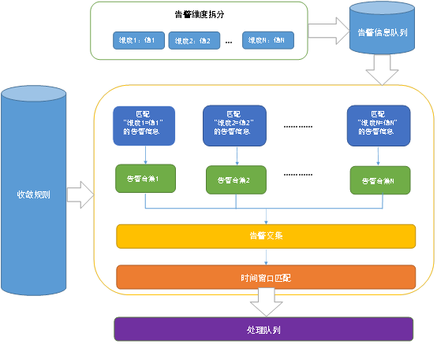

# 告警收敛

用户在 Web 页面上定义收敛规则，一条收敛规则可以简单的概括为：

某几种告警类型，在符合某几种告警纬度在某个时间分为内出现某些条数后，触发某类收敛处理。

同时将告警信息在清洗阶段按维度拆分后，并在每条告警信息加上时间戳后推送到告警信息队列中。

收敛模块从告警队列中，将按维度清洗好的告警信息与收敛规则定义中的每个维度进行匹配得到按单个维度匹配的告警合集，再将所有维度的告警合集求交集，得到满足收敛规则的所有告警信息。

最后再根据告警信息上的时间戳信息查询上个时间窗口是否有相同的维度的收敛，

若有，则将这些告警信息和合并到上一次收敛中，并时间窗口的起始时间设置为当前时间，

若无，则将告警指定的处理流程推送到处理队列中，并把当前时间设置时间窗口的起始值，在该时间窗口内的同一类告警会被收敛，不会再产生新的处理流程。
