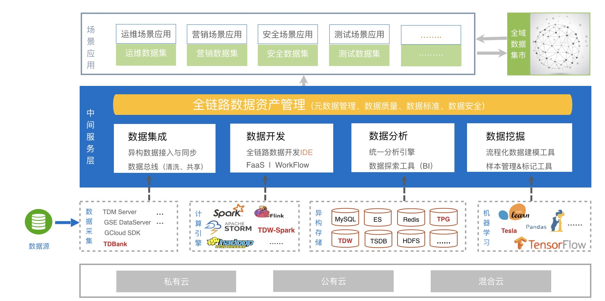

# 欢迎使用数据平台

### 数据平台介绍

数据平台是一个专注游戏研发运营领域的、一站式的、低门槛的大数据平台。提供以实时精准的决策为主，海量离线分析为辅的大数据服务。用户可以通过自助化数据接入，基于 SQL 的计算配置，多场景异构化存储，以及多维度分析等功能，低成本，高效率的构建智能化，可视化的研发工具和运营系统。

### 数据平台架构

数据平台产品架构总体分为四层（自上而下）：

- 资源层：可支持部署在私有云、公有云和混合云等云环境中。
- 组件层：可支持多种开源和腾讯自研的大数据组件

> 1. 数据采集：开源 Beats 采集器、腾讯自己研发的 GSE Agent 采集等。
>
> 2. 大数据计算框架：MapReduce、Storm、Flink 和 Spark 等,同时支持腾讯大数据生态 TDW。
>
> 3. 存储系统：关系型 MySQL 和 Tspider（腾讯）、用于日志检索 ElasticSearch、KV 型存储 Tredis（腾讯）、时间序列数据库 InfluxDB 以及分布式文件系统 HDSF 等。
>
> 4. 机器学习框架和算法库：TensorFlow、Pandas 和 SK-learn 等。

- 中间服务层：

> 1. 数据集成服务，主要由 kafka 消息队列为核心的数据总线组成，功能有数据接入、数据缓存、数据预处理、数据分发，它像一根总线连接着数据处理和存储查询。
>
> 2. 数据开发服务，隐藏各种计算框架的复杂性形成统一计算服务，基于 SQL 和图形拖拽将实时流处理和离线批处理结合，可以使用统一计算对数据进行实时、离线、聚合、关联等复杂数据处理。
>
> 3. 数据分析服务，查询引擎支持多种存储系统，包括关系型数据库 MySQL、离线存储 HDFS、全文检索 Elasticsearch、时序型数据库 TSDB 和 KV 存储 Redis 等，现阶段最新版本支持 ANSI SQL 和文本检索两类查询方式。
>
> 4. 数据挖掘服务，将机器学习建模流程标准化和自助化，基于平台的提供的样本管理和实验报告功能，用户可以更便捷的构建和管理算法模型，并将模型应用到 DataFlow 中。
>
> 5. 全链路数据资产管理，提供元数据管理、血缘分析、数据标准、数据质量和数据权限管理等服务。

- 数据应用层：运维场景应用、营销场景应用、安全场景应用、测试场景应用等。

