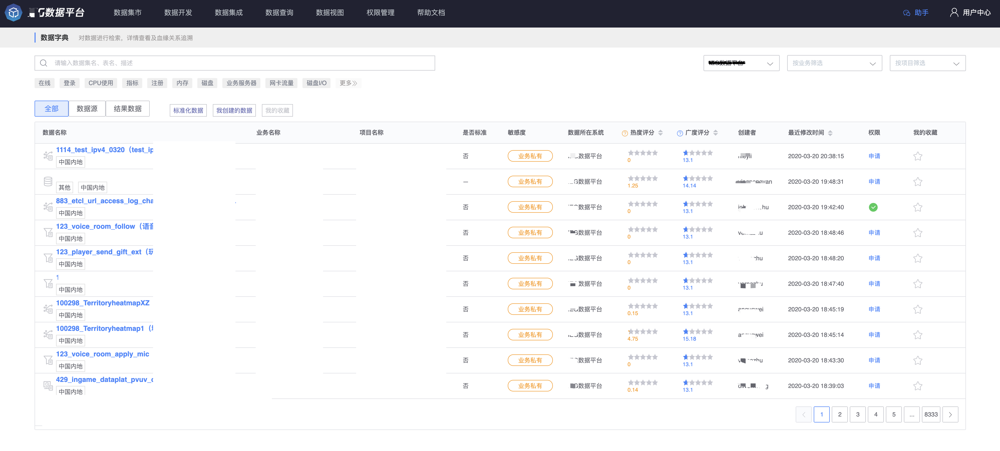
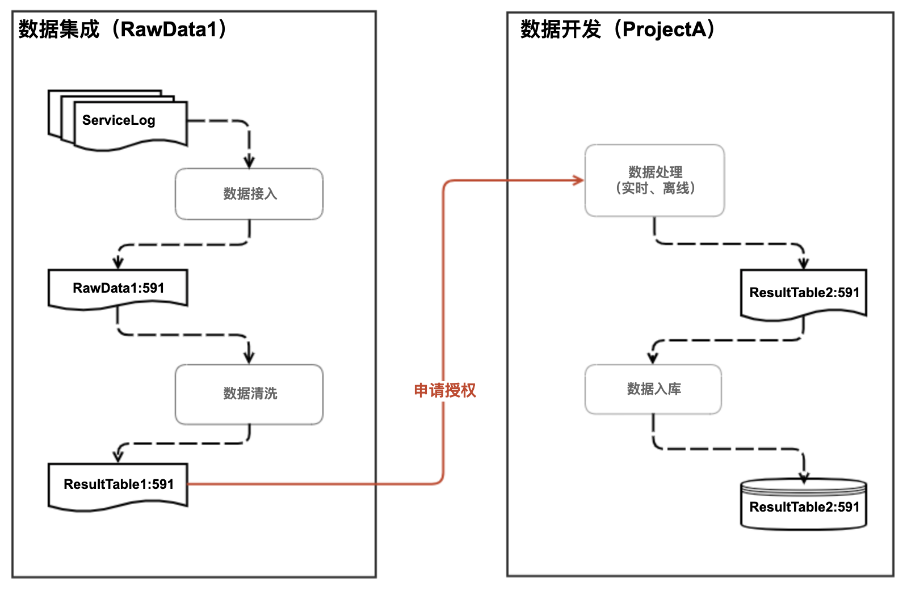
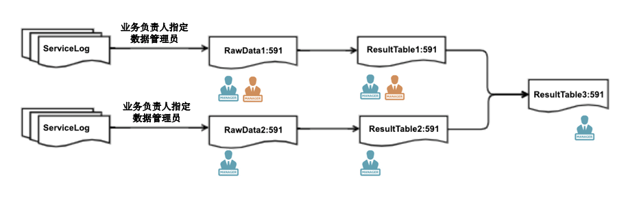
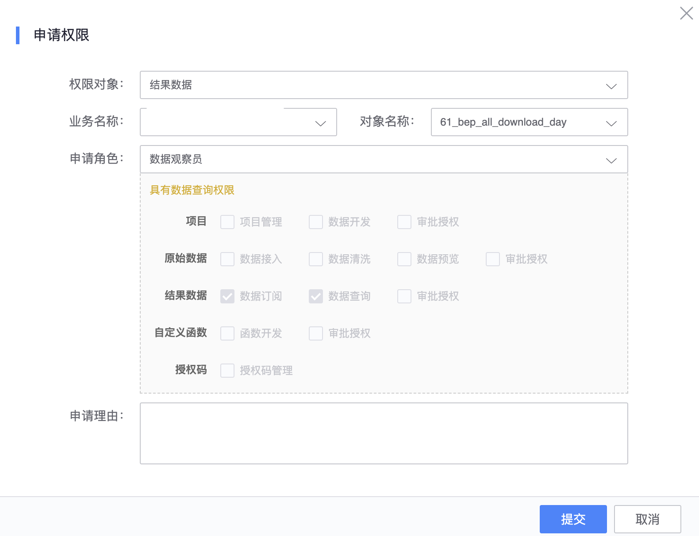

# 我的权限

> 查看我在平台的所有权限

数据平台严格按照 RBAC 对平台用户进行角色授权，如需权限，请添加或者申请对应的角色成员。平台按照操作对象对角色进行划分，比如业务运维、业务开发统一放在《业务》下，项目管理员、数据开发员统一放在《项目》下，同时展示同一对象相关的其他角色成员，便于管理员编辑更新成员。

下图列表中的对象就是当前用户有权限的对象列表，表示当前用户有项目 2926、2929、3132 三个项目的权限，并且罗列出项目相关的成员列表。

## 查看角色具体权限

点击角色旁边小标签可查看角色对应的功能权限

如图所示，平台按照操作对象对功能进行划分，然后定义角色与功能的权限关系。比如项目管理员对项目下的《项目管理》、《数据开发》、《审批授权》都有权限，同时包括对项目底下的结果数据有《数据查询》、《数据订阅》的权限。

**这里对涉及到的功能进行简单介绍**

- 《项目管理》包括项目的增删改查，以及项目下的所有操作
- 《数据开发》包括计算任务的增删改查，调试启停等操作
- 《审批授权》包括项目成员的表更操作，以及第三方对项目资源申请单据的审批
- 《数据查询》可通过 BKSql 查询项目产生和申请的结果数据
- 《数据订阅》这个功能比较特殊，没有界面功能，只能通过第三方工具来操作，同时需要申请授权码

## 如何申请权限

 

点击《申请权限》按钮，申请对应的角色权限。

**以数据开发员申请为例子演示申请流程**

1. 进入《我的权限》，点击《申请权限》
2. 选择权限对象
3. 选择具体对象
4. 选择申请角色，当选择角色时会出现对应权限关系表，供用户参考
5. 填写申请理由，作为审批人判断依据
6. 提交成功会跳转至《我的申请》查看审批进度，单据类型为《申请角色》

 ## 如何申请业务权限

业务的相关角色在平台上默认有接入和查询的权限

- 业务总监：可接入任意场景的业务数据，拥有业务数据的全部权限，包括审批授权
- 业务运维人员（包括运营规划）：可接入任意场景的业务数据，拥有业务数据的全部权限，包括审批授权
- 业务开发人员：可接入除《日志文件》、《脚本上报》、《TLOG》以外场景的业务数据，可查询业务数据
- 业务产品人员：可接入除《日志文件》、《脚本上报》、《TLOG》以外场景的业务数据，可查询业务数据
- 业务测试人员：可接入除《日志文件》、《脚本上报》、《TLOG》以外场景的业务数据，可查询业务数据

业务角色暂时无法在数据平台上直接申请，，请在配置平台配置。数据平台会定时从 [蓝鲸配置平台](../../../../配置平台/产品白皮书/产品功能/BusinessManagement.md) 同步角色成员，目前仅同步运维人员、开发人员、产品人员和测试人员，同步延迟最大为 10 分钟。

## 如何查看自己有权限的结果数据

前往数据集市可查询结果数据列表，并且支持各种维度的过滤条件，其中权限字段列会说明当前用户对该结果表是否有权限，也支持快速申请权限。

### 默认业务成员可以查询业务数据

- 业务总监：可接入任意场景的业务数据，拥有业务数据的全部权限，包括审批授权
- 业务运维人员（包括运营规划）：可接入任意场景的业务数据，拥有业务数据的全部权限，包括审批授权
- 业务开发人员：可接入除《日志文件》、《脚本上报》、《TLOG》以外场景的业务数据，可查询业务数据
- 业务产品人员：可接入除《日志文件》、《脚本上报》、《TLOG》以外场景的业务数据，可查询业务数据
- 业务测试人员：可接入除《日志文件》、《脚本上报》、《TLOG》以外场景的业务数据，可查询业务数据

不同敏感级的业务数据，访问规则有所不同，请查看 [不同敏感级数据的权限控制策略](./sensitivity.md)。**非运维业务人员如果想要审批权限，请在接入的时候，添加为数据管理员。**

### 默认项目成员可以查询项目数据

项目数据包括有项目申请到的结果数据表，以及项目下计算任务产生的结果数据表，比如项目 A 的成员可以查询到 （ResultTable1, ResultTable2）。

### 数据管理员可以查询数据

数据管理员具有数据查询权限，并承当数据授权的审批工作（业务负责人也参与审批）。数据管理员在数据接入的时候进行配置，并且由原始数据产生的结果数据都会继承原始数据的数据管理员列表。

### 数据观察员可以查询数据

一般用户如果只是查询数据，不进行数据处理或者不涉及大范围的数据授权，可以按照最细力度，对单张结果表进行权限申请，直接在《我的权限》页面添加或者申请。

### 数据申请的审批问题

**为了业务数据的安全，所有数据授权严格按照最细力度申请**，即按照结果表为单位进行授权。数据授权会使得数据的使用范围会扩大，需要数据管理员或者业务负责人审批同意。