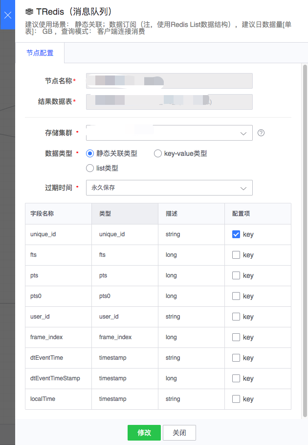
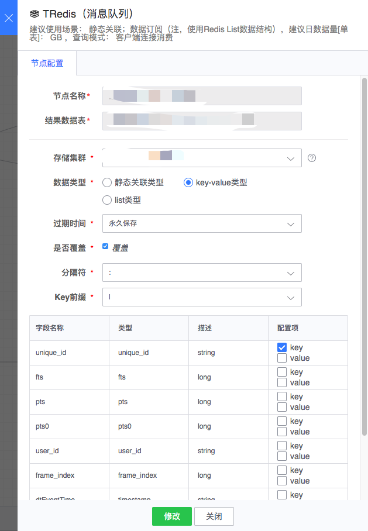

# Tredis

支持静态关联类型、key-value 类型和 list 类型。

图例，Tredis 节点

通用节点配置

- 节点名称： 自动生成，由上游结果表和当前节点类型组成
- 结果数据表：从上游节点继承过来
- 存储集群：可选集群由项目方提供
- 过期时间：Tredis 数据存储时间

#### 静态关联类型

Tredis 入库为指定格式，可作为实时关联数据源。

配置示例：

####  key-value 类型

由用户确定 key 和 value 的组装方式。

- 节点配置
	- 是否覆盖：是否覆盖已有 key 的值，默认覆盖
	- 分隔符：key 或者 value 中字段组合使用的分隔符
	- key 前缀：可以给 key 总体加个前缀，默认为空

- 字段配置
	- key：使用结果表哪些字段来组合 key
	- value：使用结果表哪些字段来组合 value

配置示例：

####  list 类型

每条数据以 JSON 格式进行存储 Tredis，可配置数据存储时间。

配置示例：

