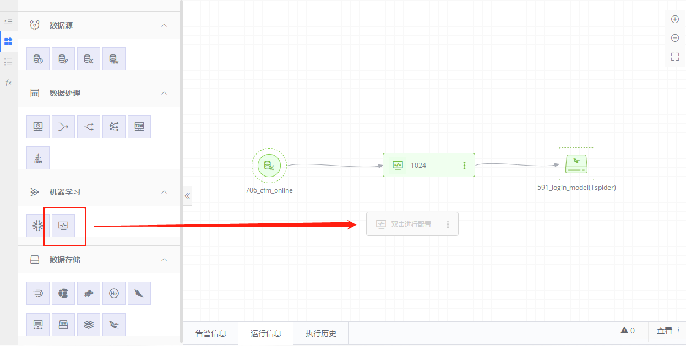
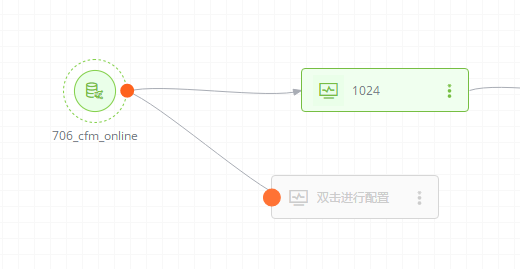
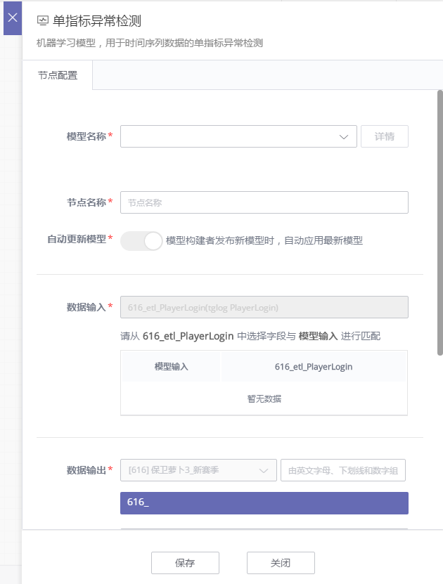
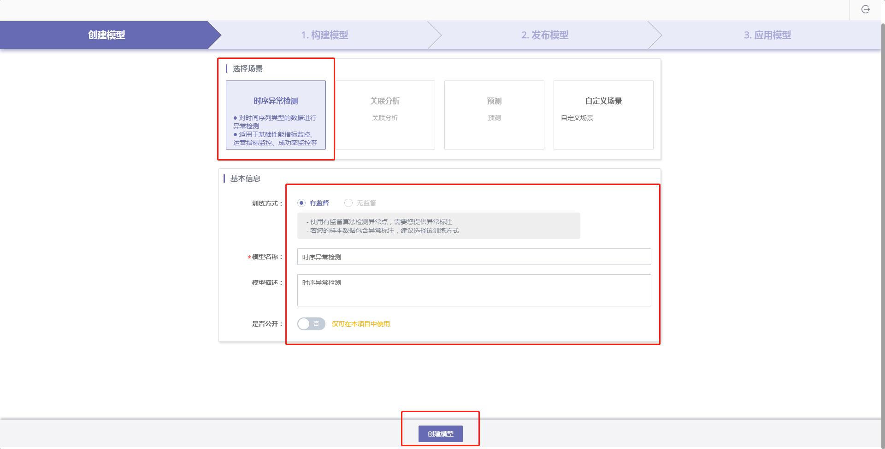
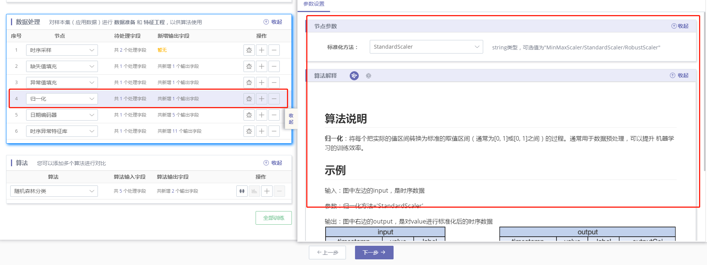
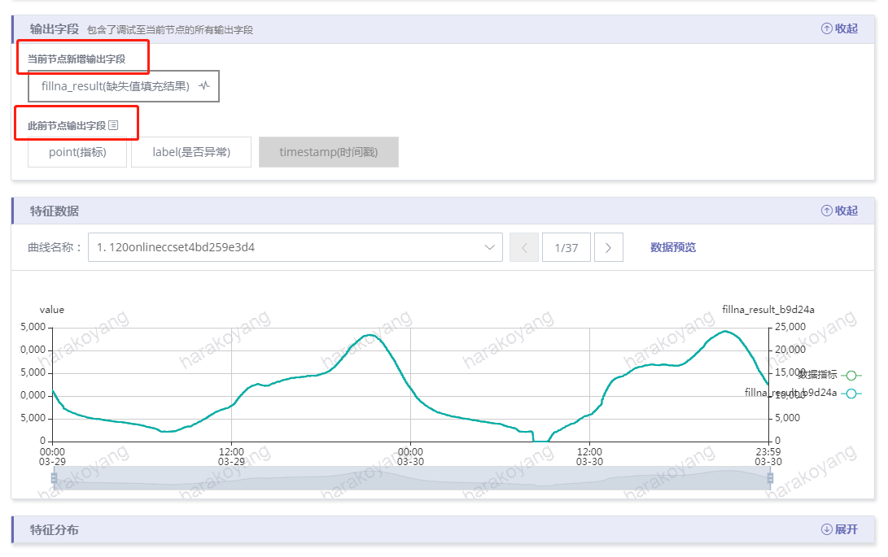
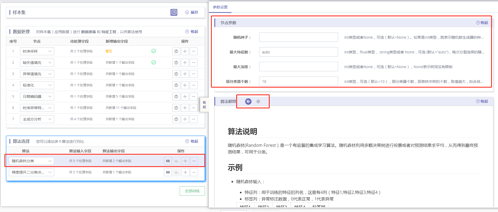
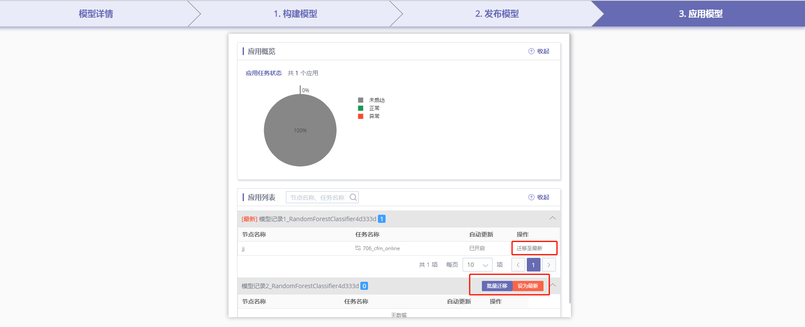

# 机器学习功能介绍

为了更好地满足用户的数据挖掘和智能运维需求，我们提供了一系列基于场景的流程化建模工具，用户可通过流程化的模板和指引进行模型构建和应用。该建模工具以 DataFlow 组件库中 机器学习 分类下的节点形式存在，该节点的使用过程流程图如下：

以下章节开始结合界面介绍该建模工具的使用过程。
注 1：用户在阅读下面文档时需对数据挖掘的一些基本概念，如 样本集、训练集、验证集、特征工程、模型评估等概念有了解。
注 2：样本集管理、闭环相关功能仍在内测中尚未上线。 

## 配置模型

用户可在自己的项目下创建模型，关于创建项目相关的介绍请参考[我的项目](fu-wu-gong-neng-jie-shao/ge-ren-zhong-xin/wo-de-xiang-mu.md)。
创建模型的入口在组件库 - 机器学习目录下，目前仅支持异常检测场景（用于对时间序列类型的数据进行异常检测）。
首先，拖拽一个异常检测节点到画布

设置连线

目前模型节点允许从以下类型节点连接

1. 离线数据节点
2. 实时数据节点
3. 离线计算节点
4. 实时计算节点

双击弹出模型的配置面板

若有已经构建好的模型，可以在模型名称下拉框直接选择，若需创建新模型，可在下拉框中点击创建模型，后续步骤请参考[创建模型](fu-wu-gong-neng-jie-shao/shu-ju-kai-fa/process-model.md)。
可以点击详情，查看所选择的模型详情，也可在节点名称输入框为该节点设置别名，还可以根据您的需求选择是否自动更新模型。
注意单指标异常检测模型通常要求一定时间长度的历史依赖用于进行特征提取，若当前连线的上游数据不满足时间长度，则会出现以下报错。

选择一个模型之后，即可继续填写字段映射。
填写模型输出的配置，包括输出表的表名、中文名、字段别名。
对于离线类型的节点，最后还可以填写应用周期和窗口长度。

## 创建模型

首次创建模型，会弹出指引页面

点击开始建模即可进入创建模型页面，首先选择时序异常检测场景，再填写模型的基本信息，点击创建模型，即可进入构建模型步骤。

## 构建模型

### 样本集

首先选择一个样本集，若需创建一个新样本集，请在下拉框中点击创建样本集，创建样本集的操作请参考[样本集](.)。
在右侧高级面板可以查看样本集详情、每一条样本数据曲线、样本分布情况。
还可修改数据划分比例（训练集和验证集的样本数据比例），注意修改该比例将影响模型效果。

### 数据处理

数据处理包括对样本集（模型应用时为应用数据）的数据预处理和特征工程，处理好的特征将用于算法训练。
选择样本集之后，会自动为您加载一套数据处理节点模板，您可以根据需求，增删节点、修改节点参数、调试节点。

单击某个数据处理节点即可选中该节点，可以在右侧高级面板中修改该节点的参数、查看该节点的算法解释（包括基于场景的解释、算法原理的解释）。

可以修改节点的待处理字段和新增输出字段，确认无误即可点击调试按钮，运行调试程序至当前节点。注意：数据处理节点的调试是串行的，上一节点如果出错，整个调试过程将会终止。

可以在右侧高级面板中查看调试的输出结果，其中输出字段包括了当前节点新增的输出字段和此前节点的输出字段，单击每个字段可查看该字段值的时序曲线和特征分布。

### 算法

选择样本集之后，会自动为您加载一套算法模板，您可以根据需求，增删算法、修改算法参数、训练算法节点。
单击某个算法节点即可选中该节点，可以在右侧高级面板中修改该节点的参数、查看该节点的算法解释（包括基于场景的解释、算法原理的解释）。

可以修改节点的算法输入字段和算法输出字段，确认无误即可点击调试按钮，运行调试程序至当前节点。注意：算法节点的训练是并行的，可分别对某一算法进行训练，也可点击全部训练按钮，对全部算法进行训练。

可以在右侧高级面板中查看训练的输出结果，其中输出字段包括了算法的输出字段和数据处理的输出字段，单击每个字段可查看该字段值的时序曲线和特征分布。
对于训练完成的算法，点击算法评估按钮可切换至算法评估 tab，对算法训练结果进行评估。

评估内容包括异常分值分布、多种类型的评估指标（PR、ROC、LIFT、GAIN、KS 曲线），您可以调整敏感度滑杆（权衡检出率和准确率），来使异常分值分布和评估指标达到满足您需求的合适标准。

您还可以在下方查看每个样本数据的模型检测结果和人工标注结果的对比情况。

已完成评估的算法会变为已评估状态。

点击下方的下一步按钮弹出模型选择弹框，可以选择效果最好的模型生成模型记录，以进行下一步的发布操作。

## 发布模型

在发布模型 tab 可以查看已生成的模型记录，已生成的模型记录有已发布和未发布两种状态。未发布的模型记录可以点击右侧操作按钮进行发布。

已发布的模型记录名称右侧有数字表示该模型当前的应用数，没有任何应用的模型记录才可取消发布或删除。

点击左上方的评估指标复选框可以勾选需要展示的评估指标，目前提供的评估指标包括：准确率、检出率、F1 Score。每个评估指标都会按照训练集、验证集分别展示。您还可以点击右上方的展示模式切换按钮切换评估指标的展示方式，目前提供的展示模式包括：数字表格、条形图表格、条形图。

点击任一个模型记录，可以在右侧高级面板查看或编辑该模型记录的发布配置，包括：发布描述、模型输入、模型输出。已发布的模型记录仅允许查看而不可编辑发布配置，未发布的模型记录可以编辑发布配置并点击下方的发布按钮对模型进行发布。

发布时勾选设为最新模型，可以将此前发布模型的应用自动迁移至当前模型（前提是该应用勾选了自动更新）。发布成功后会引导您进入模型的应用配置页面，或进入应用模型 tab 查看当前模型的应用情况。

## 应用模型

在工作台的应用配置页面可以对模型进行应用，而在应用模型 tab 可以查看和管理当前模型的应用。

### 应用概览

可以通过饼图查看当前模型的所有应用所属的任务状态。

### 应用列表

可以分别查看每个模型记录下的应用具体信息，包括：应用节点名称、应用所属的任务名称、是否开启了自动更新。您还可以进行多项操作，包括：将应用从原模型记录迁移至最新模型记录、将某个模型记录设为最新模型。

