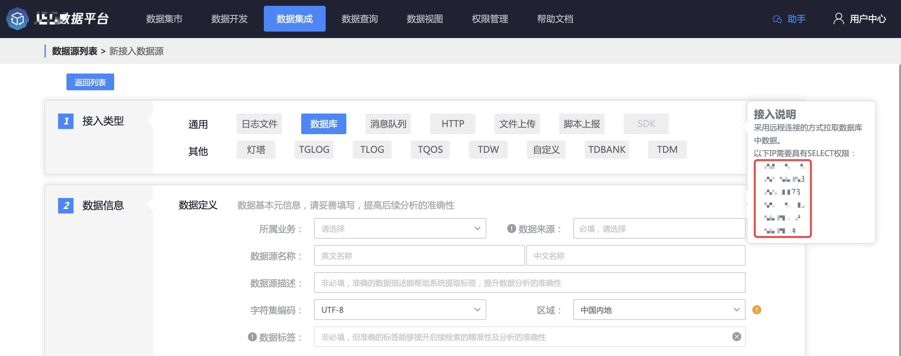

# 数据库接入

## 简介

数据库采集采用远程方式采集数据库数据. 数据查询支持按时间字段或者自增 id 字段来查询.

## 采集原理

采集器部署在数据平台的服务器上, 采取远程访问 db 的方式采集

每个固定周期\(用户配置\), 按字段条件 SELECT 查询数据, 然后上报数据.

## 接入准备

因为使用远程拉取, 所以需要用户对拉取的机器进行 db 授权

以下 IP 需要具有 SELECT 权限:

## 数据接入

### 数据信息

定义 了源数据的基础信息, 包含业务, 源数据名称等.数据源名称由用户自己定义, 在相同业务中不能重复

### 接入对象

数据库类型: 目前只支持 msql 采集

每个接入对象定义了需要采集 db 的配置

* 采集范围, 包含 db 的域名, 用户名和密码
* 数据库/表名

每个数据源支持配置多项接入对象.

配置正确的 db 域名和账号信息后, 可以自动拉取到数据库名和表名.用户可以直接选择

### 接入方式

采集方式: 分为增量和全量

* 全量采集每次拉取表中的所有数据上报

* 增量采集每次按查询条件拉取表中增量的数据上报.  第一次接入增量采集不会采集存量数据

采集周期: 每隔多久采集一次

增量字段: 增量采集指定字段, 分为时间字段和 id 字段两种.

时间字段: 支持多种时间格式, 查询是按当前时间来查询

id 字段: id 需要保证是自增的, 每次查询大于上次查询结果中最大的 id

数据延迟时间: 当增量字段为时间字段时有效. 数据延迟只要用于数据写入 db 可能存在延时的场景.

### 过滤条件

可选项. 支持按照字段过滤

#### 接入界面示例如下

