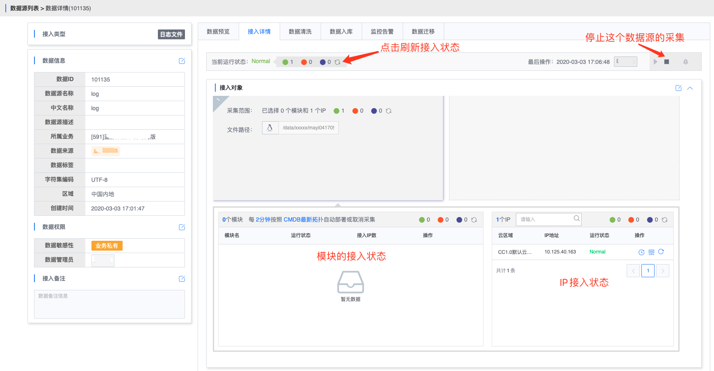
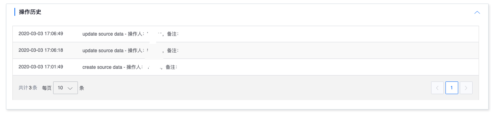

# 接入详情

接入详情页展示了接入状态, 并提供源数据接入的停止启动操作,

## 接入状态

接入状态包括统计总览和各个接入对象的接入状态.

统计总览包含正常, 异常, 运行中和停止状态, 会统计各个状态的 IP 数量. 点击刷新按钮可以查询最新的状态

接入对象分为模块的接入状态和 IP 的接入状态, 包含查看执行历史, 运行日志和支持重试操作

点击重试则会重新下发该 IP 的采集任务

执行历史中展示了 IP 的执行历史, 按操作时间逆序排列.

如果接入异常了, 这里可以看到异常原因

### 接入详情界面示例如下

## 接入方式

这里显示暂时固定

## 运行日志

运行日志展示每次部署的操作人和运行日志

## 操作历史

操作历史展示源数据的操作日志. 包含源数据接入, 停止, 启动及源数据相关任务的启停操作等.

