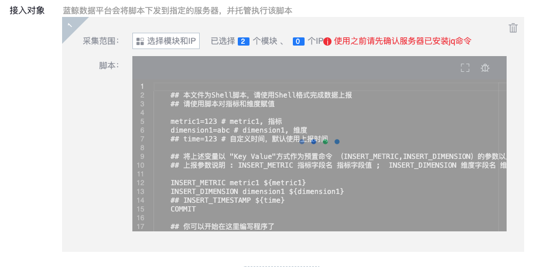
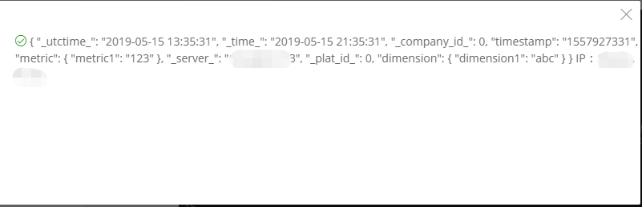
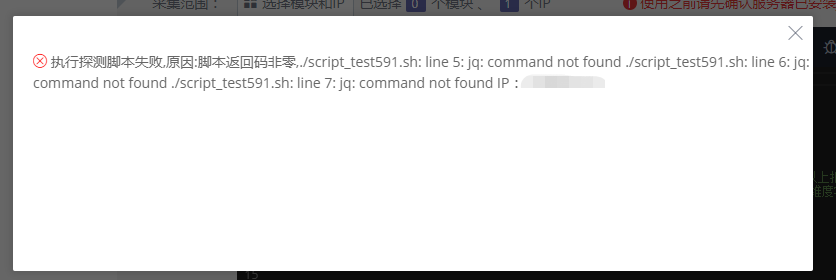

# 脚本接入

## 简介

脚本采集支持用户自定义脚本来上报数据, 用户编写脚本, 然后下发脚本到目标机器上执行

不适合上报大量的数据

## 采集原理

脚本托管到 gseAgent 上, 托管配置包含调用周期, 由 gseAgent 定期执行脚本.

脚本封装了上报逻辑, 数据通过 gsecmdline 命令行工具上报数据.

数据上报格式为 json 格式, 脚本中处理 json 数据依赖 jq 命令

## 接入准备

* job 执行权限. 采集器下发依赖 job 来执行, 所以用户需要 job 执行权限
* 使用之前请先确认服务器已安装 jq 命令

## 数据接入

### 数据信息

定义 了源数据的基础信息, 包含业务, 源数据名称等.数据源名称由用户自己定义, 在相同业务中不能重复

### 接入对象

每个接入对象定义了需要采集的 HTTP 配置

* 采集范围: 按模块或者 IP 接入
* 脚本: 用户在此编写脚本.  

每个数据源支持配置多项接入对象.

### 脚本调试

点击测试按钮可以测试数据采集情况

等待执行

调试成功返回结果, 前面有个绿色标识

调试失败返回结果,前面有个红色标识. 这台机器没有安装 jq 命令所以报错

### 接入方式

采集周期可按分, 时, 天配置

#### 接入界面示例如下

